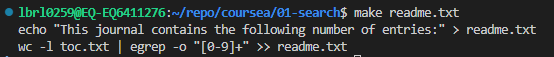

# Make

Make is a powerful build automation tool that manages dependencies between files and automatically rebuilds files when their dependencies change.

## Makefile Basics

### Creating a Basic Makefile

Creating a basic makefile with nano:

```bash
nano makefile
```

**Adding the following content:**

```makefile
draft_journal_entry.txt:
	touch draft_journal_entry.txt
```

**Note:** The commands in the rule must be indented with a `tab` character, not spaces.

### Makefile Rule Format

The simple makefile above illustrates a rule which has the following general format:

```makefile
[target]: [dependencies...]
	[commands...]
```

## Advanced Makefile Example

Let's create a more complex makefile that manages multiple files. First, let's add a table of contents for our journal:

```bash
echo "1. 2017-06-15-In-Boston" > toc.txt
```

Now let's update our makefile to automatically generate a readme.txt:

```makefile
draft_journal_entry.txt:
	touch draft_journal_entry.txt

readme.txt: toc.txt
	echo "This journal contains the following number of entries:" > readme.txt
	wc -l toc.txt | egrep -o "[0-9]+" >> readme.txt
```

Note that the `-o` flag provided to `egrep` extracts the regular expression match from the matching line, so that only the number of lines is appended to readme.txt.

Now let's run make with readme.txt as the target:

```bash
make readme.txt
```



When we update the table of contents:

```bash
echo "2. 2017-06-16-IQSS-Talk" >> toc.txt
make readme.txt
```

Make successfully updates readme.txt! With every change to toc.txt, running `make readme.txt` will programmatically update readme.txt.

## Special Rules

### The `all` Rule

To simplify the make experience, we can create a rule at the top of our makefile called `all` where we can list all of the files that are built by the makefile:

```makefile
all: draft_journal_entry.txt readme.txt

draft_journal_entry.txt:
	touch draft_journal_entry.txt

readme.txt: toc.txt
	echo "This journal contains the following number of entries:" > readme.txt
	wc -l toc.txt | egrep -o "[0-9]+" >> readme.txt
```

By adding the `all` target we can simply run `make` without any arguments to build all targets.

### The `clean` Rule

We can add a special rule called `clean` which destroys the files created by our makefile:

```makefile
all: draft_journal_entry.txt readme.txt

draft_journal_entry.txt:
	touch draft_journal_entry.txt

readme.txt: toc.txt
	echo "This journal contains the following number of entries:" > readme.txt
	wc -l toc.txt | egrep -o "[0-9]+" >> readme.txt

clean:
	rm draft_journal_entry.txt
	rm readme.txt
```

## Summary

- `make` is a tool for creating relationships between files and programs, so that files that depend on other files can be automatically rebuilt
- Makefiles are text files that contain a list of rules
- Rules are made up of targets (files to be built), commands (a list of bash commands that build the target), and dependencies (files that the target depends on to be built)

## Related Topics

- [[data-engineering.course.unix-workbench.bash-fundamentals.commands]]
- [[data-engineering.course.unix-workbench.pipes.basics]]
- [[data-engineering.course.bash-integration.workflows]]

## Further Reading

- Karl Broman's make tutorial
- Chase Lambert's makefiletutorial.com