## 🎯 Learning Objectives

After completing this lesson, you will be able to:

- 🔬 Define the ACID and BASE acronyms and their components
- ⚖️ Describe the key differences between ACID and BASE models
- 🎯 Identify appropriate use cases for ACID and BASE modeled systems
- 🏦 Understand when to choose each consistency model

---

## 📖 Overview: The Great Database Divide

One of the most fundamental differences between **relational database management systems (RDBMS)** and **NoSQL databases** lies in their **data consistency models**.


> 💡 **Key Insight**: ACID and BASE are not enemies - they're different tools for different jobs, each with distinct advantages and trade-offs.

---

## 🔬 ACID Model: Strong Consistency

### What is ACID?

The **ACID** model ensures that database transactions are processed reliably and maintain data integrity.


### ACID Properties Explained

#### 🔹 **Atomicity**
- **Definition**: All operations in a transaction succeed, or every operation is rolled back
- **Example**: In a bank transfer, both debit and credit must complete, or neither happens
- **Guarantee**: No partial transactions

#### 🔹 **Consistency**
- **Definition**: On transaction completion, database structural integrity is maintained
- **Example**: Account balances remain valid, constraints are enforced
- **Guarantee**: Data follows all defined rules

#### 🔹 **Isolation**
- **Definition**: Transactions cannot interfere with each other while in progress
- **Example**: Two simultaneous transfers don't corrupt account balances
- **Guarantee**: Concurrent transactions appear sequential

#### 🔹 **Durability**
- **Definition**: Completed transaction data persists even during system failures
- **Example**: Committed bank transfer survives power outage
- **Guarantee**: Data permanence

### ACID Transaction Example


---

## 🌊 BASE Model: Eventual Consistency

### What is BASE?

The **BASE** model prioritizes availability and performance over immediate consistency, accepting that data may be temporarily inconsistent.


### BASE Properties Explained

#### 🔹 **Basically Available**
- **Definition**: System ensures availability by spreading/replicating data across cluster nodes
- **Example**: Netflix remains accessible even if some servers fail
- **Trade-off**: May serve slightly stale data to maintain availability

#### 🔹 **Soft State**
- **Definition**: Data values may change over time due to eventual consistency
- **Example**: Social media follower counts may vary across different servers
- **Acceptance**: Temporary inconsistency is acceptable

#### 🔹 **Eventually Consistent**
- **Definition**: System will achieve consistency, but not immediately
- **Example**: Amazon product reviews appear on all servers within minutes
- **Promise**: Consistency happens, just not instantly

### BASE Example: Social Media Platform


---

## ⚖️ ACID vs BASE: Detailed Comparison

| **Aspect** | **ACID** | **BASE** |
|------------|----------|----------|
| **Primary Focus** | Data Consistency | Data Availability |
| **Consistency** | Immediate, Strong | Eventual, Weak |
| **Availability** | May be reduced during failures | Always available |
| **Partition Tolerance** | Limited | High |
| **Performance** | May be slower due to coordination | Faster, optimized for scale |
| **Complexity** | Simpler to reason about | More complex distributed logic |
| **Use Cases** | Financial, Critical systems | Social media, Content delivery |

### CAP Theorem Context


---

## 🏦 ACID Use Cases

### When to Choose ACID

**Perfect for**:
- 💰 **Financial Systems**: Banking, payments, accounting
- 🏥 **Critical Applications**: Healthcare records, safety systems
- 📊 **Data Warehousing**: Analytical systems requiring accuracy
- 🛒 **E-commerce Transactions**: Order processing, inventory management

### Real-World ACID Examples

#### Financial Institution Example


**Why ACID is Critical**:
- Money cannot "disappear" due to system failures
- Regulatory compliance requirements
- Customer trust depends on transaction accuracy
- Audit trails must be perfect

---

## 🌐 BASE Use Cases

### When to Choose BASE

**Perfect for**:
- 📱 **Social Media**: User posts, likes, comments
- 🎬 **Content Delivery**: Netflix, Spotify, YouTube
- 🚗 **Real-time Services**: Uber, ride-sharing apps
- 🛍️ **Product Catalogs**: Amazon product listings
- 📊 **Analytics**: User behavior tracking

### Real-World BASE Examples

#### Netflix Streaming Platform


**Why BASE Works Well**:
- Users don't notice if a movie appears 30 seconds later
- Service must remain available globally
- Massive scale requires distributed architecture
- Temporary inconsistency is acceptable

---

## 🏢 Industry Applications

### ACID Industries & Companies

| **Industry** | **Companies** | **Use Case** |
|--------------|---------------|--------------|
| **Banking** | JPMorgan, Wells Fargo | Money transfers, account management |
| **E-commerce** | Traditional retail systems | Order processing, payment processing |
| **Healthcare** | Hospital systems | Patient records, prescription tracking |
| **Government** | Tax systems, voting | Critical data that must be accurate |

### BASE Industries & Companies

| **Industry** | **Companies** | **Use Case** |
|--------------|---------------|--------------|
| **Social Media** | Facebook, Twitter, Instagram | Posts, likes, comments, feeds |
| **Streaming** | Netflix, Spotify, YouTube | Content metadata, user preferences |
| **Ride Sharing** | Uber, Lyft | Real-time location, trip data |
| **E-commerce** | Amazon, eBay | Product catalogs, recommendations |
| **Gaming** | Online games | Player stats, leaderboards |

---

## 🔄 Modern Hybrid Approaches

### Multi-Model Databases

Many modern systems use **both** approaches:

```mermaid
graph TB
    subgraph "Hybrid Database System"
        A[Critical Data<br/>ACID Transactions]
        B[Catalog Data<br/>BASE Consistency]
        C[Application Layer<br/>Intelligent Routing]
    end
    
    subgraph "Examples"
        D[Amazon: Payments (ACID)<br/>+ Product Catalog (BASE)]
        E[Facebook: Payments (ACID)<br/>+ Social Feed (BASE)]
    end
    
    C --> A
    C --> B
    
    style A fill:#ff5722,color:#ffffff
    style B fill:#4caf50,color:#ffffff
    style C fill:#2196f3,color:#ffffff
```

### MongoDB's Evolution

**Example**: MongoDB (document database) added ACID transaction support in version 4.0
- **Before v4.0**: Pure BASE model
- **After v4.0**: ACID transactions for critical operations + BASE for scalability

---

## 📊 Performance Comparison

### Throughput Characteristics


### When Performance Matters

- **ACID**: When correctness > speed (financial systems)
- **BASE**: When speed > immediate consistency (social media)

---

## 📋 Decision Framework

### Choosing Between ACID and BASE

```mermaid
flowchart TD
    A[New System Design] --> B{Data Consistency Critical?}
    B -->|Yes| C{Can Tolerate Downtime?}
    B -->|No| D{Need Global Scale?}
    
    C -->|No| E[Consider BASE<br/>with Compensation]
    C -->|Yes| F[Choose ACID]
    
    D -->|Yes| G[Choose BASE]
    D -->|No| H[Either Works<br/>Consider Simplicity]
    
    F --> I[RDBMS<br/>PostgreSQL, MySQL]
    G --> J[NoSQL<br/>Cassandra, MongoDB]
    E --> K[Hybrid Approach<br/>Event Sourcing]
    H --> L[Start Simple<br/>ACID → BASE Later]
    
    style F fill:#ff5722,color:#ffffff
    style G fill:#4caf50,color:#ffffff
    style I fill:#ff5722,color:#ffffff
    style J fill:#4caf50,color:#ffffff
```



### Key Questions to Ask

1. **💰 Financial Data?** → ACID
2. **🌍 Global Scale?** → BASE
3. **⚡ Real-time Critical?** → ACID
4. **📱 User-generated Content?** → BASE
5. **🏥 Safety Critical?** → ACID
6. **📊 Analytics/Reporting?** → ACID
7. **🎮 Gaming/Social?** → BASE

---

## 📋 Key Takeaways

### ✅ **What You Should Remember**

1. **ACID** = Atomicity, Consistency, Isolation, Durability
2. **BASE** = Basically Available, Soft state, Eventually consistent
3. **ACID focuses on consistency**, BASE focuses on availability
4. **Both have valid use cases** - choose based on requirements
5. **Modern systems often use both** - hybrid approaches are common

### 🎯 **The Bottom Line**


**Remember**: The choice between ACID and BASE is not about "better" or "worse" - it's about matching the tool to the job.

---

## 🔗 Related Topics

- **[[13-Distributed-Databases]]** - How BASE enables distribution
- **[[05-characteristics-of-NoSQL-databases]]** - NoSQL and BASE principles
- **[[07-key-value-NoSQL-Databases]]** - BASE in practice
- **[[09-column-based-NoSQL-Databases]]** - Cassandra's eventual consistency

---

## 📝 Study Questions

1. What does each letter in ACID and BASE represent?
2. Why can't distributed systems easily provide ACID guarantees?
3. Give three examples each of ACID and BASE use cases.
4. How does the CAP theorem relate to ACID vs BASE?
5. When might you use both ACID and BASE in the same system?

---

*Next: Explore how distributed databases implement BASE principles in practice.*