## 🎯 Learning Objectives

After completing this lesson, you will be able to:

- 📏 Define the CAP theorem and its three components
- 🔍 Describe the characteristics and trade-offs of CAP theorem
- 📚 Understand the history and relevance of CAP theorem in distributed systems
- 🗂️ Classify NoSQL databases using CAP theorem principles

---

## 📖 Historical Context: The Birth of Distributed Computing

### The Early 2000s: A Paradigm Shift

In the early 2000s, the technology landscape was transforming rapidly:


### The Challenge

**Traditional Relational Databases** faced a critical limitation:
- ✅ **Strong consistency** was their strength
- ❌ **Global distribution** while maintaining consistency seemed impossible
- ❌ **High availability** conflicted with consistency requirements

**The Question**: How can we build systems that are globally distributed, always available, AND consistent?

**The Answer**: CAP Theorem proved this was fundamentally impossible.

---

## 🧮 What is CAP Theorem?

### Definition

**CAP Theorem** (also known as **Brewer's Theorem**) states:

> 💡 **"A distributed system can guarantee delivery of only TWO of these three desired characteristics: Consistency, Availability, and Partition Tolerance."**

### The CAP Triangle

```mermaid
graph TB
    subgraph "CAP Theorem"
        C[Consistency<br/>📊 All nodes see same data]
        A[Availability<br/>🌐 System remains operational]
        P[Partition Tolerance<br/>🔗 Works despite network failures]
    end
    
    subgraph "Possible Combinations"
        CA[CA Systems<br/>🏦 Traditional RDBMS<br/>Single Location]
        CP[CP Systems<br/>🔒 Strong Consistency<br/>MongoDB, HBase]
        AP[AP Systems<br/>📱 High Availability<br/>Cassandra, DynamoDB]
    end
    
    C -.-> CA
    A -.-> CA
    C -.-> CP
    P -.-> CP
    A -.-> AP
    P -.-> AP
    
    style C fill:#e53e3e,color:#ffffff
    style A fill:#51cf66,color:#ffffff
    style P fill:#339af0,color:#ffffff
    style CA fill:#ffd43b
    style CP fill:#ff922b
    style AP fill:#845ef7,color:#ffffff
```



### Key Insight

🚨 **You must sacrifice one of the three properties**. There's no system that can guarantee all three simultaneously in a distributed environment.

---

## 🔍 Understanding the Three Properties

### 1. 📊 **Consistency**

**Definition**: All nodes in a distributed system see the same data at the same time.


**Key Questions**:
- Do all nodes see the data they're supposed to see?
- Is the system operating with complete, synchronized information?
- Are all replicas identical at any given moment?

**Real-World Example**: Bank account balance must be identical across all ATMs worldwide.

### 2. 🌐 **Availability**

**Definition**: Every request receives a response (success or failure) without system downtime.

```mermaid
graph TB
    subgraph "High Availability System"
        LB[Load Balancer]
        N1[Node 1<br/>✅ Operational]
        N2[Node 2<br/>❌ Failed]
        N3[Node 3<br/>✅ Operational]
        N4[Node 4<br/>✅ Operational]
    end
    
    subgraph "Client Requests"
        C1[Client 1]
        C2[Client 2]
        C3[Client 3]
    end
    
    C1 --> LB
    C2 --> LB
    C3 --> LB
    
    LB --> N1
    LB --> N3
    LB --> N4
    
    style N1 fill:#51cf66
    style N2 fill:#e03131
    style N3 fill:#51cf66
    style N4 fill:#51cf66
    style LB fill:#339af0,color:#ffffff
```



**Key Questions**:
- Does each request get a response?
- Is the system accessible even during partial failures?
- Can users always interact with the system?

**Real-World Example**: Social media platform stays accessible even if some servers fail.

### 3. 🔗 **Partition Tolerance**

**Definition**: System continues operating despite network failures or communication breakdowns between nodes.


**What is a Network Partition?**
- A communication break within a distributed system
- Lost or temporarily delayed connection between nodes
- Can split one cluster into multiple smaller clusters

**Key Point**: 🚨 **In distributed systems, partitions CAN'T be avoided** - they will happen due to:
- Network hardware failures
- Software bugs
- High network latency
- Maintenance operations

---

## ⚖️ CAP Trade-offs in Practice

### Why Partition Tolerance is Mandatory

In real distributed systems, **Partition Tolerance** becomes a requirement, not an option:


### The Real Choice: CP vs AP

Since **Partition Tolerance** is mandatory in distributed systems, the choice becomes:

| **CP Systems** | **AP Systems** |
|----------------|----------------|
| **Choose**: Consistency + Partition Tolerance | **Choose**: Availability + Partition Tolerance |
| **Sacrifice**: Availability during partitions | **Sacrifice**: Immediate consistency |
| **Behavior**: System may become unavailable to maintain consistency | **Behavior**: System stays available but data may be temporarily inconsistent |
| **Examples**: MongoDB, HBase, Redis Cluster | **Examples**: Cassandra, DynamoDB, Riak |

---

## 🗂️ NoSQL Database Classification

### CP (Consistency + Partition Tolerance) Systems


**MongoDB Characteristics**:
- ✅ **Strong consistency**: All reads return the most recent write
- ✅ **Partition tolerant**: Continues operating during network issues
- ❌ **Limited availability**: May become read-only during partitions

**Use Cases**: Financial systems, inventory management, any application requiring immediate consistency

### AP (Availability + Partition Tolerance) Systems


**Cassandra Characteristics**:
- ✅ **High availability**: Always accepts reads and writes
- ✅ **Partition tolerant**: Each node operates independently
- ❌ **Eventual consistency**: Data may be temporarily inconsistent

**Use Cases**: Social media, content delivery, IoT data collection, analytics

---

## 🎯 Real-World Examples

### Financial Institution: CP Choice


**Why CP for Banking**:
- Account balance must be accurate everywhere
- Better to have ATM temporarily unavailable than show wrong balance
- Regulatory compliance requires consistency

### Social Media Platform: AP Choice


**Why AP for Social Media**:
- Users expect platform to always work
- Brief delays in seeing posts are acceptable
- Global scale requires high availability

---

## 📊 CAP in Modern Database Landscape

### Database Comparison

| **Database** | **CAP Type** | **Primary Choice** | **Secondary Feature** | **Use Cases** |
|--------------|--------------|-------------------|---------------------|---------------|
| **PostgreSQL** | CA | Consistency + Availability | Limited partition tolerance | Single-region OLTP |
| **MongoDB** | CP | Consistency + Partition Tolerance | Configurable availability | Financial, inventory |
| **Cassandra** | AP | Availability + Partition Tolerance | Tunable consistency | IoT, social media |
| **Redis** | CP/CA | Depends on configuration | Flexible deployment | Caching, sessions |
| **DynamoDB** | AP | Availability + Partition Tolerance | Eventually consistent | Web applications |
| **HBase** | CP | Consistency + Partition Tolerance | Strong consistency | Big data analytics |

### Tunable Consistency

Many modern databases offer **tunable consistency**:


**Key Insight**: You can adjust the consistency/availability trade-off based on specific operations!

---

## 🎓 Advanced Concepts

### PACELC Theorem

An extension of CAP that considers latency:

> **"In case of network Partitioning (P), one has to choose between Availability (A) and Consistency (C), but Else (E), even when the system is running normally in the absence of partitions, one has to choose between Latency (L) and Consistency (C)."**


### Evolution Beyond CAP

Modern distributed systems use sophisticated techniques:

1. **Consensus Algorithms** (Raft, PBFT)
2. **Multi-Model Databases** (ArangoDB, CosmosDB)
3. **NewSQL** (CockroachDB, TiDB) - trying to achieve all three
4. **Microservices** - different services with different CAP choices

---

## 🚀 Practical Implications

### When to Choose Each Type

#### Choose CP (Consistency + Partition Tolerance)
```
✅ Financial transactions
✅ Inventory management  
✅ Healthcare records
✅ Legal documents
✅ Audit logs

❌ Global social platforms
❌ Real-time gaming
❌ IoT sensor data
❌ Content delivery
```

#### Choose AP (Availability + Partition Tolerance)
```
✅ Social media feeds
✅ Product catalogs
✅ User preferences
✅ Analytics data
✅ Content delivery

❌ Payment processing
❌ Account balances
❌ Critical system state
❌ Compliance data
```

### Migration Considerations

When moving from traditional RDBMS to NoSQL:


---

## 📋 Key Takeaways

### ✅ **What You Should Remember**

1. **CAP Theorem** = You can only guarantee 2 out of 3: Consistency, Availability, Partition Tolerance
2. **Partition Tolerance** is mandatory in distributed systems
3. **Real choice** is between Consistency (CP) and Availability (AP)
4. **MongoDB** = CP (consistency first, availability tunable)
5. **Cassandra** = AP (availability first, consistency tunable)
6. **Choice depends on use case**, not technical preference

### 🎯 **The Decision Framework**


### 🚨 **Common Misconceptions**

❌ **Wrong**: "NoSQL is always better than RDBMS"  
✅ **Right**: "Choose the right tool for the job"

❌ **Wrong**: "You can have all three CAP properties"  
✅ **Right**: "You must make trade-offs"

❌ **Wrong**: "CP systems are never available"  
✅ **Right**: "CP systems prioritize consistency, availability is tunable"

---

## 🔗 Related Topics

- **[[12-ACID versus BASE Operations]]** - How consistency models relate to CAP
- **[[13-Distributed-Databases]]** - Implementation of CAP principles
- **[[05-characteristics-of-NoSQL-databases]]** - NoSQL design principles
- **[[09-column-based-NoSQL-Databases]]** - Cassandra as AP example
- **[[16-Challenges in Migrating from RDBMS to NoSQL Databases]]** - Migration considerations

---

## 📝 Study Questions

1. Explain why you cannot have all three CAP properties simultaneously.
2. Why is Partition Tolerance considered mandatory in distributed systems?
3. Compare MongoDB and Cassandra in terms of CAP choices.
4. When would you choose a CP system over an AP system?
5. How does the PACELC theorem extend CAP theory?
6. What factors should drive your CAP decision in system design?

---

*Next: Learn about the practical challenges of migrating from RDBMS to NoSQL systems.*