## Learning Objectives

After studying this content, you will be able to:

- ✅ Describe the concepts and characteristics of NoSQL databases
- ✅ Identify the four main categories of NoSQL databases
- ✅ Explain the primary benefits of adopting NoSQL databases
- ✅ Understand the open-source foundation of NoSQL technologies
- ✅ Compare NoSQL advantages vs traditional RDBMS limitations

---

## Four Categories of NoSQL Databases

NoSQL databases are categorized into **four main types**, each optimized for specific use cases:

```mermaid
graph TD
    A[NoSQL Database Types] --> B[🔑 Key-Value]
    A --> C[📄 Document]
    A --> D[📊 Column-Based]
    A --> E[🕸️ Graph]
    
    B --> F[Redis<br/>DynamoDB<br/>Riak]
    C --> G[MongoDB<br/>CouchDB<br/>DocumentDB]
    D --> H[Cassandra<br/>HBase<br/>BigTable]
    E --> I[Neo4j<br/>Neptune<br/>ArangoDB]
    
    style A fill:#e1f5fe
    style B fill:#fff3e0
    style C fill:#f3e5f5
    style D fill:#e8f5e8
    style E fill:#fff8e1
```

### Database Type Characteristics

| Type | Data Model | Use Cases | Examples |
|------|------------|-----------|----------|
| **🔑 Key-Value** | Simple key-value pairs | Caching, sessions, shopping carts | Redis, DynamoDB |
| **📄 Document** | JSON-like documents | Content management, catalogs | MongoDB, CouchDB |
| **📊 Column-Based** | Column families | Time-series, IoT data, analytics | Cassandra, HBase |
| **🕸️ Graph** | Nodes and relationships | Social networks, recommendations | Neo4j, Neptune |

---

## Open Source Foundation

### 🌱 Community Roots

Most NoSQL databases have **strong open-source foundations** that have been fundamental to their industry growth:

### Commercial + Open Source Examples

| Open Source | Commercial/Managed Service | Company |
|-------------|---------------------------|---------|
| **CouchDB** | IBM Cloudant | IBM |
| **Apache Cassandra** | DataStax Enterprise | DataStax |
| **MongoDB** | MongoDB Atlas | MongoDB Inc. |
| **Redis** | Redis Enterprise | Redis Labs |
| **Elasticsearch** | Elastic Cloud | Elastic |

---

## Common NoSQL Characteristics

### 🏗️ Technical Commonalities

### Key Technical Features

#### 1. 🔄 Horizontal Scaling
- **Built for distribution** across multiple servers
- **Data sharding** with global unique keys
- **Easier data sharing** than relational databases

#### 2. 🎯 Specialized Use Cases
- **More targeted** than "Swiss army knife" RDBMS
- **Optimized performance** for specific scenarios
- **Purpose-built** data structures

#### 3. 🚀 Developer-Friendly
- **Flexible schemas** enable agile development
- **Intuitive data modeling** matches application needs
- **Faster development cycles** with less overhead

---

## Primary Benefits of NoSQL

### 📈 Why NoSQL Popularity is Growing

### 1. 📊 Scalability
- **Horizontal scaling** across servers, racks, and data centers
- **Elastic scaling** to meet varying application demands
- **Distributed architecture** handles massive workloads

### 2. ⚡ Performance
- **Fast response times** even with large datasets
- **High concurrency** support for modern applications
- **Cluster resources** leverage for optimal performance

### 3. 🔄 High Availability
- **Cluster-based operation** with multiple data copies
- **More resilient** than single-server solutions
- **Built-in fault tolerance** and redundancy

### 4. 💰 Cost Efficiency
- **Cloud-native deployment** on commodity hardware
- **Significant cost reduction** vs traditional databases
- **Better price-performance ratio** for scale

### 5. 🛠️ Developer Experience
- **Flexible schemas** enable rapid feature development
- **No database locking** during schema changes
- **Intuitive data structures** match application logic

### 6. 🎯 Specialized Capabilities
- **Geospatial search** and indexing
- **Robust data replication** mechanisms
- **Modern HTTP APIs** for easy integration

---

## NoSQL vs RDBMS Comparison

### Performance & Scale Comparison

### When to Choose Each

| Scenario | NoSQL ✅ | RDBMS ✅ |
|----------|----------|----------|
| **Scale** | Millions of users, TB+ data | Thousands of users, GB data |
| **Schema** | Evolving, flexible requirements | Well-defined, stable structure |
| **Performance** | Sub-millisecond response | Complex queries, joins |
| **Consistency** | Eventual consistency OK | Strong consistency required |
| **Development** | Rapid prototyping, agile | Enterprise applications, compliance |

---

## Real-World Application Examples

### Data Structure Use Cases

```mermaid
graph TD
    subgraph "Application Use Cases"
        A[E-commerce Platform] --> B[Product Catalog<br/>📄 Document DB]
        A --> C[Shopping Cart<br/>🔑 Key-Value DB]
        A --> D[User Activity<br/>📊 Column DB]
        A --> E[Recommendations<br/>🕸️ Graph DB]
        
        F[Social Media] --> G[User Profiles<br/>📄 Document DB]
        F --> H[Session Data<br/>🔑 Key-Value DB]
        F --> I[Timeline Feeds<br/>📊 Column DB]
        F --> J[Friend Networks<br/>🕸️ Graph DB]
        
        K[IoT Platform] --> L[Device Configs<br/>📄 Document DB]
        K --> M[Real-time Cache<br/>🔑 Key-Value DB]
        K --> N[Time Series Data<br/>📊 Column DB]
        K --> O[Device Relationships<br/>🕸️ Graph DB]
    end
```

---

## When NOT to Use NoSQL

### 🚫 RDBMS Still Better For

While NoSQL offers many benefits, **RDBMS is still preferred** for:

- **Complex transactions** requiring ACID compliance
- **Complex joins** across multiple related tables
- **Mature tooling ecosystem** requirements
- **Regulatory compliance** with strict data consistency
- **Legacy system integration** with existing SQL infrastructure
- **Advanced analytics** requiring complex SQL queries

---

## Key Takeaways

### ✨ Summary Points

1. **Four Types**: Key-Value, Document, Column-based, and Graph databases
2. **Open Source Heritage**: Most NoSQL databases originated from open-source communities
3. **Horizontal Scaling**: Built for distributed, cluster-based architectures
4. **Specialized Solutions**: Optimized for specific use cases vs general-purpose RDBMS
5. **Developer Experience**: Flexible schemas enable agile development
6. **Cost-Performance**: Better scaling economics in cloud environments

### 🎯 Decision Framework

---

## Specialized NoSQL Capabilities

### 🔧 Advanced Features

| Capability | Description | Examples |
|------------|-------------|----------|
| **🌍 Geospatial Search** | Location-based queries and indexing | MongoDB, Elasticsearch |
| **🔄 Data Replication** | Multi-region data distribution | Cassandra, DynamoDB |
| **🌐 HTTP APIs** | RESTful interfaces for easy integration | CouchDB, Elasticsearch |
| **📊 Real-time Analytics** | Stream processing and aggregation | InfluxDB, TimescaleDB |
| **🔍 Full-text Search** | Advanced search capabilities | Elasticsearch, Solr |
| **📱 Mobile Sync** | Offline-first mobile applications | CouchDB, PouchDB |

---

*This document provides a comprehensive overview of NoSQL database characteristics, categories, benefits, and practical considerations for choosing the right database technology.*