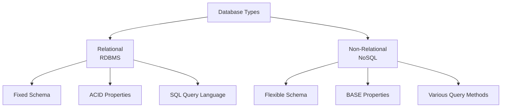
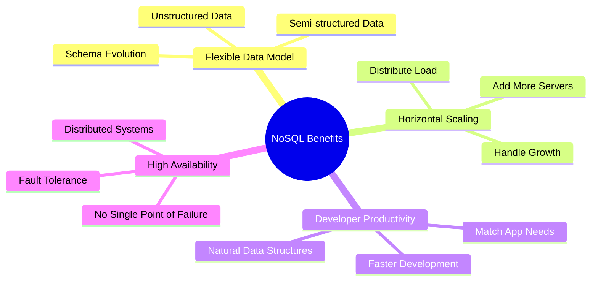
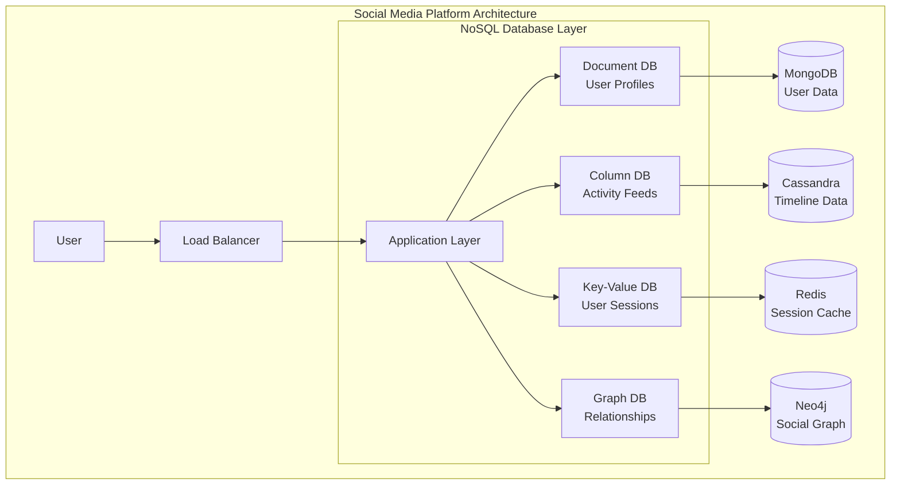
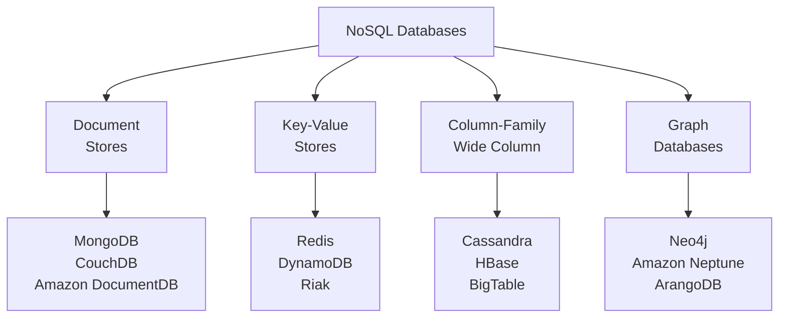

## Learning Objectives

After studying this content, you will be able to:

- ✅ Define the term NoSQL
- ✅ Describe NoSQL technology and its characteristics
- ✅ Understand the history of NoSQL in the database landscape
- ✅ List key reasons for using NoSQL databases

---

## What is NoSQL?

### Definition

> **NoSQL** stands for **"Not Only SQL"** (not "No SQL")

The term NoSQL describes a family of databases that:

- Vary widely in style and technology
- Share a common trait: **non-relational** in nature
- Are **not** standard row-and-column relational database management systems (RDBMS)

### Key Characteristics

| Feature | Traditional RDBMS | NoSQL |
|---------|------------------|-------|
| **Schema** | Fixed, predefined | Flexible, dynamic |
| **Scaling** | Vertical (scale up) | Horizontal (scale out) |
| **Data Model** | Relational tables | Document, Key-Value, Column, Graph |
| **ACID** | Full ACID compliance | Eventually consistent (BASE) |
| **Query Language** | SQL | Varies by database type |

---

## History of NoSQL Movement

### Timeline

```mermaid
gantt
    title NoSQL Evolution Timeline
    dateFormat X
    axisFormat %s

    section Relational Era
    RDBMS Dominance (Oracle, DB2, SQL Server)  :1970, 2000
    IBM IMS (Hierarchical)                     :1970, 2000

    section Internet Era
    Dot-com Boom & Scale Challenges           :1995, 2005
    Performance & Availability Critical       :1998, 2005

    section Innovation Period
    Google MapReduce Paper                     :2004, 2006
    Amazon Dynamo Paper                        :2007, 2008
    Open Source Movement                       :2000, 2010

    section NoSQL Emergence
    Apache Cassandra                          :2008, 2010
    MongoDB, CouchDB                          :2009, 2011
    Redis, Neo4j, HBase                       :2009, 2012

    section DBaaS Era
    IBM Cloudant                              :2010, 2025
    Amazon DynamoDB                           :2012, 2025
    Managed Services                          :2015, 2025
```

### Key Milestones

#### 1970-2000: Relational Database Era

- **Dominant Players**: Oracle, IBM DB2, Microsoft SQL Server, MySQL
- **Exception**: IBM IMS (hierarchical database used for Apollo missions)
- **Use Case**: Internal enterprise applications (thousands of users)

#### Late 1990s - Early 2000s: The Scale Challenge

- **Driver**: Dot-com boom and internet explosion
- **Challenge**: Scale from thousands to millions of users
- **Requirements**: High availability and performance

#### Innovation Period: Key White Papers

1. **Google MapReduce** - Processing large datasets on distributed systems
2. **Amazon Dynamo** - Distributed data and workload distribution with quorum architecture

#### Late 2000s: NoSQL Database Emergence

- **Apache Cassandra** - Wide-column store
- **MongoDB** - Document database
- **Redis** - Key-value store
- **Neo4j** - Graph database
- **CouchDB** - Document database
- **HBase** - Wide-column store

---

## Why Use NoSQL?

### Core Benefits

### 1. 🔄 Flexible Data Model

- Store **unstructured** or **semi-structured** data easily
- No fixed schema requirements
- Adapt to evolving use cases

### 2. 📈 Horizontal Scaling

- Add more capacity by adding servers
- Scale out rather than scale up
- Handle increasing data and traffic demands

### 3. 🚀 Developer Productivity

- Work with data structures that match application needs
- Faster development cycles
- Natural mapping between application objects and database storage

### 4. ⚡ High Availability & Fault Tolerance

- Distributed architecture
- Native fault tolerance
- Continue operating even when components fail

---

## Real-World Example: Social Media Platform

### Database Usage by Function

| Use Case | Database Type | Example | Purpose |
|----------|---------------|---------|---------|
| **User Profiles** | Document | MongoDB | Store complex user data with nested attributes |
| **Activity Feeds** | Column | Cassandra | Handle high-volume time-series data |
| **User Sessions** | Key-Value | Redis | Fast access to frequently used data |
| **Friend Networks** | Graph | Neo4j | Model and query relationships between users |

---

## NoSQL Database Types Overview

---

## Key Takeaways

### ✨ Summary Points

1. **NoSQL = "Not Only SQL"** - Family of non-relational databases
2. **Flexible Schema** - Adapt to changing requirements without migrations
3. **Horizontal Scaling** - Add servers to handle growth
4. **Distributed Architecture** - Built for fault tolerance and high availability
5. **Use Case Specific** - Different types for different needs
6. **Complementary** - Often used alongside relational databases

### 🎯 When to Consider NoSQL

- **Large Scale**: Millions of users, high traffic
- **Flexible Data**: Evolving or unstructured data models
- **High Availability**: 24/7 uptime requirements
- **Performance**: Sub-millisecond response times
- **Global Distribution**: Data across multiple regions

### 🤔 Trade-offs to Consider

- **Eventual Consistency** vs Strong Consistency
- **Learning Curve** for developers familiar with SQL
- **Tool Ecosystem** may be less mature than RDBMS
- **Data Modeling** requires different thinking patterns

---

## Database as a Service (DBaaS) Examples

| Provider | Service | Type | Key Features |
|----------|---------|------|--------------|
| **IBM** | Cloudant | Document | JSON storage, HTTP API, sync |
| **Amazon** | DynamoDB | Key-Value | Serverless, auto-scaling |
| **MongoDB** | Atlas | Document | Global clusters, built-in security |
| **Redis** | Enterprise Cloud | Key-Value | In-memory, real-time analytics |
| **Neo4j** | AuraDB | Graph | Managed graph database service |

---

*This document provides a comprehensive overview of NoSQL databases, their history, benefits, and practical applications in modern software architecture.*
