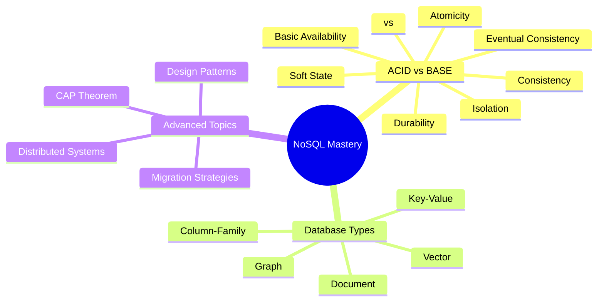
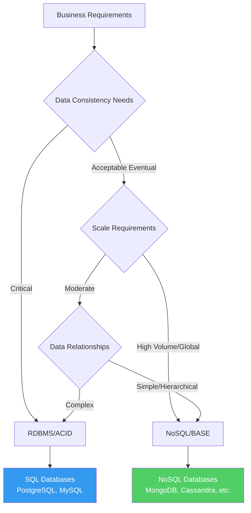
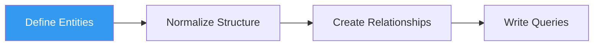
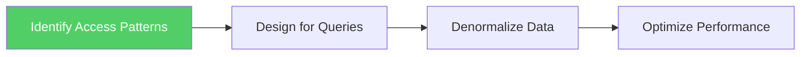
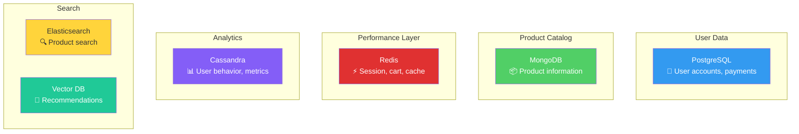

## 🎉 Congratulations on Completing Your NoSQL Journey!

You have successfully completed **Module-01: NoSQL Database Fundamentals**! This comprehensive module has equipped you with essential knowledge about NoSQL databases, their characteristics, types, and real-world applications.

---

## 🎯 Key Learning Achievements

### 🧬 Core Concepts Mastered

### 📚 What You've Learned

#### 🔬 **Database Theory & Models**

✅ **ACID Properties** - Atomicity, Consistency, Isolation, and Durability
- Understanding traditional relational database guarantees
- When strict consistency is critical (financial systems, transactions)
- Trade-offs between consistency and performance

✅ **BASE Model** - Basic Availability, Soft-state, and Eventual Consistency  
- NoSQL's alternative approach to data consistency
- Benefits of eventual consistency in distributed systems
- Use cases where BASE model excels

✅ **CAP Theorem** - Consistency, Availability, Partition Tolerance
- Understanding the fundamental trade-offs in distributed systems
- How to classify and choose NoSQL databases based on CAP priorities
- Real-world implications of network partitions

#### 🗄️ **Database Architecture & Distribution**

✅ **Distributed Database Concepts**
- Physical distribution across multiple data sites
- **Fragmentation**: Breaking large datasets into manageable pieces
- **Replication**: Creating copies for availability and fault tolerance
- Horizontal vs vertical scaling strategies

✅ **Partition Tolerance**
- Basic feature requirement for all NoSQL databases
- How systems handle network failures and split-brain scenarios
- Design patterns for maintaining operation during partitions

#### 🔧 **NoSQL Database Types & Applications**

✅ **Key-Value Stores** 
- Simple, high-performance data storage
- Use cases: Caching, session management, shopping carts
- Examples: Redis, DynamoDB, Riak

✅ **Document Databases**
- Flexible schema design for complex data structures  
- JSON/BSON document storage and querying
- Examples: MongoDB, CouchDB, Amazon DocumentDB

✅ **Column-Family Databases**
- Wide-column storage for analytical workloads
- Time-series data and big data analytics
- Examples: Cassandra, HBase, Amazon SimpleDB

✅ **Graph Databases**
- Relationship-focused data modeling
- Social networks, recommendation engines, fraud detection
- Examples: Neo4j, Amazon Neptune, ArangoDB

✅ **Vector Databases** 
- AI and machine learning applications
- Semantic search and similarity matching
- Examples: Pinecone, Chroma, Weaviate

#### ⚖️ **Strategic Decision Making**

✅ **When to Use NoSQL vs RDBMS**
- Performance and scalability requirements analysis
- Data structure and relationship complexity assessment
- Consistency requirements evaluation
- Team expertise and operational considerations

✅ **Migration Strategies**
- Understanding migration drivers and challenges
- Strangler Fig and Event Sourcing patterns
- Hybrid approaches and polyglot persistence
- Risk assessment and rollback planning

✅ **Design Patterns & Best Practices**
- Query-driven design for document databases
- Denormalization strategies and trade-offs
- Schema evolution and versioning approaches
- Performance optimization techniques

---

## 🎓 Core Principles Internalized

### 1. 🎯 **Technology Selection Framework**

### 2. 🔄 **NoSQL is NOT a Replacement**

> **🎯 Critical Understanding**: NoSQL systems are **not a de facto replacement** for RDBMS. They are complementary technologies that cater to different use cases.

**Modern Architecture Reality**:
- **Polyglot Persistence**: Using multiple database types in one application
- **Right Tool for the Job**: Each database type optimized for specific use cases  
- **Hybrid Solutions**: Combining RDBMS and NoSQL for optimal performance

### 3. ⚡ **Performance vs Consistency Trade-offs**

| **Aspect** | **RDBMS/ACID** | **NoSQL/BASE** |
|------------|----------------|----------------|
| **Consistency** | Immediate | Eventual |
| **Availability** | May be limited | High |
| **Partition Tolerance** | Limited | Built-in |
| **Scalability** | Vertical (scale up) | Horizontal (scale out) |
| **Performance** | Consistent | High throughput |
| **Use Cases** | Transactions, Analytics | Big Data, Real-time Apps |

---

## 🛠️ Practical Skills Developed

### 📋 **Database Evaluation Checklist**

When choosing a database technology, you can now systematically evaluate:

#### 🔍 **Requirements Analysis**
- [ ] **Data Volume**: Current size and growth projections
- [ ] **Query Patterns**: Read vs write ratios, complexity
- [ ] **Consistency Needs**: ACID vs eventual consistency acceptable
- [ ] **Scalability Requirements**: Geographic distribution, user load
- [ ] **Performance Targets**: Latency, throughput requirements

#### 🏗️ **Technical Considerations**  
- [ ] **Schema Flexibility**: How often data structure changes
- [ ] **Relationship Complexity**: Simple vs complex data relationships
- [ ] **Transaction Requirements**: Multi-document consistency needs
- [ ] **Integration Requirements**: Existing system compatibility
- [ ] **Operational Expertise**: Team skills and learning curve

#### 💰 **Business Factors**
- [ ] **Total Cost of Ownership**: Licensing, infrastructure, maintenance
- [ ] **Time to Market**: Development speed requirements
- [ ] **Risk Tolerance**: Acceptable downtime, data loss scenarios
- [ ] **Vendor Dependencies**: Open source vs proprietary solutions

### 🎯 **Migration Planning Framework**

You now understand how to approach database migrations:

1. **📊 Assessment Phase**: Analyze current pain points and requirements
2. **🎯 Strategy Selection**: Choose migration pattern (Strangler Fig, Event Sourcing, etc.)
3. **🧪 Proof of Concept**: Test with representative data and use cases
4. **📈 Gradual Rollout**: Incremental migration with rollback capabilities
5. **📋 Success Metrics**: Define and monitor key performance indicators

---

## 🌟 Advanced Concepts Explored

### 🧠 **Data Modeling Paradigm Shifts**

#### RDBMS Approach: Data-Centric Design

#### NoSQL Approach: Query-Centric Design  

### 🔬 **Emerging Technologies**

#### **Vector Databases & AI Integration**
- Understanding the role of vector databases in modern AI applications
- Semantic search and similarity matching capabilities
- Integration with Large Language Models (LLMs) and embeddings

#### **Hybrid and Multi-Model Approaches**
- Combining different NoSQL types in single solutions
- Graph + Document databases for complex applications
- Vector + Traditional search for enhanced user experiences

---

## 🎯 Real-World Application Scenarios

### 📱 **E-commerce Platform**

You can now design a complete e-commerce architecture:

### 🌐 **Social Media Application**

**Design Decisions You Can Make**:
- **User Profiles**: Document database (MongoDB) for flexible user data
- **Social Graph**: Graph database (Neo4j) for friend relationships  
- **Posts/Content**: Document database with denormalized user data
- **Real-time Feeds**: Column-family (Cassandra) for timeline data
- **Content Search**: Vector database for semantic content discovery

### 💰 **Financial Services**

**Hybrid Approach Strategy**:
- **Core Transactions**: RDBMS (PostgreSQL) for ACID compliance
- **Audit Logs**: Column-family (Cassandra) for immutable records
- **Risk Analytics**: Graph database for fraud detection patterns
- **Customer 360**: Document database for comprehensive profiles

---

## 🔮 Future Learning Paths

### 🎯 **Immediate Next Steps**

1. **📝 Hands-on Practice**
   - Set up local MongoDB, Redis, or Cassandra instances
   - Practice data modeling exercises for different use cases
   - Experiment with different query patterns

2. **🏗️ Architecture Projects**
   - Design database architectures for sample applications
   - Create migration plans for hypothetical scenarios
   - Build polyglot persistence proof-of-concepts

3. **📊 Performance Testing**
   - Benchmark different databases with realistic workloads
   - Test scalability scenarios and failure conditions
   - Measure consistency vs performance trade-offs

### 🚀 **Advanced Specialization Tracks**

#### **Cloud-Native Databases**
- Amazon DynamoDB, Azure Cosmos DB, Google Firestore
- Serverless database architectures
- Multi-region and global distribution strategies

#### **Big Data & Analytics**
- Apache Spark integration with NoSQL
- Real-time stream processing architectures  
- Data lake and data warehouse integration

#### **AI & Machine Learning Integration**
- Vector database optimization for ML workloads
- Feature stores and embedding management
- Real-time recommendation system architectures

#### **DevOps & Operations**
- Database monitoring and observability
- Backup and disaster recovery strategies
- Performance tuning and optimization

---

## 📋 Knowledge Validation

### ✅ **Self-Assessment Questions**

Test your understanding with these comprehensive questions:

1. **🎯 Scenario Analysis**: A startup is building a global chat application expecting 10M users. They need real-time messaging, user profiles, and friend connections. Design a database architecture and justify your choices.

2. **⚖️ Trade-off Evaluation**: Compare the pros and cons of using MongoDB vs PostgreSQL for a content management system with frequent schema changes and complex reporting requirements.

3. **🔄 Migration Strategy**: A legacy e-commerce system using MySQL is experiencing performance issues during peak shopping periods. Develop a migration strategy to NoSQL while maintaining data consistency for orders and payments.

4. **📊 CAP Analysis**: Classify Redis, MongoDB, and Cassandra according to CAP theorem. Explain how each handles network partitions and what consistency guarantees they provide.

5. **🎨 Design Challenge**: Design a data model for a music streaming service using both document and graph databases. Explain how you'd handle user playlists, song metadata, and recommendation algorithms.

### 🏆 **Mastery Indicators**

You've achieved mastery when you can:

- ✅ **Analyze Requirements** and choose appropriate database types
- ✅ **Design Data Models** optimized for specific access patterns  
- ✅ **Plan Migrations** with risk assessment and rollback strategies
- ✅ **Evaluate Trade-offs** between consistency, availability, and performance
- ✅ **Architect Solutions** using multiple database types effectively

---

## 🎊 Congratulations & Next Steps

### 🌟 **What You've Accomplished**

You've completed a comprehensive journey through the NoSQL database landscape:

- **🔬 Theoretical Foundation**: Deep understanding of database consistency models
- **🛠️ Practical Knowledge**: Hands-on experience with different NoSQL types
- **🎯 Strategic Thinking**: Framework for making database technology decisions
- **🚀 Future-Ready Skills**: Knowledge of emerging trends like vector databases

### 🎯 **Ready for Production**

You now have the knowledge to:
- **Design scalable database architectures** for modern applications
- **Lead migration projects** from legacy systems to NoSQL
- **Make informed technology choices** based on business requirements
- **Optimize performance** across different database paradigms

### 🚀 **Continue Your Journey**

**Module-02** awaits with advanced topics:
- **Hands-on Implementation**: Practical database setup and configuration
- **Performance Optimization**: Advanced tuning and monitoring techniques  
- **Production Operations**: Backup, recovery, and maintenance strategies
- **Integration Patterns**: Microservices and API design with NoSQL

---

## 📚 **Module-01 Learning Resources**

### 📖 **Completed Lessons**
1. ✅ Course Introduction and Overview
2. ✅ NoSQL Database Fundamentals  
3. ✅ Database Types and Characteristics
4. ✅ Key-Value, Document, Column, and Graph Databases
5. ✅ ACID vs BASE Consistency Models
6. ✅ Distributed Systems and CAP Theorem
7. ✅ Migration Strategies and Best Practices
8. ✅ Modern Trends: Vector Databases and AI Integration

### 🔗 **Cross-References**
- **[[04-overview-of-NoSQL]]** - Foundational concepts
- **[[15-CAP-Theorem]]** - Distributed systems theory
- **[[16-Challenges in Migrating from RDBMS to NoSQL Databases]]** - Migration strategies
- **[[18-Reading: Vector Databases]]** - Emerging AI technologies

---

**🎓 You are now ready to tackle real-world NoSQL challenges and design modern, scalable database architectures!**

*Proceed to Module-02 for hands-on implementation and advanced operational techniques.* 

