## Learning Objectives

After completing this content, you will be able to:

- ✅ Describe column-based NoSQL database architecture
- ✅ Understand technical advantages and disadvantages
- ✅ List suitable business use cases for column-based databases
- ✅ Compare column-based vs. row-oriented storage
- ✅ Identify popular column-based database implementations

---

## 📊 Column-Based Database Overview

### Origins: Google's Bigtable

Column-based databases spawned from **Google's Bigtable** architecture and are commonly referred to as:


### Alternative Names

| Term | Context | Usage |
|------|---------|-------|
| **Bigtable Clones** | Historical reference | Academic/technical |
| **Columnar Databases** | Storage focus | Data warehousing |
| **Wide-Column Databases** | Schema flexibility | NoSQL categorization |
| **Column-Family Stores** | Data organization | Database classification |

---

## 🏗️ Architecture and Data Model

### Core Architecture Concept

Column-based databases **focus on columns and groups of columns** when storing and accessing data.


### Column Families Structure


### Data Organization Principles

| Principle | Description | Benefit |
|-----------|-------------|---------|
| **Column Families** | Columns grouped together because they're accessed together | Improved query performance |
| **Unique Row Keys** | Each row has a unique identifier | Fast row-level access |
| **Sparse Data Support** | Rows don't need to share the same columns | Storage efficiency |
| **Dynamic Schema** | Columns can be added to some rows and not others | Schema flexibility |

---

## 🔄 Row-Based vs. Column-Based Storage

### Storage Comparison


### Performance Characteristics

| Aspect | Row-Based | Column-Based | Winner |
|--------|-----------|--------------|---------|
| **Read Full Record** | Fast | Slower | Row-Based |
| **Read Specific Columns** | Slower | Fast | Column-Based |
| **Compression** | Lower | Higher | Column-Based |
| **Analytics Queries** | Slower | Fast | Column-Based |
| **OLTP Workloads** | Optimized | Suboptimal | Row-Based |
| **OLAP Workloads** | Suboptimal | Optimized | Column-Based |

---

## ⚡ Technical Advantages

### 🎯 Key Benefits


#### 1. **Superior Data Compression**


#### 2. **Sparse Data Optimization**

```json
// Example: User Preferences (Sparse Data)
{
  "user_001": {
    "name": "John",
    "email": "john@example.com"
    // No age, location, or preferences
  },
  "user_002": {
    "name": "Jane",
    "email": "jane@example.com",
    "age": 30,
    "location": "New York",
    "preferences": {
      "theme": "dark",
      "notifications": true
    }
  }
}
```

#### 3. **Horizontal Scalability**


---

## ❌ Technical Disadvantages

### ⚠️ Limitations


### Detailed Limitations

| Limitation | Description | Impact | Mitigation |
|------------|-------------|---------|------------|
| **ACID Transactions** | Only atomic at row level | Limited transaction scope | Design around single-row operations |
| **Schema Evolution** | Changes can be costly early in development | Development delays | Plan schema carefully upfront |
| **Query Patterns** | Must be known in advance | Design constraints | Thorough requirements analysis |
| **Full Record Access** | Slower for complete row reads | Performance impact | Use when column-specific access needed |

---

## 🎯 Primary Use Cases

### ✅ Ideal Scenarios


---

## 🏢 Data Warehousing Applications

### Data Sources Integration


### E-commerce Query Example

**Scenario**: Display total price for all orders of product ID P101


**Benefits**:
- Only reads relevant columns (Product ID, Total Price)
- Ignores unnecessary data (Customer info, Order date, etc.)
- Faster query execution
- Reduced I/O operations

---

## 📊 Analytics and Business Intelligence

### OLAP Operations

**Online Analytical Processing (OLAP)** - analyzing data that doesn't change often


### Financial Analysis Example

```sql
-- Building histogram of insurance premiums paid last financial year
SELECT
    premium_range,
    COUNT(*) as policy_count,
    AVG(premium_amount) as avg_premium
FROM insurance_policies
WHERE payment_date BETWEEN '2023-04-01' AND '2024-03-31'
GROUP BY premium_range
ORDER BY premium_range;
```

**Column Database Advantage**:
- Reads only `premium_range`, `premium_amount`, and `payment_date` columns
- Ignores customer details, policy terms, and other irrelevant data
- Achieves 10x+ performance improvement over row-based storage

---

## 🌐 IoT Data Management

### IoT Data Characteristics


### Commercial Truck IoT Example


### IoT Data Storage Benefits

| Challenge | Column Database Solution | Result |
|-----------|-------------------------|---------|
| **Storage Space** | Superior compression for similar data types | 70-90% storage reduction |
| **Query Latency** | Column-specific access patterns | Sub-second query response |
| **Real-time Analysis** | Efficient aggregation operations | Near real-time insights |
| **Scalability** | Horizontal distribution across nodes | Linear scaling with data growth |

---

## 🔢 Counter and Time-Based Operations

### Counter Use Cases


### Cassandra Counter Example

```cql
-- Create counter table
CREATE TABLE page_views (
    page_id UUID,
    view_count COUNTER,
    PRIMARY KEY (page_id)
);

-- Increment counter
UPDATE page_views
SET view_count = view_count + 1
WHERE page_id = 123e4567-e89b-12d3-a456-426614174000;
```

### Time-To-Live (TTL) Features

```cql
-- Insert data with TTL (expires in 30 days)
INSERT INTO trial_data (user_id, feature_access, data)
VALUES (12345, true, 'trial_content')
USING TTL 2592000;

-- Insert ad data with 7-day expiration
INSERT INTO ad_campaigns (campaign_id, ad_content, active)
VALUES (67890, 'seasonal_promotion', true)
USING TTL 604800;
```

**TTL Applications**:
- **Trial Periods** - Automatic expiration of trial features
- **Ad Timing** - Campaign duration management
- **Cache Management** - Automatic cleanup of temporary data
- **Compliance** - Data retention policy enforcement

---

## 🚫 When NOT to Use Column-Based Databases

### Unsuitable Scenarios


### Detailed Anti-Patterns

#### 1. **Traditional ACID Transactions**

```sql
-- This type of operation is problematic in column databases
BEGIN TRANSACTION;
  UPDATE account SET balance = balance - 100 WHERE id = 'account_1';
  UPDATE account SET balance = balance + 100 WHERE id = 'account_2';
  INSERT INTO transaction_log VALUES ('transfer', 100, NOW());
COMMIT;
```

**Problem**: Reads and writes are only atomic at the **row level**

#### 2. **Evolving Query Patterns**


**Problem**: Column family design must be planned upfront based on known query patterns

---

## 🏢 Popular Implementations

### Major Column-Based Databases


### Vendor Comparison

| Database | Origin | Key Features | Best For |
|----------|--------|--------------|----------|
| **Apache Cassandra** | Facebook | High availability, linear scalability | Large-scale web applications |
| **HBase** | Apache/Google | Hadoop integration, consistent reads | Big data analytics with Hadoop |
| **Hypertable** | Open Source | High performance, C++ implementation | High-throughput applications |
| **Accumulo** | NSA/Apache | Cell-level security, BigTable clone | Secure government/enterprise |
| **Google Bigtable** | Google | Original design, fully managed | Google Cloud ecosystem |
| **Amazon DynamoDB** | Amazon | Serverless, auto-scaling | AWS applications, variable workloads |

### Performance Characteristics


---

## 🎯 Decision Framework

### When to Choose Column-Based Databases

```mermaid
flowchart TD
    A[Data Analysis Requirements] --> B{Large Dataset?}
    B -->|Yes| C{Column-Specific Queries?}
    B -->|No| D[Consider Other Options]

    C -->|Yes| E{Sparse Data?}
    C -->|No| F[Consider Row-Based]

    E -->|Yes| G{Known Query Patterns?}
    E -->|No| H[Consider Document DB]

    G -->|Yes| I[Column Database ✅]
    G -->|No| J[Plan Queries First]

    style I fill:#e8f5e8
```



### Selection Criteria Matrix

| Criteria | Column-Based Score | Notes |
|----------|-------------------|--------|
| **Analytics Workloads** | ⭐⭐⭐⭐⭐ | Excellent for OLAP operations |
| **Data Compression** | ⭐⭐⭐⭐⭐ | Superior compression ratios |
| **Sparse Data** | ⭐⭐⭐⭐⭐ | Handles sparse data efficiently |
| **Horizontal Scaling** | ⭐⭐⭐⭐⭐ | Linear scalability |
| **ACID Transactions** | ⭐⭐ | Row-level atomicity only |
| **Schema Flexibility** | ⭐⭐⭐ | Requires upfront planning |
| **Full Record Reads** | ⭐⭐ | Slower than row-based |

---

## 📋 Summary

### 🔑 Key Takeaways

1. **Google Bigtable Origin** - Spawned from Google's distributed storage system
2. **Column-Focused Storage** - Data organized in columns and column families
3. **Sparse Data Optimization** - Excellent for data with many optional fields
4. **Superior Compression** - Better compression ratios than row-based storage
5. **Horizontal Scalability** - Effective distribution across cluster nodes
6. **Row-Level Atomicity** - Transactions limited to single row operations

### 🎯 Best Use Cases

- **Data Warehousing** - OLAP operations and business intelligence
- **IoT Data Storage** - Time-series sensor data and device metrics
- **Event Logging** - Application logs and system events
- **Analytics Workloads** - Column-specific aggregations and reporting
- **Counter Systems** - Metrics tracking and usage statistics

### ⚠️ Avoid When

- **ACID Transactions** - Multi-row transaction requirements
- **Evolving Schemas** - Frequent schema changes during development
- **Unknown Query Patterns** - Uncertain access patterns
- **OLTP Workloads** - Transaction processing applications

### 🏆 Popular Choices

- **Apache Cassandra** - High availability, linear scalability
- **HBase** - Hadoop ecosystem integration
- **Google Bigtable** - Original implementation, fully managed
- **Amazon DynamoDB** - Serverless, auto-scaling capabilities

### 📊 Performance Benefits

- **10x+ faster** analytical queries compared to row-based storage
- **70-90% storage reduction** through superior compression
- **Linear scalability** to petabyte-scale datasets
- **Sub-second query response** for column-specific operations

---

*Column-based NoSQL databases excel in analytical workloads, data warehousing, and IoT applications where column-specific access patterns and superior compression provide significant performance advantages.*
