## Learning Objectives

After completing this content, you will be able to:

- ✅ Describe document-based NoSQL database architecture
- ✅ Understand how document databases build upon the Key-Value model
- ✅ Identify primary use cases for document databases
- ✅ Recognize when document databases are suitable vs. unsuitable
- ✅ List popular document database implementations

---

## 📄 Document Database Overview

### Evolution from Key-Value

Document databases **build off the Key-Value model** by making the **value visible and queryable**.


### Core Characteristics


---

## 🏗️ Architecture and Data Model

### Document Structure

Each piece of data is considered a **document** and typically stored in **JSON** or **XML** format.


### Schema Flexibility Example

```json
// User Document 1 - Basic Profile
{
  "_id": "user_001",
  "username": "john_doe",
  "email": "john@example.com",
  "created_at": "2023-01-15T10:30:00Z"
}

// User Document 2 - Extended Profile
{
  "_id": "user_002",
  "username": "jane_smith",
  "email": "jane@example.com",
  "created_at": "2023-02-20T14:45:00Z",
  "profile": {
    "firstName": "Jane",
    "lastName": "Smith",
    "bio": "Software developer passionate about NoSQL"
  },
  "preferences": {
    "theme": "dark",
    "notifications": true
  },
  "social_links": ["twitter.com/jane", "linkedin.com/in/jane"]
}
```

### Key Benefits

| Feature | Description | Benefit |
|---------|-------------|---------|
| **Flexible Schema** | No two documents need the same structure | Easy schema evolution |
| **Queryable Content** | Index and search document contents | Rich query capabilities |
| **JSON/XML Support** | Native format support | Web-friendly data exchange |
| **Horizontal Scaling** | Shard across multiple nodes | Handle large datasets |

---

## 🔍 Query Capabilities

### Query Types Supported


### Query Examples

#### 1. **Key Lookup**

```javascript
// Find document by ID
db.users.findOne({"_id": "user_001"})
```

#### 2. **Field-based Query**

```javascript
// Find users with specific email domain
db.users.find({"email": /.*@company\.com$/})
```

#### 3. **Range Query**

```javascript
// Find users created in the last month
db.users.find({
  "created_at": {
    "$gte": new Date("2023-09-01"),
    "$lt": new Date("2023-10-01")
  }
})
```

#### 4. **Nested Field Query**

```javascript
// Find users with dark theme preference
db.users.find({"preferences.theme": "dark"})
```

---

## 🎯 Primary Use Cases

### ✅ Ideal Scenarios


#### 1. 📊 Event Logging

**Use Case**: Application and process event logging

```json
{
  "_id": "event_12345",
  "event_type": "user_login",
  "timestamp": "2023-10-21T09:15:30Z",
  "user_id": "user_001",
  "session_id": "sess_abc123",
  "source": {
    "ip_address": "192.168.1.100",
    "user_agent": "Mozilla/5.0...",
    "platform": "web"
  },
  "metadata": {
    "login_method": "oauth",
    "provider": "google",
    "location": "New York, US"
  }
}
```

**Benefits**:

- Each event as independent document
- Flexible schema for different event types
- Easy to add new event properties
- Efficient querying and analytics

#### 2. 📝 Online Blogging Platform


**Document Examples**:

```json
// Post Document
{
  "_id": "post_789",
  "title": "Getting Started with Document Databases",
  "content": "Document databases are a powerful...",
  "author": {
    "user_id": "user_001",
    "username": "john_doe"
  },
  "published_at": "2023-10-21T08:00:00Z",
  "tags": ["nosql", "databases", "tutorial"],
  "metrics": {
    "views": 1250,
    "likes": 45,
    "comments": 12
  },
  "seo": {
    "meta_description": "Learn about document databases...",
    "slug": "getting-started-document-databases"
  }
}

// Comment Document
{
  "_id": "comment_456",
  "post_id": "post_789",
  "author": {
    "user_id": "user_002",
    "username": "jane_smith"
  },
  "content": "Great explanation! Very helpful.",
  "created_at": "2023-10-21T10:30:00Z",
  "parent_comment": null,
  "status": "approved"
}
```

#### 3. 🌐 Web and Mobile Applications

**Operational Datasets**: User profiles, preferences, application state

```json
{
  "_id": "user_profile_123",
  "user_id": "usr_123",
  "profile": {
    "display_name": "Alex Chen",
    "avatar_url": "https://cdn.example.com/avatars/123.jpg",
    "bio": "Full-stack developer and coffee enthusiast"
  },
  "settings": {
    "language": "en",
    "timezone": "America/New_York",
    "privacy": {
      "profile_visibility": "public",
      "email_notifications": true,
      "push_notifications": false
    }
  },
  "activity": {
    "last_login": "2023-10-21T14:20:00Z",
    "login_count": 247,
    "favorite_categories": ["technology", "programming", "design"]
  },
  "subscription": {
    "plan": "premium",
    "expires_at": "2024-10-21T00:00:00Z",
    "features": ["advanced_search", "export_data", "priority_support"]
  }
}
```

---

## 🔧 Technical Characteristics

### Scalability and Sharding


### Sharding Strategies

| Strategy | Method | Best For | Example |
|----------|---------|----------|---------|
| **Range-based** | Document key ranges | Sequential access | user_001 to user_500 |
| **Hash-based** | Hash function on key | Even distribution | Hash(user_id) % 3 |
| **Geographic** | Location-based sharding | Global applications | US, EU, ASIA regions |
| **Feature-based** | Functional boundaries | Multi-tenant apps | tenant_id based |

### Transaction Limitations

```mermaid
graph LR
    A[Transaction Scope] --> B[Single Document]
    A --> C[Multiple Documents]

    B --> B1[ACID Guaranteed ✅]
    C --> C1[Limited Support ⚠️]

    B1 --> B2[Atomic Operations]
    C1 --> C2[Eventual Consistency]
```



---

## ❌ When NOT to Use Document Databases

### Unsuitable Scenarios


### Detailed Anti-Patterns

#### 1. 🚫 Multi-Document ACID Transactions

**Problem**: Document databases typically only guarantee **atomic transactions on single document operations**.

```javascript
// This is problematic in document databases
// Transfer money between accounts (requires ACID across documents)
start_transaction();
  debit_account("account_123", 100);   // Document 1
  credit_account("account_456", 100);  // Document 2
commit_transaction();
```

**Better Alternative**: Relational databases with full ACID support

#### 2. 🚫 Forcing Aggregate-Oriented Design

**Problem**: When data naturally fits a normalized/tabular model

```json
// Forced denormalization - poor design
{
  "_id": "order_789",
  "customer": {
    "id": "cust_123",
    "name": "John Doe",
    "email": "john@example.com",
    "address": "123 Main St"  // Duplicated across orders
  },
  "products": [
    {
      "id": "prod_456",
      "name": "Laptop",
      "price": 999.99,
      "description": "..."  // Duplicated across orders
    }
  ]
}
```

**Better Alternative**: Normalized relational tables

#### 3. 🚫 Complex Relational Queries

**Problem**: Document databases lack efficient JOIN operations

```sql
-- Complex query better suited for SQL
SELECT u.name, p.title, COUNT(c.id) as comment_count
FROM users u
JOIN posts p ON u.id = p.author_id
JOIN comments c ON p.id = c.post_id
WHERE u.created_at > '2023-01-01'
GROUP BY u.id, p.id
HAVING comment_count > 10;
```

---

## 🏢 Popular Implementations

### Major Document Database Vendors


### Vendor Comparison

| Vendor | Type | Key Features | Best For |
|--------|------|--------------|----------|
| **MongoDB** | Open Source | Rich query language, aggregation | General purpose, web apps |
| **IBM Cloudant** | Cloud Service | HTTP API, sync capabilities | Mobile, IoT applications |
| **Apache CouchDB** | Open Source | RESTful API, map-reduce | Offline-first applications |
| **Couchbase** | Commercial | In-memory caching, N1QL | High-performance applications |
| **Amazon DocumentDB** | Managed Service | MongoDB-compatible | AWS ecosystem integration |
| **RavenDB** | Commercial | .NET integration, ACID | Windows-based applications |
| **OrientDB** | Open Source | Multi-model (document+graph) | Complex data relationships |

### Market Position


---

## 📊 Design Patterns and Best Practices

### Document Design Patterns

#### 1. **Embedding Pattern**

```json
{
  "_id": "user_123",
  "name": "John Doe",
  "addresses": [
    {
      "type": "home",
      "street": "123 Main St",
      "city": "New York",
      "zipcode": "10001"
    },
    {
      "type": "work",
      "street": "456 Business Ave",
      "city": "New York",
      "zipcode": "10002"
    }
  ]
}
```

**When to Use**: One-to-many relationships, read-heavy workloads

#### 2. **Reference Pattern**

```json
// User Document
{
  "_id": "user_123",
  "name": "John Doe",
  "order_ids": ["order_456", "order_789"]
}

// Order Documents
{
  "_id": "order_456",
  "user_id": "user_123",
  "total": 99.99,
  "items": [...]
}
```

**When to Use**: Many-to-many relationships, write-heavy workloads

#### 3. **Hybrid Pattern**

```json
{
  "_id": "blog_post_123",
  "title": "Document Database Guide",
  "content": "...",
  "author": {
    "id": "user_456",
    "name": "Jane Smith"  // Embedded for performance
  },
  "comment_ids": ["comment_789", "comment_101"]  // Referenced for flexibility
}
```

---

## 🎯 Decision Framework

### When to Choose Document Databases

```mermaid
flowchart TD
    A[Data Structure] --> B{Semi-structured?}
    B -->|Yes| C{Schema Flexibility Needed?}
    B -->|No| D[Consider Relational DB]

    C -->|Yes| E{Query Requirements?}
    C -->|No| F[Consider Key-Value]

    E -->|Complex| G{ACID Across Documents?}
    E -->|Simple| H[Document Database ✅]

    G -->|Yes| I[Consider Relational DB]
    G -->|No| H

    style H fill:#e8f5e8
```



### Selection Criteria

| Criteria | Document DB Score | Notes |
|----------|------------------|--------|
| **Schema Flexibility** | ⭐⭐⭐⭐⭐ | Excellent for evolving schemas |
| **Query Richness** | ⭐⭐⭐⭐ | Good indexing and search capabilities |
| **Horizontal Scaling** | ⭐⭐⭐⭐ | Effective sharding strategies |
| **ACID Transactions** | ⭐⭐ | Limited to single documents |
| **Complex Relationships** | ⭐⭐ | Requires careful design patterns |
| **Performance** | ⭐⭐⭐⭐ | Fast for document-based operations |

---

## 📋 Summary

### 🔑 Key Takeaways

1. **Enhanced Key-Value Model** - Makes values visible and queryable
2. **Flexible Schema** - Documents can have different structures
3. **JSON/XML Format** - Web-friendly data representation
4. **Rich Querying** - Index and search document contents
5. **Horizontal Scaling** - Effective sharding capabilities
6. **Single Document ACID** - Atomic operations per document only

### 🎯 Best Use Cases

- **Event Logging** - Application and process events
- **Content Management** - Blogging, CMS platforms
- **Web Applications** - User profiles, operational data
- **Mobile Backends** - App data storage and sync
- **Real-time Analytics** - Operational datasets

### ⚠️ Avoid When

- **Multi-document ACID** - Complex transactions across documents
- **Normalized Models** - Data fits traditional table structures
- **Complex Joins** - Heavy relational query requirements
- **Strict Consistency** - Immediate consistency requirements

### 🏆 Popular Choices

- **MongoDB** - Most widespread, rich ecosystem
- **IBM Cloudant** - Cloud service, mobile-friendly
- **Apache CouchDB** - Open source, offline capabilities
- **Amazon DocumentDB** - Managed MongoDB-compatible service

### 📈 Market Position

Document databases are currently the **most widespread** of the NoSQL database categories in use today, designed with the **internet in mind** - thinking JSON, RESTful APIs, and unstructured data.

---

*Document-based NoSQL databases excel in scenarios requiring flexible schemas, rich querying capabilities, and web-friendly data formats while maintaining horizontal scalability.*
