## Learning Objectives

After completing this content, you will be able to:

- ✅ Describe Graph NoSQL database architecture
- ✅ Understand how graph databases differ from other NoSQL types
- ✅ Identify primary use cases for graph databases
- ✅ Recognize when graph databases are suitable vs. unsuitable
- ✅ List popular graph database implementations

---

## 🕸️ Graph Database Overview

### Unique Position in NoSQL Landscape

Graph databases are the **last NoSQL category** we'll discuss and **stand apart** from the previous three types because they **don't follow common NoSQL traits**.

```mermaid
graph TB
    A[NoSQL Databases] --> B[Key-Value]
    A --> C[Document]
    A --> D[Column-Family]
    A --> E[Graph]

    B --> B1[Simple Structure]
    C --> C1[Flexible Schema]
    D --> D1[Column-Oriented]
    E --> E1[Relationship-Focused]

    B --> B2[Horizontal Scaling ✅]
    C --> C2[Horizontal Scaling ✅]
    D --> D2[Horizontal Scaling ✅]
    E --> E2[Vertical Scaling ⚠️]

    B --> B3[Eventual Consistency]
    C --> C3[Eventual Consistency]
    D --> D3[Eventual Consistency]
    E --> E3[ACID Compliance ✅]

    style E fill:#ffe6e6
    style E1 fill:#ffe6e6
    style E2 fill:#ffe6e6
    style E3 fill:#ffe6e6
```



### Key Differentiators

| Characteristic | Other NoSQL Types | Graph Databases |
|----------------|------------------|-----------------|
| **Scaling** | Horizontal scaling ✅ | Vertical scaling preferred ⚠️ |
| **Consistency** | Eventual consistency | ACID compliance ✅ |
| **Data Model** | Aggregate-oriented | Relationship-oriented |
| **Sharding** | Easy to shard | Not recommended ❌ |
| **Traversal** | Limited relationships | Efficient graph traversal ⚡ |

---

## 🏗️ Architecture and Data Model

### Core Components

Graph databases store information in:


#### **Entities (Nodes)**
- Represent data objects (users, products, locations)
- Contain properties and attributes
- Can have multiple labels/types

#### **Relationships (Edges)**
- Connect entities together
- Have direction and type
- Can contain properties
- First-class citizens in the data model

### Graph Structure Example


### Property Graph Model

```json
// Node Example
{
  "id": "user_123",
  "labels": ["User", "Customer"],
  "properties": {
    "name": "Alice Johnson",
    "email": "alice@example.com",
    "age": 28,
    "joinDate": "2023-01-15"
  }
}

// Relationship Example
{
  "id": "rel_456",
  "type": "FOLLOWS",
  "startNode": "user_123",
  "endNode": "user_789",
  "properties": {
    "since": "2023-03-20",
    "strength": "strong"
  }
}
```

---

## ⚡ Graph Database Advantages

### 🎯 Core Strengths


#### 1. **Efficient Graph Traversal**

Graph databases excel when your dataset **resembles a graph-like data structure**:

```mermaid
graph LR
    A[Start Node] --> B[Hop 1]
    B --> C[Hop 2]
    C --> D[Hop 3]

    A --> E[Direct Path]
    E --> D

    note1[Traversal Speed:<br/>O(log n) or O(1)<br/>vs O(n²) in relational]
```

#### 2. **ACID Transaction Compliance**

Unlike other NoSQL databases, graph databases maintain **ACID properties**:


**Benefit**: Prevents dangling relationships between nodes that don't exist.

#### 3. **Natural Data Modeling**


---

## ❌ Graph Database Limitations

### ⚠️ Key Challenges


#### 1. **Horizontal Scaling Challenges**


**Issue**: Sharding a graph database is **not recommended** since traversing graphs with nodes split across multiple servers becomes difficult and hurts performance.

#### 2. **Bulk Update Limitations**


**Challenge**: Updating all or a subset of nodes with a given parameter can prove difficult and non-trivial.

---

## 🎯 Primary Use Cases

### ✅ Ideal Scenarios

Graph databases are **very powerful** when your data is **highly connected and related**.


---

## 👥 Social Networking Applications

### Social Graph Structure


### Common Social Queries

```cypher
// Find friends of friends (2nd degree connections)
MATCH (user:User {name: 'Alice'})-[:FRIENDS_WITH]->(friend)-[:FRIENDS_WITH]->(fof)
WHERE fof <> user
RETURN DISTINCT fof.name

// Find popular posts among friends
MATCH (user:User {name: 'Alice'})-[:FRIENDS_WITH]->(friend)-[:LIKES]->(post:Post)
RETURN post.title, COUNT(friend) as likes
ORDER BY likes DESC
LIMIT 10

// Suggest new friends (friends of friends who aren't already friends)
MATCH (user:User {name: 'Alice'})-[:FRIENDS_WITH]->(friend)-[:FRIENDS_WITH]->(suggestion)
WHERE NOT (user)-[:FRIENDS_WITH]->(suggestion) AND suggestion <> user
RETURN suggestion.name, COUNT(friend) as mutual_friends
ORDER BY mutual_friends DESC
```

**Benefits**:
- **Quick friend discovery**: Find friends, friends of friends, mutual connections
- **Content recommendations**: Identify popular posts among connections
- **Social analytics**: Analyze influence patterns and network effects

---

## 🗺️ Routing, Spatial, and Map Applications

### Geographic Graph Model


### Shortest Path Algorithms

```cypher
// Find shortest route between two cities
MATCH path = shortestPath(
    (start:City {name: 'New York'})-[*]-(end:City {name: 'Miami'})
)
RETURN path, length(path) as hops

// Find shortest path by distance
MATCH path = (start:City {name: 'New York'})-[roads*]-(end:City {name: 'Miami'})
RETURN path, reduce(distance = 0, r in roads | distance + r.miles) as total_distance
ORDER BY total_distance ASC
LIMIT 1

// Find all routes under 8 hours
MATCH path = (start:City {name: 'New York'})-[roads*]-(end:City {name: 'Miami'})
WHERE reduce(time = 0, r in roads | time + r.hours) <= 8
RETURN path, reduce(time = 0, r in roads | time + r.hours) as total_time
```

**Applications**:
- **Navigation systems**: GPS routing and directions
- **Logistics optimization**: Delivery route planning
- **Transportation networks**: Public transit systems
- **Supply chain**: Warehouse and distribution optimization

---

## 🛒 Recommendation Engines

### Product Relationship Graph


### Recommendation Queries

```cypher
// Products frequently bought together
MATCH (product:Product {name: 'Laptop'})-[:FREQUENTLY_BOUGHT_WITH]->(recommended)
RETURN recommended.name, recommended.price

// Users who bought this also bought
MATCH (target:Product {name: 'Laptop'})<-[:PURCHASED]-(user)-[:PURCHASED]->(other:Product)
WHERE other <> target
RETURN other.name, COUNT(user) as popularity
ORDER BY popularity DESC
LIMIT 5

// Collaborative filtering
MATCH (user:User {id: 123})-[:PURCHASED]->(product)<-[:PURCHASED]-(similar_user)
MATCH (similar_user)-[:PURCHASED]->(recommendation)
WHERE NOT (user)-[:PURCHASED]->(recommendation)
RETURN recommendation.name, COUNT(similar_user) as score
ORDER BY score DESC
```

**Recommendation Types**:
- **Collaborative filtering**: Users with similar preferences
- **Content-based**: Similar product attributes
- **Cross-selling**: Frequently bought together
- **Trend analysis**: Popular among similar users

---

## 🚫 When NOT to Use Graph Databases

### Unsuitable Scenarios


### Detailed Anti-Patterns

#### 1. **Large-Scale Horizontal Requirements**


**Problem**: When applications need to scale horizontally, you'll quickly reach the limitations of graph databases.

#### 2. **Mass Update Operations**

```cypher
-- This type of operation is challenging in graph databases
MATCH (user:User)
WHERE user.region = 'US'
SET user.gdpr_compliant = true

-- Updating millions of nodes can be:
-- - Slow and resource intensive
-- - Difficult to parallelize
-- - May require special tooling
```

**Alternative**: Consider document or column-family databases for bulk operations.

---

## 🏢 Popular Implementations

### Major Graph Database Vendors


### Vendor Comparison

| Database | Type | Key Features | Best For |
|----------|------|--------------|----------|
| **Neo4j** | Native Graph | Cypher query language, ACID | Social networks, recommendations |
| **Amazon Neptune** | Cloud Service | Gremlin & SPARQL, fully managed | AWS ecosystem, RDF graphs |
| **OrientDB** | Multi-Model | Document + Graph, SQL-like | Hybrid document-graph needs |
| **ArangoDB** | Multi-Model | Document + Graph + Key-Value | Flexible data modeling |
| **JanusGraph** | Distributed | Horizontally scalable, Apache | Large-scale graph processing |
| **Apache Giraph** | Processing | Bulk graph processing, Hadoop | Analytics and computation |

### Query Language Support

| Database | Primary Language | Alternative Languages |
|----------|-----------------|----------------------|
| **Neo4j** | Cypher | Gremlin |
| **Amazon Neptune** | Gremlin | SPARQL |
| **JanusGraph** | Gremlin | - |
| **OrientDB** | SQL | Gremlin |
| **ArangoDB** | AQL | - |

---

## 📊 Performance Characteristics

### Graph vs. Relational Performance


### Performance Metrics

| Operation | Relational DB | Graph DB | Winner |
|-----------|---------------|----------|---------|
| **Single Record Lookup** | O(log n) | O(log n) | Tie |
| **2-Hop Relationship** | O(n²) via JOIN | O(1) traversal | Graph |
| **Deep Traversal (5+ hops)** | Exponential | Linear | Graph |
| **Bulk Updates** | Fast | Slow | Relational |
| **Aggregations** | Fast | Moderate | Relational |

---

## 🎯 Decision Framework

### When to Choose Graph Databases

```mermaid
flowchart TD
    A[Data Characteristics] --> B{Highly Connected?}
    B -->|Yes| C{Relationship Queries?}
    B -->|No| D[Consider Other NoSQL]

    C -->|Yes| E{ACID Requirements?}
    C -->|No| F[Consider Document DB]

    E -->|Yes| G{Horizontal Scale Needs?}
    E -->|No| H[Consider Key-Value]

    G -->|No| I[Graph Database ✅]
    G -->|Yes| J[Consider Distributed Graph]

    style I fill:#e8f5e8
```



### Selection Criteria

| Criteria | Graph Database Score | Notes |
|----------|---------------------|--------|
| **Relationship Queries** | ⭐⭐⭐⭐⭐ | Excellent for traversal operations |
| **ACID Compliance** | ⭐⭐⭐⭐⭐ | Full ACID transaction support |
| **Complex Queries** | ⭐⭐⭐⭐⭐ | Pattern matching and path finding |
| **Horizontal Scaling** | ⭐⭐ | Challenging to shard effectively |
| **Bulk Operations** | ⭐⭐ | Difficult mass updates |
| **Simple Lookups** | ⭐⭐⭐ | Good but not optimized for this |

---

## 📋 Summary

### 🔑 Key Takeaways

1. **Relationship-Focused** - Store information in entities (nodes) and relationships (edges)
2. **ACID Compliance** - Unlike other NoSQL types, maintains full ACID properties
3. **Efficient Traversal** - Impressive performance when data resembles graph structures
4. **Scaling Limitations** - Don't shard well, prefer vertical scaling
5. **Connected Data** - Powerful for highly connected and related datasets

### 🎯 Best Use Cases

- **Social Networks** - Friend connections, social graphs, influence analysis
- **Routing & Maps** - Shortest paths, navigation, spatial relationships
- **Recommendation Engines** - Product relationships, collaborative filtering
- **Fraud Detection** - Pattern analysis, network relationships
- **Knowledge Graphs** - Entity relationships, semantic networks

### ⚠️ Avoid When

- **Horizontal Scaling** - Applications requiring massive horizontal scale
- **Bulk Operations** - ETL processes, mass data updates
- **Simple Storage** - Key-value or document storage needs
- **Analytics Workloads** - OLAP operations, data warehousing

### 🏆 Popular Choices

- **Neo4j** - Leading native graph database with Cypher
- **Amazon Neptune** - Fully managed cloud service
- **OrientDB** - Multi-model database with graph capabilities
- **ArangoDB** - Multi-model approach with flexible querying

### 🚀 Performance Benefits

- **Sub-second traversal** for complex relationship queries
- **Linear performance** for deep graph operations vs. exponential in relational
- **Natural modeling** aligns with real-world relationship structures
- **ACID guarantees** prevent data inconsistencies

---

*Graph NoSQL databases excel in scenarios with highly connected data where relationship traversal and pattern matching are primary requirements, offering unique ACID compliance among NoSQL options.*
