## Learning Objectives

After completing this content, you will be able to:

- ✅ List the four main categories of NoSQL databases
- ✅ Describe Key-Value NoSQL database architecture
- ✅ Identify primary use cases for Key-Value databases
- ✅ Understand when to choose Key-Value over other NoSQL types
- ✅ Recognize popular Key-Value database implementations

---

## NoSQL Database Categories Overview

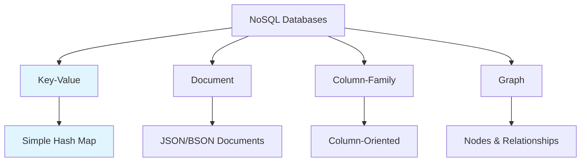

### The Four Main Categories

| Category | Primary Structure | Best For | Complexity |
|----------|------------------|----------|------------|
| **Key-Value** | Hash Map | Simple CRUD operations | Lowest |
| **Document** | JSON/BSON | Semi-structured data | Low-Medium |
| **Column-Family** | Column-oriented | Time-series, analytics | Medium |
| **Graph** | Nodes & edges | Relationships | Highest |

---

## 🔑 Key-Value Database Architecture

### Core Concept

Key-Value databases store all data with a **key** and an associated **value blob**. They are the **least complex** of NoSQL databases architecturally.

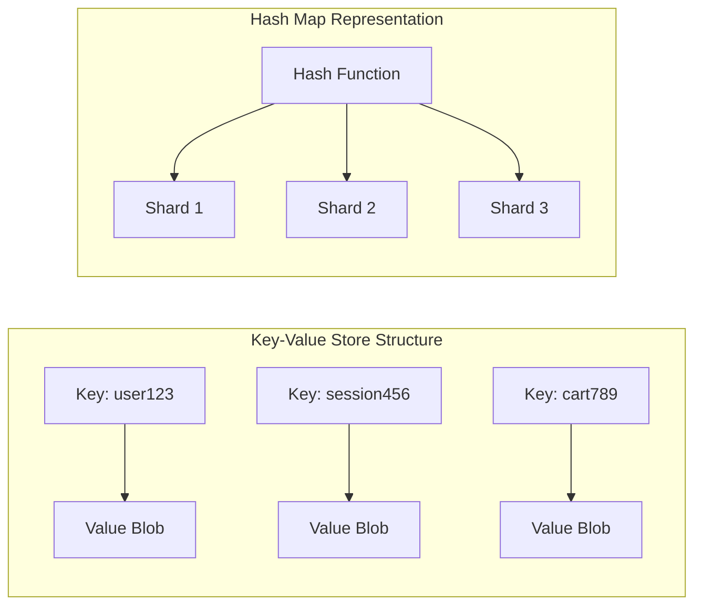

### Architecture Characteristics

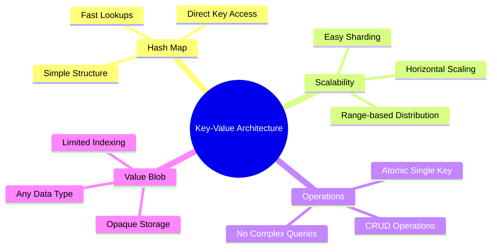

---

## 🏗️ Technical Architecture

### Data Storage Model

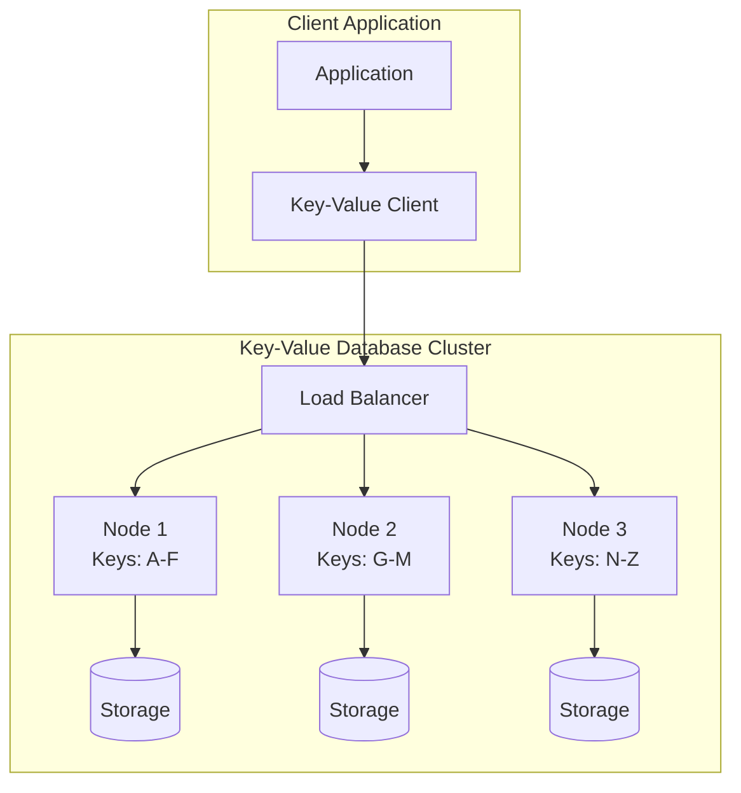

### Sharding Strategy

| Sharding Method | Description | Benefits | Use Cases |
|----------------|-------------|----------|-----------|
| **Range-based** | Keys divided by ranges | Simple, predictable | Sequential keys |
| **Hash-based** | Hash function determines shard | Even distribution | Random keys |
| **Directory-based** | Lookup service for key location | Flexible | Complex routing |

---

## ⚡ Key Characteristics

### ✅ Strengths

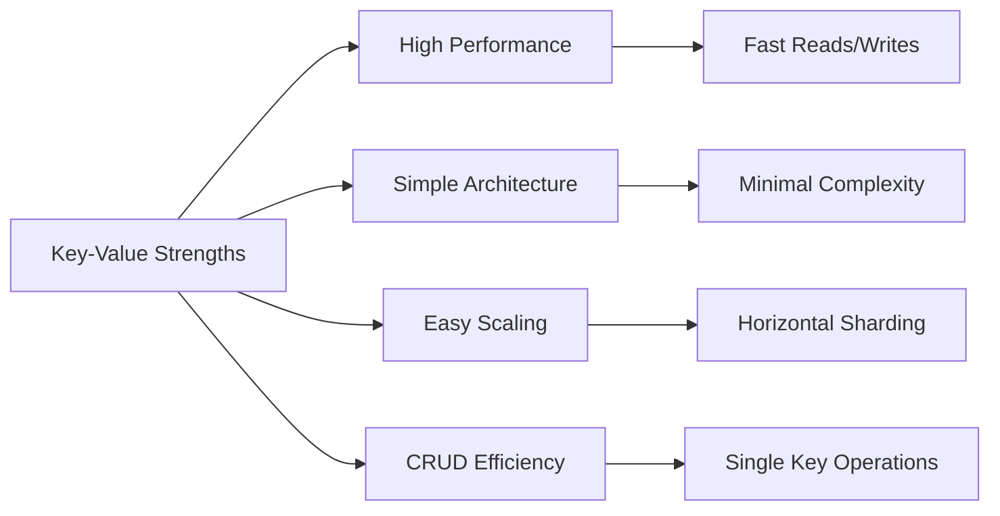

| Strength | Description | Impact |
|----------|-------------|---------|
| **High Performance** | Optimized for basic CRUD operations | Sub-millisecond response |
| **Scalability** | Easy to shard across multiple nodes | Linear scaling |
| **Simplicity** | Minimal architectural complexity | Easy to manage |
| **Atomicity** | Single key operations are atomic | Data consistency |

### ❌ Limitations

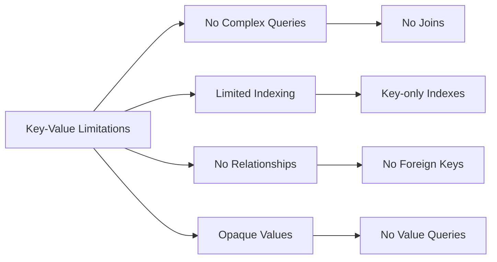

| Limitation | Description | Impact |
|------------|-------------|---------|
| **Complex Queries** | Cannot join or connect multiple keys | Limited query flexibility |
| **Value Opacity** | Cannot query based on value content | Reduced searchability |
| **Relationships** | No built-in relationship handling | Poor for interconnected data |
| **Multi-key Transactions** | Limited ACID across multiple keys | Consistency challenges |

---

## 🎯 Primary Use Cases

### ✅ Ideal Scenarios

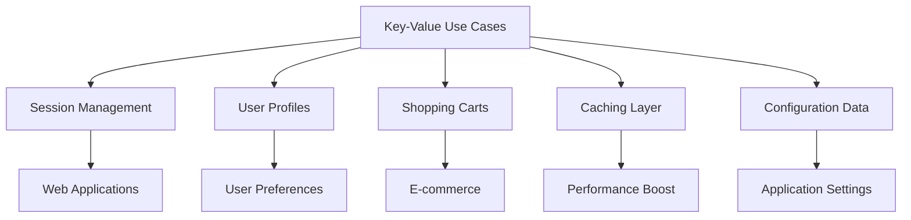

#### 1. 🌐 Session Management

**Use Case**: Web application user sessions

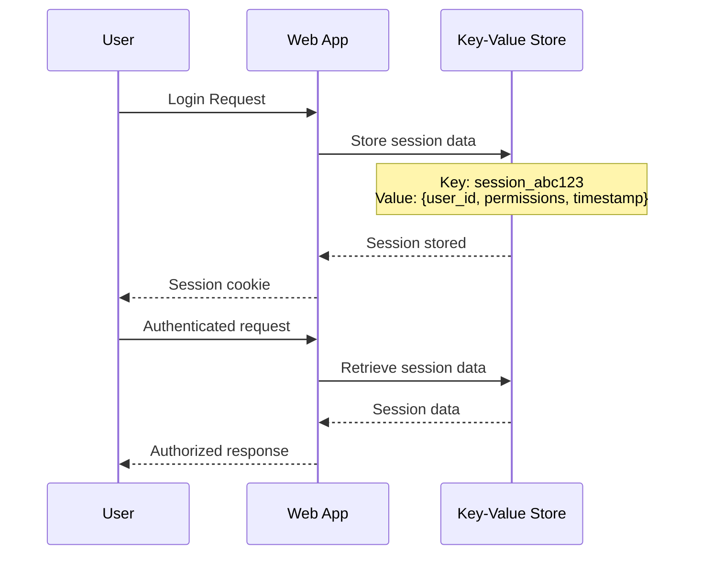

**Benefits**:
- Fast session lookup by session ID
- No complex relationships needed
- Easy horizontal scaling
- Simple expiration handling

#### 2. 👤 User Profiles and Preferences

**Use Case**: Storing user-specific application data

```json
{
  "key": "user_profile_12345",
  "value": {
    "name": "John Doe",
    "preferences": {
      "theme": "dark",
      "language": "en",
      "notifications": true
    },
    "settings": {
      "timezone": "UTC-5",
      "privacy_level": "medium"
    },
    "last_login": "2023-10-21T10:30:00Z"
  }
}
```

#### 3. 🛒 Shopping Cart Data

**Use Case**: E-commerce shopping cart storage

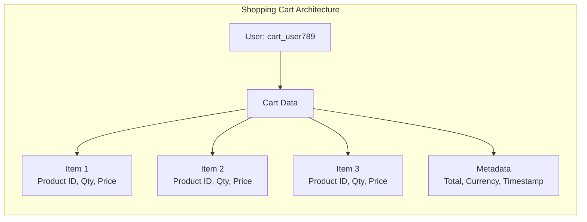

#### 4. 🚀 Caching Layer

**Use Case**: High-performance data caching

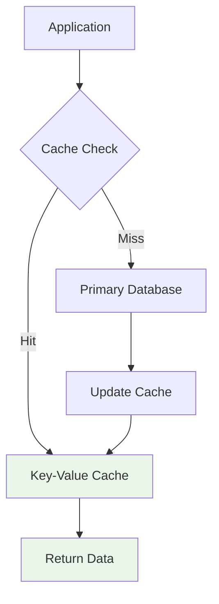

### ❌ Unsuitable Scenarios

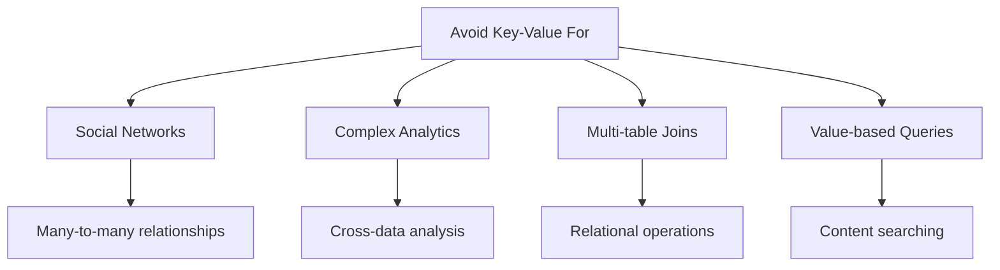

#### When NOT to Use Key-Value

| Scenario | Why Not Suitable | Better Alternative |
|----------|------------------|-------------------|
| **Social Networks** | Complex interconnected relationships | Graph databases |
| **Recommendation Engines** | Need to analyze patterns across data | Graph or Document |
| **Multi-key Transactions** | ACID requirements across keys | Relational databases |
| **Value-based Queries** | Need to search within value content | Document databases |

---

## 🏢 Popular Implementations

### Major Vendors and Solutions

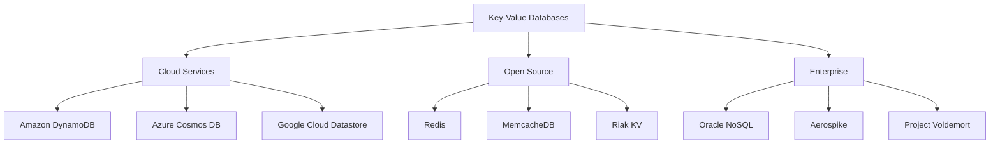

### Detailed Vendor Comparison

| Vendor | Type | Key Features | Best For |
|--------|------|--------------|----------|
| **Amazon DynamoDB** | Managed Cloud | Auto-scaling, serverless | Web applications, IoT |
| **Redis** | In-Memory | Ultra-fast, data structures | Caching, real-time apps |
| **Oracle NoSQL** | Enterprise | ACID transactions, SQL support | Enterprise applications |
| **Aerospike** | High-Performance | Sub-millisecond latency | Real-time analytics |
| **Riak KV** | Distributed | High availability, fault tolerance | Mission-critical systems |
| **MemcacheDB** | Persistent Cache | Berkeley DB backend | Persistent caching |
| **Project Voldemort** | Distributed | LinkedIn-developed | High-volume web services |

### Performance Characteristics

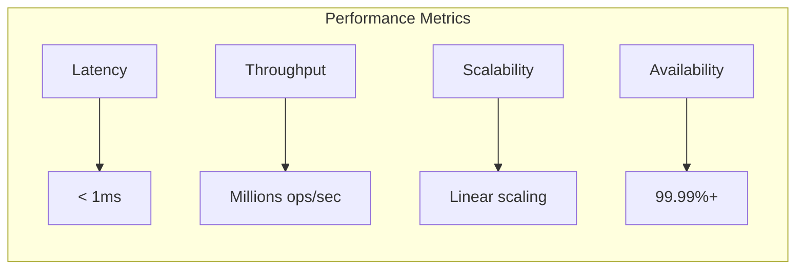

---

## 🔧 Implementation Considerations

### Design Patterns

#### 1. **Key Design Strategies**

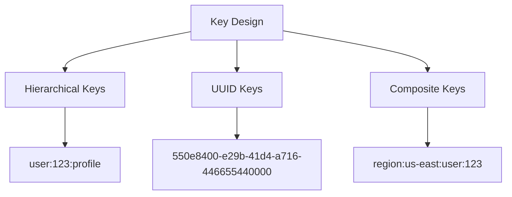

#### 2. **Value Structure Patterns**

| Pattern | Structure | Use Case | Example |
|---------|-----------|----------|---------|
| **Simple Value** | Single data type | Basic storage | `"John Doe"` |
| **JSON Object** | Structured data | Complex entities | `{"name": "John", "age": 30}` |
| **Serialized Data** | Binary format | Performance optimization | Protocol Buffers |
| **Reference Pattern** | Links to other keys | Large objects | `{"data_ref": "large_object_456"}` |

### Scaling Strategies

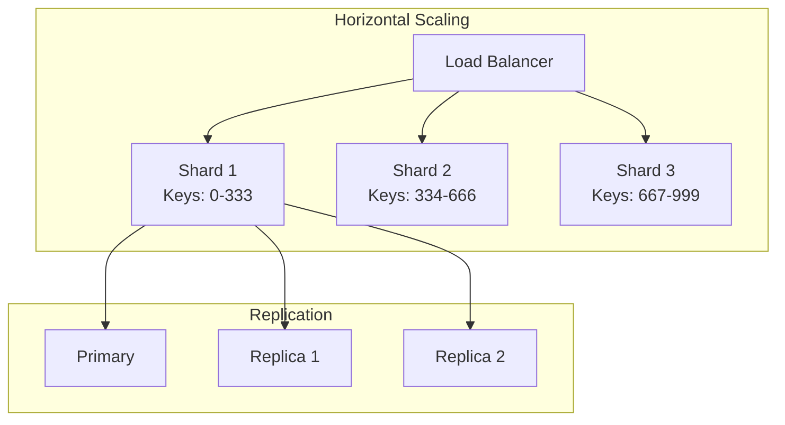

---

## 📊 Performance Optimization

### Best Practices

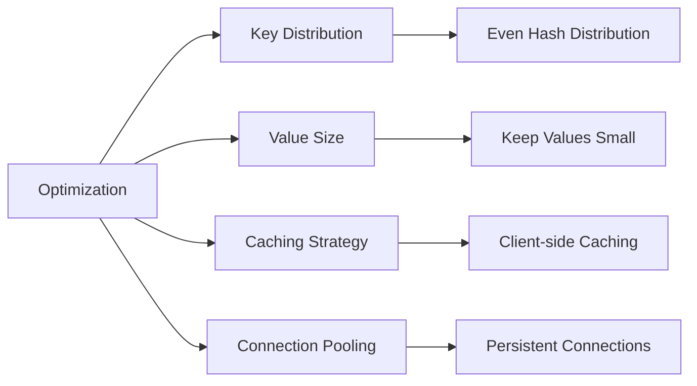

### Performance Tuning

| Aspect | Recommendation | Impact |
|--------|----------------|--------|
| **Key Distribution** | Use consistent hashing | Even load distribution |
| **Value Size** | Keep under 1MB | Better performance |
| **Batch Operations** | Group related operations | Reduced network overhead |
| **Connection Pooling** | Reuse connections | Lower latency |
| **Compression** | Compress large values | Reduced storage/bandwidth |

---

## 🎯 Decision Framework

### When to Choose Key-Value

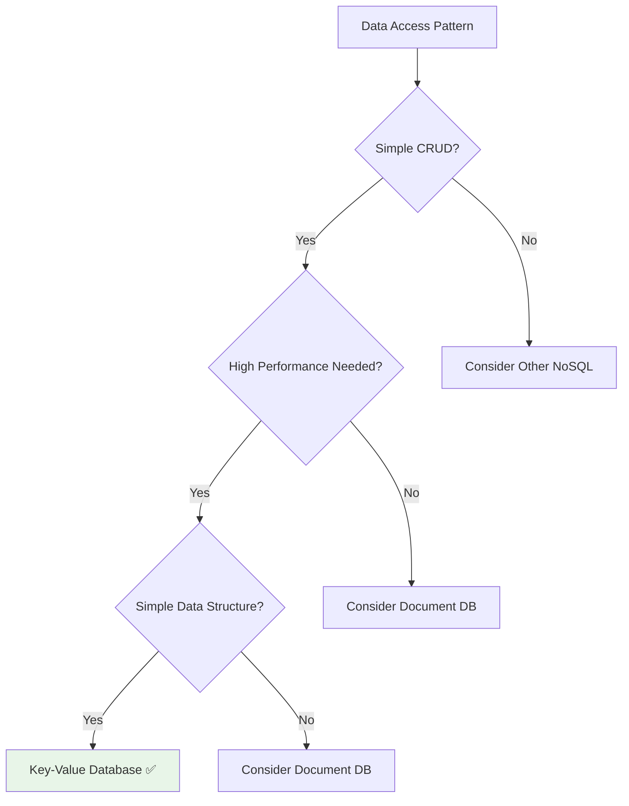

### Selection Criteria

| Criteria | Key-Value Score | Notes |
|----------|----------------|--------|
| **Simple CRUD** | ⭐⭐⭐⭐⭐ | Excellent for basic operations |
| **High Performance** | ⭐⭐⭐⭐⭐ | Sub-millisecond latency |
| **Horizontal Scaling** | ⭐⭐⭐⭐⭐ | Linear scaling capabilities |
| **Complex Queries** | ⭐ | Very limited query capabilities |
| **Relationships** | ⭐ | No native relationship support |
| **Value Flexibility** | ⭐⭐ | Limited value querying |

---

## 📋 Summary

### 🔑 Key Takeaways

1. **Simplest Architecture** - Hash map-based storage model
2. **High Performance** - Optimized for basic CRUD operations
3. **Easy Scaling** - Horizontal sharding across nodes
4. **Limited Querying** - No complex queries or relationships
5. **Atomic Operations** - Single key transactions only

### 🎯 Best Use Cases

- **Session Management** - Web application sessions
- **User Profiles** - Application user data
- **Shopping Carts** - E-commerce cart storage
- **Caching Layer** - High-performance data cache
- **Configuration Data** - Application settings

### ⚠️ Avoid When

- **Complex Relationships** - Social networks, recommendations
- **Multi-key Transactions** - ACID across multiple keys
- **Value-based Queries** - Searching within value content
- **Data Analytics** - Cross-data pattern analysis

### 🏆 Popular Choices

- **Amazon DynamoDB** - Managed cloud service
- **Redis** - High-performance in-memory
- **Oracle NoSQL** - Enterprise features
- **Aerospike** - Ultra-low latency

---

*Key-Value NoSQL databases excel in scenarios requiring simple, high-performance data access patterns with straightforward key-based retrieval operations.*