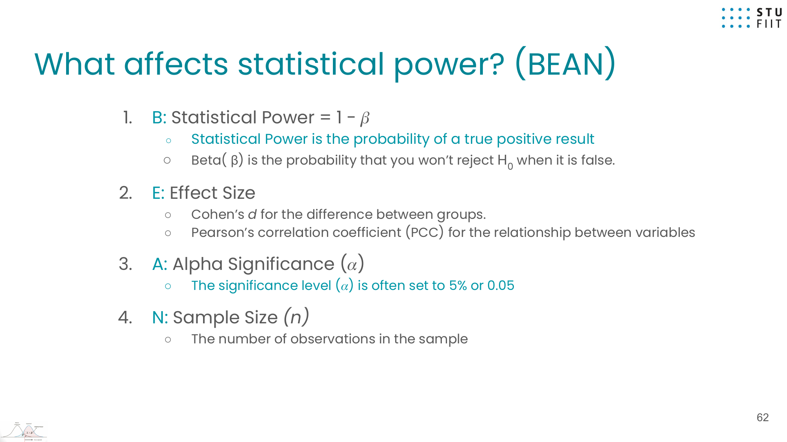
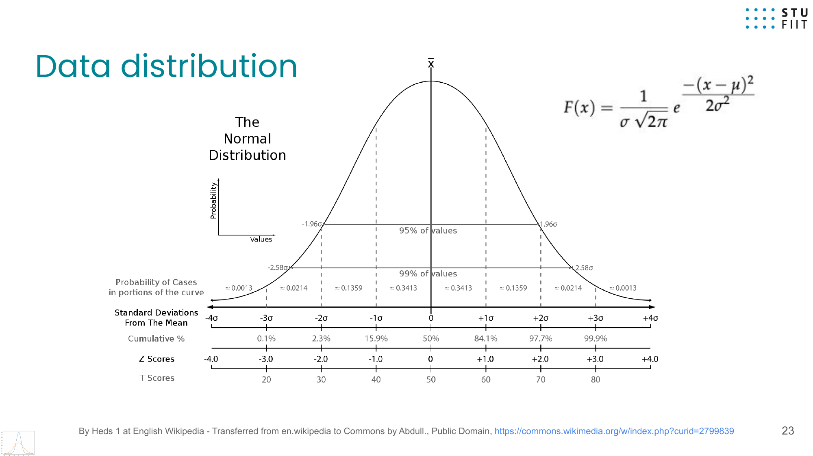

# Lecture 05 1 Exploratory Data Analysis using Statistical Analysis\n\n# IAU-05-1-Exploratory-Data-Analysis-using-Statistical-Analysis

\n\n---\n\n## Navigation\n\n- **Parent**: [[data-science.iau-intelligent-analysis.lectures]]\n- **Course**: [[data-science.iau-intelligent-analysis]]\n