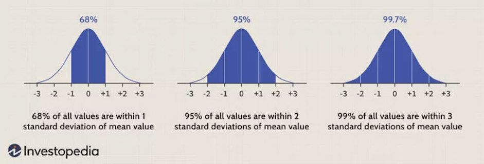

# 4.3 Stages of Data Processing

Data processing involves several stages required to convert data into meaningful information. These stages are: data collection, data preparation, input, data analysis, data interpretation, and data storage (PeerXP, 2017). While these stages are typically carried out in a specific sequence, it's important to note that this order can be seen as cyclical. In many cases, completing the interpretation and storage stages may trigger a repetition of the data collection stage.

## Data Collection

Once raw data are gathered from various sources, they are converted into computer-friendly formats, such as tables, text, or images, to create a **data lake**. Data collection methods can include statistical populations, research experiments, sample surveys, and byproduct operations. Collecting and managing data isn't always straightforward, especially when dealing with issues like noise, redundancy, and contradictions in the data.

## Data Preparation

Data preparation, a crucial stage, involves preprocessing. Raw data are cleaned, organized, standardized, and checked for errors. The goal here is to address missing values and eliminate redundant, incomplete, duplicate, and incorrect records. This process often requires significant domain knowledge to ensure accurate data preparation, as poorly prepared data can lead to misleading insights.

## Data Input

Once data have been meticulously prepared and cleaned, they are entered into their intended destination, such as a **data warehouse**. Additionally, they are translated into a format that is easily understandable by data consumers, like an organization's employees. Understanding data entails grasping key characteristics such as distribution, trends, and attribute relationships. This process can be time-consuming and demands speed and accuracy, which is why many organizations opt to outsource this stage.

## Data Analysis

The data analysis stage involves executing multiple threads of instructions simultaneously using machine learning and artificial intelligence algorithms. The duration of this stage depends on the processing device's specifications, the complexity of the input data, and the volume of data being processed. This stage is the core of data processing and includes tasks like converting data into a suitable format, ensuring data accuracy, summarizing detailed data into key points, and merging various groups of data records.

The data analysis stage generally follows five steps:

1. **Features Extraction**: Data is represented by a fixed set of features, which can be categorical, binary, or continuous.
2. **Correlation Analysis**: This step identifies pairs of data features with a high degree of correlation. If two features are highly correlated within a specified threshold, one of them can be removed from the feature set.
3. **Feature Selection**: During this step, relevant and informative features are chosen by applying correlation analysis to eliminate redundant features. The goal is to reduce the feature set and make the data more comprehensible. Relevant features are those with low intercorrelation with other features and high variability across data records. Domain expertise may be required to guide this process and review the selected features.
4. **Machine Learning**: Here, a mathematical learning algorithm is developed to extract knowledge from the data, uncover data properties, and predict future outcomes when new data is introduced. Descriptive analytics are used to understand data patterns, predictive analytics estimate future data based on performance, and prescriptive analytics optimize actions. The choice of learning technique depends on whether it's unsupervised (e.g., clustering analysis) or supervised (e.g., classification and regression approaches).
5. **Extracting Valuable Insights**: After evaluating the model for accuracy and performance, the most critical and relevant information from the input data is extracted and presented. At this point, the model is ready to predict future events and assess potential gains or losses under various scenarios. Evaluating the model's impact on a business can be challenging, so both model evaluation metrics and key performance indicators (KPIs) are used to assess its performance and influence.

.png>)

## Data Interpretation

Following the data analysis stage, it's essential to interpret the outcomes of machine learning predictions. This interpretation is crucial for transforming the model's results into actionable insights. The goal is to extract valuable information that can guide a company's future decisions. Interpretation is a critical step because the model's outputs must be presented in a user-friendly format to business managers, enabling them to take appropriate actions and make informed decisions. These outputs can be presented in various forms, such as tables, audio, videos, or images. While insights gained during data analysis are significant, the actions taken, whether automated or human-driven, are the most valuable outcomes.

## Data Storage

The final stage of data processing involves storing the data, instructions, developed numerical models, and information for future use. Data should be stored in a way that allows quick access and retrieval when needed. Efficient data storage ensures that valuable resources can be accessed and utilized effectively in future processes and analyses.
\n\n---\n\n## Navigation\n\n- **Parent**: [[data-science.iu-dlmbdsa01.data-processing]]\n- **Course**: [[data-science.iu-dlmbdsa01]]\n