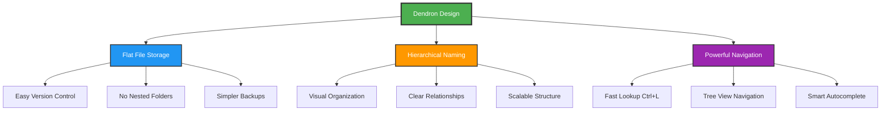
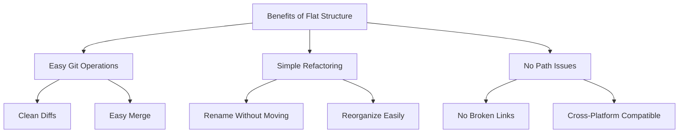
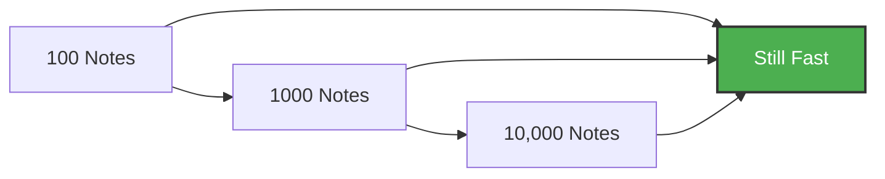
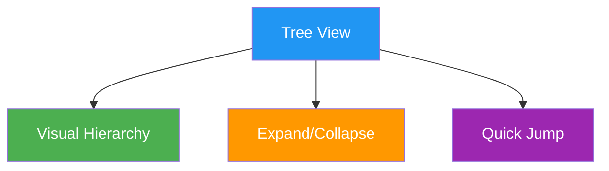
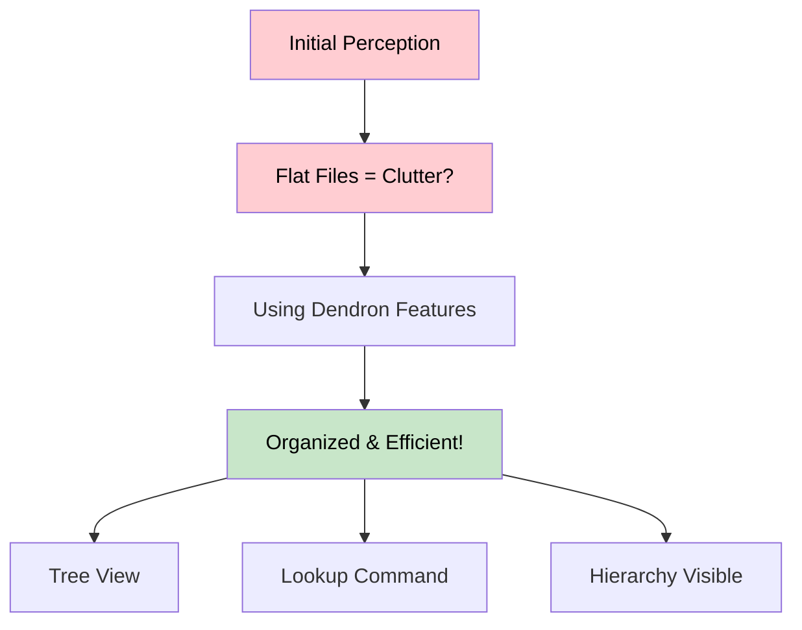
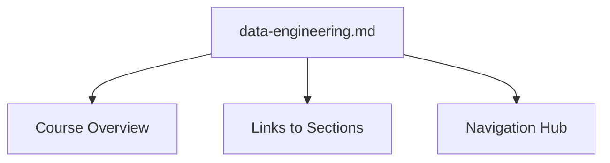
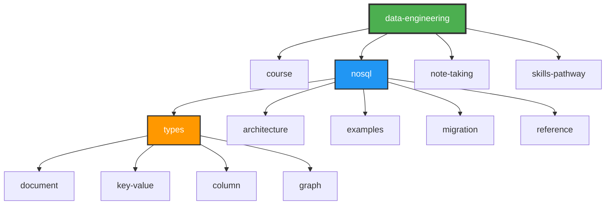
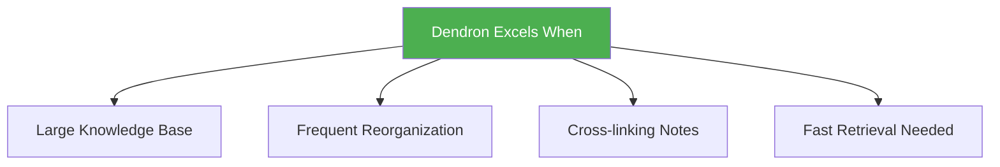
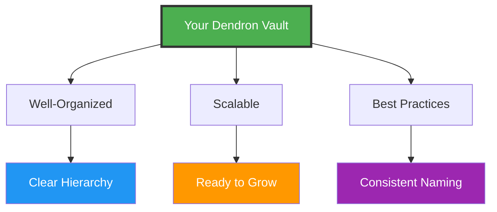

## 🎯 Understanding Dendron's File Structure

### Is It the Best Structure?

**Yes!** Dendron's flat file structure with hierarchical naming is intentionally designed and offers significant advantages over traditional folder-based systems. Here's why:

## 🏗️ Dendron's Design Philosophy

### Flat Structure with Hierarchical Naming

```
❌ Traditional Folder Structure:
data-engineering/
  ├── nosql/
  │   ├── types/
  │   │   ├── document.md
  │   │   └── key-value.md
  │   └── architecture/
  │       └── acid-vs-base.md

✅ Dendron Structure:
data-engineering.nosql.types.document.md
data-engineering.nosql.types.key-value.md
data-engineering.nosql.architecture.acid-vs-base.md
```

### Why This Approach Works



## 📊 Key Advantages

### 1. **Lightning-Fast Lookup** ⚡


**Example**: Type "nosql doc" to instantly find `data-engineering.nosql.types.document.md`

### 2. **No Folder Clutter** 🗂️



### 3. **Hierarchical Organization** 🌳

Your vault maintains perfect organization through naming:

```
data-engineering              # Root topic
├── .course                   # Course section
│   ├── .introduction         # Subsection
│   └── .overview            # Subsection
├── .nosql                    # Main topic area
│   ├── .types               # Category
│   │   ├── .document        # Specific type
│   │   ├── .key-value       # Specific type
│   │   └── .graph           # Specific type
│   └── .architecture        # Category
│       ├── .acid-vs-base    # Specific concept
│       └── .cap-theorem     # Specific concept
```

### 4. **Scalability** 📈



Dendron scales beautifully:
- **Small vaults** (10-100 notes): Easy to navigate
- **Medium vaults** (100-1,000 notes): Organized and searchable
- **Large vaults** (1,000-10,000+ notes): Still performant with lookup

## 🎨 Navigation Features

### Tree View Sidebar



Dendron's tree view shows your hierarchy visually:
- Collapsible sections
- Clear parent-child relationships
- Click to navigate

### Lookup Command (Ctrl+L)

**Most powerful feature!**

```
Type: "eng nosql doc"
Finds: data-engineering.nosql.types.document.md

Type: "cap"
Finds: data-engineering.nosql.architecture.cap-theorem.md

Type: "acid"
Finds: data-engineering.nosql.architecture.acid-vs-base.md
```

### Graph View

Visualize connections between notes:
- See related concepts
- Discover connection patterns
- Navigate visually

## 🚀 Addressing "Clutter" Concerns

### It Looks Like Clutter, But It's Not!



### Why It Feels Cluttered (At First)

1. **File Explorer View**: Shows ALL files at once
2. **Alphabetical Sorting**: Mixed hierarchy levels
3. **No Folders**: Breaks traditional mental model

### Why It's Actually Better

1. **Use Tree View Instead**: Shows proper hierarchy
2. **Use Lookup (Ctrl+L)**: Never browse files manually
3. **Trust the System**: Dendron's navigation is superior

## 💡 Best Practices

### 1. Use Consistent Naming

```
✅ Good:
data-engineering.nosql.types.document.md
data-engineering.nosql.types.key-value.md
data-engineering.nosql.types.column.md

❌ Bad:
nosql-document.md
keyvalue-database.md
column_db.md
```

### 2. Create Root Notes



**Example**: `data-engineering.md` serves as landing page

### 3. Use Schemas (Optional)

Define templates for consistent note structure:

```yaml
# data-engineering.schema.yml
schemas:
  - id: nosql
    children:
      - types
      - architecture
      - examples
```

### 4. Leverage Tags and Frontmatter

```yaml
---
id: data-engineering.nosql.types.document
title: Document Databases
tags: [nosql, database, document-db, mongodb]
---
```

## 🔧 Workflow Tips

### Daily Workflow


### Creating New Notes

1. **Press Ctrl+L** (or Cmd+L on Mac)
2. **Type new note name**: Following hierarchy
3. **Press Enter**: Note created automatically
4. **Start writing**: No folder navigation needed!

### Linking Notes

```markdown
[[data-engineering.nosql.types.document]]
[[data-engineering.nosql.architecture.acid-vs-base]]
[[data-engineering.course.overview]]
```

Dendron handles the rest!

## 📦 Your Current Structure Is Excellent

### Analysis of Your Vault

```
✅ Clear hierarchy: data-engineering.nosql.types.document
✅ Consistent naming: All follow same pattern
✅ Logical grouping: Related concepts together
✅ Scalable: Easy to add more sections
✅ Discoverable: Quick lookup works perfectly
```

### It's Organized Like This:



## 🎯 Comparison with Alternatives

### Dendron vs Traditional Folders

| Aspect | Dendron | Folders |
|--------|---------|---------|
| **Navigation** | Ctrl+L instant search | Click through folders |
| **Refactoring** | Rename notes easily | Move files, update paths |
| **Scalability** | Handles 10,000+ notes | Gets slow with depth |
| **Git Operations** | Clean, simple diffs | Complex with moves |
| **Visual Hierarchy** | Tree view + naming | Folder structure |
| **Learning Curve** | Takes time to trust | Immediately familiar |

### When Dendron Shines



## 🎓 Learning to Trust the System

### Initial Reaction vs Reality


### Tips for Adaptation

1. **Hide File Explorer**: Use tree view instead
2. **Practice Ctrl+L**: Make it muscle memory
3. **Trust Hierarchy**: The dots (.) show structure
4. **Give It Time**: Takes 2-3 weeks to feel natural

## 🏆 Conclusion

### Your Structure Is Perfect! ✨



### Key Takeaways

1. **It's Not Clutter** - It's hierarchical organization in file names
2. **Navigation Rocks** - Ctrl+L is faster than any folder system
3. **It Scales Beautifully** - From 10 to 10,000+ notes
4. **Trust the System** - Dendron's design is battle-tested
5. **You're Doing Great** - Your current structure follows best practices!

### Keep Doing What You're Doing! 🎉

Your vault structure is:
- ✅ Following Dendron best practices
- ✅ Scalable for future growth
- ✅ Easy to navigate with proper tools
- ✅ Clean and maintainable
- ✅ Perfect for learning materials

**Don't change a thing about the structure!** Just use the Dendron features:
- Tree view for visual browsing
- Ctrl+L for instant lookup
- Wikilinks for navigation

---

## 📚 Additional Resources

- **Dendron Docs**: [dendron.so](https://wiki.dendron.so)
- **Lookup Guide**: [dendron.so/notes/a7c3a810-28c8-4b47-96a6-8156b1524af3](https://wiki.dendron.so/notes/a7c3a810-28c8-4b47-96a6-8156b1524af3/)
- **Hierarchies**: [dendron.so/notes/f3a41725-c5e5-4851-a6ed-5f541054d409](https://wiki.dendron.so/notes/f3a41725-c5e5-4851-a6ed-5f541054d409/)
- **Schemas**: [dendron.so/notes/c5e5adde-5459-409b-b34d-a0d75cbb1052](https://wiki.dendron.so/notes/c5e5adde-5459-409b-b34d-a0d75cbb1052/)

---

*Your Dendron vault structure is excellent. Embrace the flat file system, use the navigation features, and watch your knowledge base scale effortlessly!*
