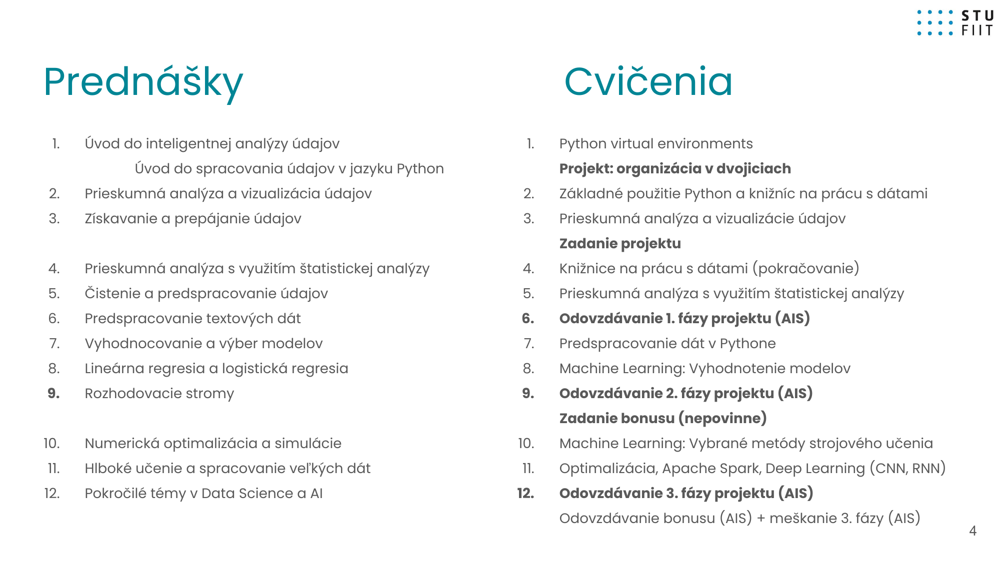

# Lecture 00 1 Course Organization\n\n# IAU-00-1-Course-Organization

\n\n---\n\n## Navigation\n\n- **Parent**: [[education.academic.data-science.iau-intelligent-analysis.lectures]]\n- **Course**: [[education.academic.data-science.iau-intelligent-analysis]]\n