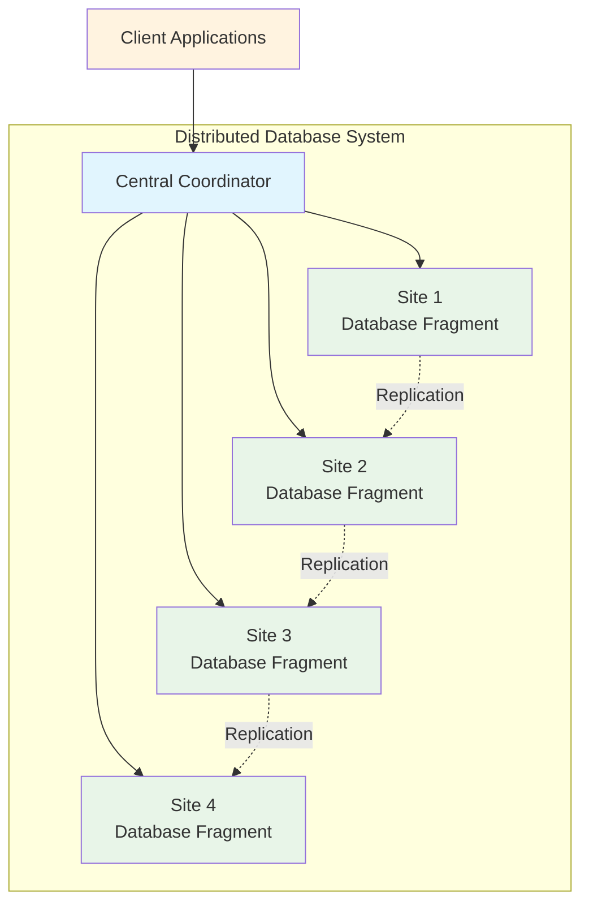
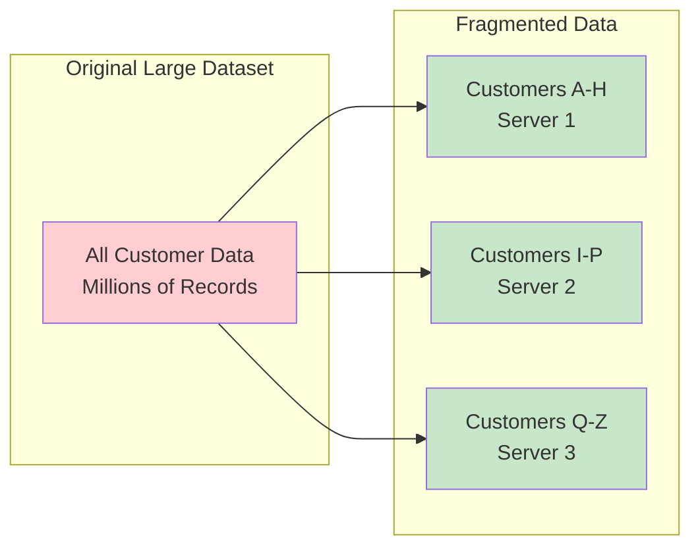
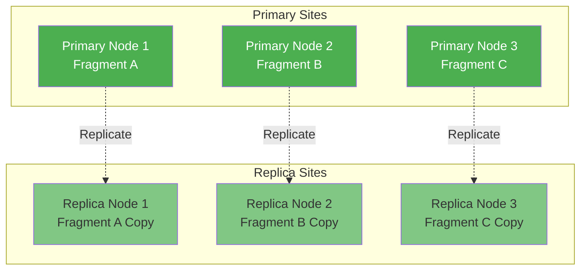
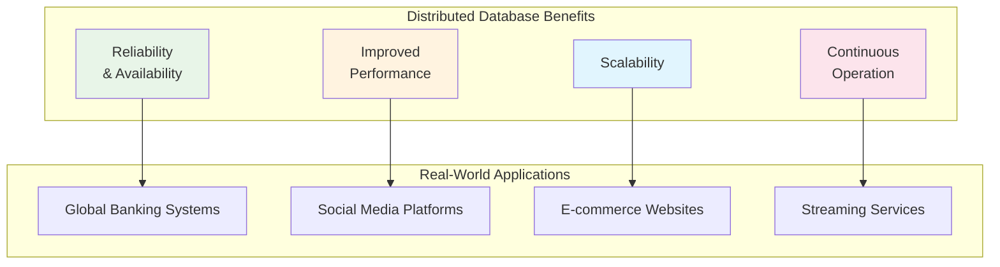
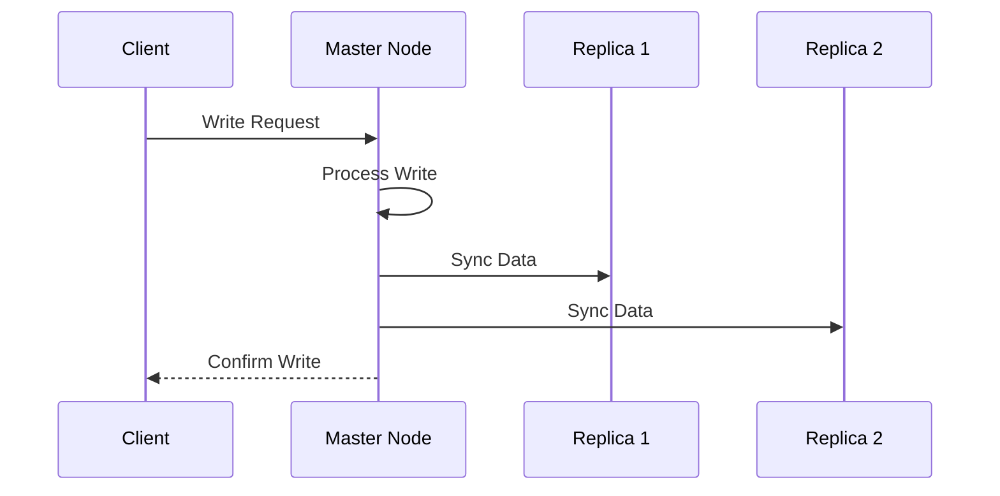
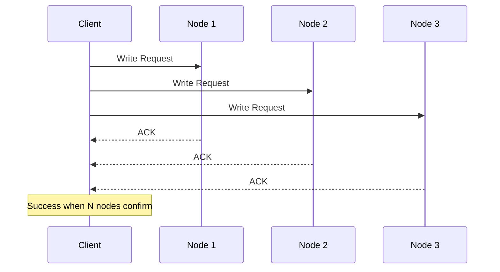
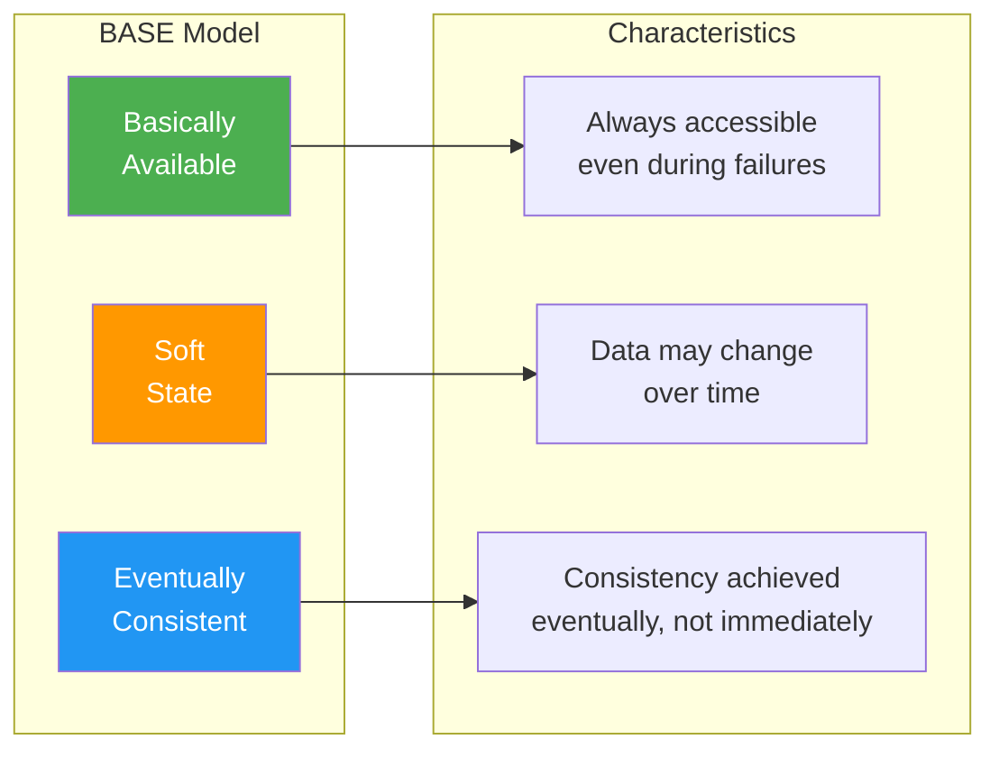

## 🎯 Learning Objectives

After completing this lesson, you will be able to:

- 📊 Describe the concepts of distributed databases
- 🔄 Define fragmentation and replication of data
- ⚖️ Describe the advantages and challenges of distributed systems
- 🏗️ Understand distributed database architecture patterns

---

## 📖 What are Distributed Databases?

A **distributed database** is a collection of multiple interconnected databases that are spread physically across various locations and communicate via a computer network.

### Key Characteristics



> 💡 **Key Point**: A distributed database is physically distributed across data sites by **fragmenting** and **replicating** the data, following the BASE consistency model.

---

## 🔧 Data Fragmentation (Partitioning/Sharding)

To store large amounts of data across all servers in a distributed system, you need to break your data into smaller pieces. This process has several names:

- **Fragmentation** (distributed databases)
- **Partitioning** (general distributed systems)
- **Sharding** (NoSQL databases)

### Fragmentation Strategies

#### 1. **Lexical Grouping (Range-Based)**
```
Keys A-C → Server 1
Keys D-F → Server 2
Keys G-I → Server 3
```

#### 2. **Key-Based Grouping (Hash-Based)**
```
Store ID 1-100 → Server 1
Store ID 101-200 → Server 2
Store ID 201-300 → Server 3
```

### Practical Example



**Benefits:**
- ✅ Query: "Give me all sales from Store ID 15" → All records on single server
- ✅ Faster query processing
- ✅ Reduced network traffic

---

## 🔄 Data Replication

After data is distributed across cluster nodes, **replication** ensures data availability when nodes fail.

### What is Replication?

**Replication** means all fragments/partitions/shards of your data are stored redundantly in two or more sites.



### Replication Benefits & Challenges

| ✅ **Advantages** | ❌ **Disadvantages** |
|------------------|---------------------|
| Increased data availability | Data synchronization complexity |
| Fault tolerance | Storage overhead |
| Load distribution | Consistency challenges |
| Reduced latency | Network overhead |

> ⚠️ **Challenge**: Any change at one site must be replicated to every site storing related data, or inconsistency occurs.

---

## 🚀 Advantages of Distributed Systems

### 1. **Reliability and Availability**
- Data replicated at multiple sites
- If local server unavailable, data retrieved from another server
- No single point of failure

### 2. **Improved Performance**
- Reduced query processing time for high data volumes
- Parallel processing capabilities
- Local data access reduces latency

### 3. **Scalability**
- Easy horizontal scaling by adding new servers
- Elastic capacity adjustment
- Cost-effective growth

### 4. **Continuous Operation**
- No reliance on central site
- Independent node operation
- High availability architecture



---

## ⚖️ Challenges of Distributed Systems

### 1. **Concurrency Control**

**The Problem**: Same data stored in multiple locations - how to handle concurrent modifications?

**Solutions**:

#### Approach A: Single-Node Operations


#### Approach B: Multi-Node Operations


### 2. **Limited Transaction Support**

- Distributed databases provide limited ACID transaction support
- Focus on BASE model (Basically Available, Soft state, Eventually consistent)
- Trade-off: Consistency vs. Availability

### 3. **Data Synchronization**

| **Challenge** | **Impact** | **Solution** |
|---------------|------------|--------------|
| Network latency | Delayed updates | Optimized protocols |
| Partial failures | Inconsistent state | Consensus algorithms |
| Concurrent updates | Data conflicts | Conflict resolution strategies |

---

## 🏗️ BASE Consistency Model

Distributed databases follow the **BASE** model:



---

## 🎯 Real-World Applications

### Modern Services Using Distributed Databases

| **Service** | **Use Case** | **Database Type** |
|-------------|--------------|------------------|
| **Netflix** | Content delivery, user preferences | Cassandra, DynamoDB |
| **Facebook** | Social graph, messaging | Cassandra, MySQL clusters |
| **Amazon** | Product catalog, shopping cart | DynamoDB, Aurora |
| **Google** | Search index, user data | Bigtable, Spanner |
| **Uber** | Real-time location, trip data | Cassandra, MySQL |

---

## 📋 Key Takeaways

### ✅ **What You Should Remember**

1. **Distributed databases** = Multiple interconnected databases across locations
2. **Fragmentation** = Breaking large data into smaller, manageable pieces
3. **Replication** = Storing data copies redundantly for availability
4. **BASE model** = Eventually consistent, always available
5. **Trade-offs** = Availability vs. immediate consistency

### 🔄 **The Distribution Process**
```
Large Dataset → Fragmentation → Distribution → Replication → BASE Consistency
```

### 🚀 **Why Use Distributed Databases?**
- Handle massive data volumes
- Serve global user bases
- Provide high availability
- Scale horizontally
- Reduce latency

---

## 🔗 Related Topics

- **[[12-ACID versus BASE Operations]]** - Understanding consistency models
- **[[05-characteristics-of-NoSQL-databases]]** - NoSQL principles
- **[[09-column-based-NoSQL-Databases]]** - Cassandra as distributed example
- **[[11-Reading-NoSQL-Database-Deployment-Options]]** - Deployment strategies

---

## 📝 Study Questions

1. What are the two main fragmentation strategies?
2. How does replication improve system reliability?
3. What are the main challenges of distributed systems?
4. Why do distributed databases follow BASE instead of ACID?
5. Give examples of when you'd choose distributed over centralized databases.

---

*Next: Continue with advanced NoSQL topics and hands-on implementation examples.*