## 🎯 Learning Objectives

After completing this reading, you will be able to:

- 📊 Compare modeling the same data in relational and document databases
- 🔍 Describe the complexities of querying data in different database paradigms
- 📋 Understand how data duplication affects data modeling decisions
- 🔄 Analyze considerations associated with evolving database schemas
- ⚖️ Make informed decisions about when to use each approach

---

## 📖 Introduction

Understanding data modeling approaches is crucial for designing efficient database systems. Let's explore how the same data can be structured differently across database paradigms.

### 🏗️ Fundamental Design Philosophy


**Key Philosophical Differences**:

- **RDBMS**: Organizes data into tables with predefined schemas and relationships. Avoids duplication by storing data once and referencing it everywhere needed.
- **Document DB**: Designs for usage patterns first, often duplicating data to optimize for specific queries and access patterns.

---

## 📚 Case Study: Library Book Catalog

Let's explore how to model library book data using both approaches, examining the trade-offs and implications of each design decision.

### 🗄️ RDBMS Approach: Normalized Structure

#### Database Schema Design

When working with library book data using a relational database, we create separate, normalized tables:


#### Sample Data Tables

**📖 Books Table**

| BookID | Title | AuthorID | ISBN | Published Year |
|--------|-------|----------|------|----------------|
| 1 | The Great Gatsby | 1 | 978-0743273565 | 1925 |
| 2 | To Kill a Mockingbird | 2 | 978-0061120084 | 1960 |
| 3 | 1984 | 3 | 978-0451524935 | 1949 |
| 4 | Pride and Prejudice | 4 | 978-0141439518 | 1813 |
| 5 | The Hobbit | 5 | 978-0618260300 | 1937 |

**✍️ Authors Table**

| AuthorID | Name |
|----------|------|
| 1 | F. Scott Fitzgerald |
| 2 | Harper Lee |
| 3 | George Orwell |
| 4 | Jane Austen |
| 5 | J.R.R. Tolkien |

**🏷️ Genres Table**

| GenreID | Genre Name |
|---------|------------|
| 1 | Fiction |
| 2 | Classic |
| 3 | Dystopian |
| 4 | Romance |
| 5 | Fantasy |

**🔗 BookGenres (Junction Table)**

| BookID | GenreID |
|--------|---------|
| 1 | 1 |
| 1 | 2 |
| 2 | 1 |
| 3 | 1 |
| 3 | 3 |
| 4 | 1 |
| 4 | 4 |
| 5 | 1 |
| 5 | 5 |

#### ✅ RDBMS Benefits

```mermaid
graph TB
    subgraph "RDBMS Advantages"
        A[Data Consistency<br/>🎯 Single Source of Truth]
        B[Storage Efficiency<br/>💾 No Duplication]
        C[Data Integrity<br/>🔒 Foreign Key Constraints]
        D[ACID Compliance<br/>⚛️ Transaction Safety]
    end
    
    style A fill:#339af0,color:#ffffff
    style B fill:#339af0,color:#ffffff
    style C fill:#339af0,color:#ffffff
    style D fill:#339af0,color:#ffffff
```



### 📄 Document Database Approach: Denormalized Structure

In contrast, a document database stores comprehensive information in single documents:

```javascript
// Complete book document with embedded data
{
  "_id": 1,
  "title": "The Great Gatsby",
  "author": {
    "id": 1,
    "name": "F. Scott Fitzgerald",
    "bio": "American novelist and short story writer"
  },
  "isbn": "978-0743273565",
  "published_year": 1925,
  "genres": ["Fiction", "Classic"],
  "publisher": {
    "name": "Scribner",
    "location": "New York"
  },
  "reviews": [
    {
      "rating": 5,
      "comment": "A masterpiece of American literature",
      "reviewer": "BookLover123"
    }
  ],
  "availability": {
    "total_copies": 5,
    "available_copies": 2,
    "checked_out": 3
  }
}
```

#### ✅ Document Database Benefits

```mermaid
graph TB
    subgraph "Document DB Advantages"
        A[Query Performance<br/>⚡ Single Document Access]
        B[Schema Flexibility<br/>🔄 Easy Evolution]
        C[Natural Data Grouping<br/>📦 Related Data Together]
        D[Horizontal Scalability<br/>📈 Distributed Design]
    end
    
    style A fill:#51cf66,color:#ffffff
    style B fill:#51cf66,color:#ffffff
    style C fill:#51cf66,color:#ffffff
    style D fill:#51cf66,color:#ffffff
```



---

## 🔍 Query Complexity Comparison

Let's examine how the same information retrieval differs between the two approaches.

### 📊 Requirement: Get All Book Details

**Goal**: Retrieve book title, author name, and all genres for each book

#### 🗄️ RDBMS Query: Complex Multi-Table Joins

```sql
-- Complex SQL query requiring multiple JOINs
SELECT 
    Books.Title AS BookTitle,
    Authors.Name AS Author,
    GROUP_CONCAT(Genres.GenreName) AS Genres
FROM Books
    JOIN Authors ON Books.AuthorID = Authors.AuthorID
    JOIN BookGenres ON Books.BookID = BookGenres.BookID
    JOIN Genres ON BookGenres.GenreID = Genres.GenreID
GROUP BY Books.Title, Authors.Name;
```

**Query Complexity Analysis**:


**Performance Implications**:
- 📊 **3 JOIN operations** across 4 tables
- 🔄 **GROUP BY** clause for aggregation
- 🔗 **GROUP_CONCAT** function for genre concatenation
- ⚠️ **Performance degradation** with large datasets
- 🎯 **Query plan complexity** increases significantly

**Sample Output**:

| BookTitle | Author | Genres |
|-----------|--------|--------|
| 1984 | George Orwell | Fiction, Dystopian |
| Pride and Prejudice | Jane Austen | Fiction, Romance |
| The Great Gatsby | F. Scott Fitzgerald | Fiction, Classic |
| The Hobbit | J.R.R. Tolkien | Fiction, Fantasy |
| To Kill a Mockingbird | Harper Lee | Fiction |

#### 📄 Document Database Query: Simple Document Access

```javascript
// Simple MongoDB query - no joins needed
db.books.find({}, { 
    title: 1, 
    "author.name": 1, 
    genres: 1,
    _id: 0 
});
```

**Query Simplicity Analysis**:


**Performance Benefits**:
- ⚡ **Single collection access** - no joins required
- 🎯 **Direct field projection** - only fetch needed data
- 📈 **Linear performance scaling** with collection size
- 🚀 **Optimal for read-heavy workloads**
- 🔍 **Index-friendly** queries

The data needed is already embedded in each document, eliminating the need for complex relationships.

---

## ⚖️ Data Duplication Trade-offs

Understanding when and why to duplicate data is crucial for effective database design.

### 🔄 Update Scenario: Author Name Change

Let's examine what happens when J.R.R. Tolkien wants to be known by his full name: **John Ronald Reuel Tolkien**

#### RDBMS: Single Point Update

```sql
-- Single update in Authors table affects all related books
UPDATE Authors 
SET Name = 'John Ronald Reuel Tolkien' 
WHERE AuthorID = 5;
```


**✅ RDBMS Advantages**:
- 🎯 **Single source of truth** - update once, change everywhere
- 🔒 **Immediate consistency** - all queries see updated name instantly
- 💾 **Storage efficient** - no duplicate data
- ⚛️ **ACID compliance** - transactional integrity

#### Document Database: Multiple Document Updates

```javascript
// Must update author name in ALL documents where it appears
db.books.updateMany(
    { "author.id": 5 },
    { $set: { "author.name": "John Ronald Reuel Tolkien" } }
);
```


**⚠️ Document Database Challenges**:
- 📋 **Multiple updates required** - one per document containing author data
- ⏱️ **Temporary inconsistency** - some documents updated before others
- 💻 **Application complexity** - code must handle update coordination
- 🔄 **Eventual consistency** - system reaches consistent state eventually

### 📊 Update Frequency vs Performance Trade-off

| **Scenario** | **Update Frequency** | **Read Frequency** | **Recommended Approach** |
|--------------|---------------------|-------------------|------------------------|
| **Author Info** | Very Low (rare name changes) | Very High | ✅ Document DB - Accept rare update complexity for read performance |
| **Book Prices** | High (frequent price changes) | High | ⚖️ Hybrid - Reference pricing data |
| **User Profiles** | Medium (profile updates) | High | ✅ Document DB - User controls their data |
| **Financial Data** | Medium | Medium | ✅ RDBMS - Consistency critical |

---

## 🔄 Schema Evolution Considerations

How databases adapt to changing application requirements over time.

### 🗄️ RDBMS Schema Changes

#### Adding New Fields

```sql
-- Modify existing table structure
ALTER TABLE Books 
ADD COLUMN page_count INT,
ADD COLUMN language VARCHAR(50) DEFAULT 'English';

-- Data migration might be required
UPDATE Books 
SET page_count = 
    CASE 
        WHEN BookID = 1 THEN 180
        WHEN BookID = 2 THEN 376
        -- ... manual data entry for existing records
    END;
```

#### Impact Analysis


**🚨 RDBMS Schema Change Challenges**:
- ⏰ **Downtime requirements** - database may be unavailable during changes
- 📝 **Migration scripts** - complex data transformation logic
- 🔄 **Backwards compatibility** - existing application versions must work
- 🧪 **Extensive testing** - schema changes affect entire system
- 📋 **Coordination overhead** - multiple teams must synchronize changes

### 📄 Document Database Schema Evolution

#### Adding New Fields - Flexible Approach

```javascript
// Simply add new fields to new documents
db.books.insertOne({
  "_id": 6,
  "title": "Dune",
  "author": {
    "id": 6,
    "name": "Frank Herbert",
    "bio": "American science fiction author"
  },
  "isbn": "978-0441172719",
  "published_year": 1965,
  "genres": ["Science Fiction", "Adventure"],
  // New fields added seamlessly
  "page_count": 688,
  "language": "English",
  "awards": ["Hugo Award", "Nebula Award"],
  "series": {
    "name": "Dune Chronicles",
    "book_number": 1,
    "total_books": 6
  }
});

// Update existing documents as needed
db.books.updateOne(
  { "_id": 1 },
  { $set: { 
    "page_count": 180,
    "language": "English" 
  }}
);
```

#### Gradual Evolution Pattern


**✅ Document Database Schema Benefits**:
- 🚀 **Zero downtime** - new schema coexists with old
- 🔄 **Gradual migration** - update documents as needed
- 🎯 **Application flexibility** - code handles missing fields gracefully
- 📈 **Incremental rollout** - deploy changes progressively
- 🔧 **Easy rollback** - revert to previous schema without issues

### 🔍 Schema Versioning Strategy

#### Document Versioning Approach

```javascript
// Version-aware document design
{
  "_id": 1,
  "schema_version": "2.1",
  "title": "The Great Gatsby",
  "author": {
    "id": 1,
    "name": "F. Scott Fitzgerald"
  },
  // Version 2.0+ fields
  "metadata": {
    "page_count": 180,
    "language": "English",
    "edition": "First Edition"
  },
  // Version 2.1+ fields
  "digital_assets": {
    "ebook_available": true,
    "audiobook_narrator": "Jake Gyllenhaal"
  }
}
```

**Application Code Pattern**:
```javascript
function processBook(book) {
  // Handle different schema versions gracefully
  const version = book.schema_version || "1.0";
  
  switch(version) {
    case "2.1":
      return processV21Book(book);
    case "2.0":
      return processV20Book(book);
    default:
      return processLegacyBook(book);
  }
}
```

---

## 📈 Performance and Scalability Implications

### 🚀 Read Performance Comparison

| **Operation** | **RDBMS** | **Document DB** | **Winner** |
|---------------|-----------|-----------------|------------|
| **Single book lookup** | Multiple table access | Single document read | 🥇 Document DB |
| **Author's all books** | JOIN required | Query by author.id | 🥇 Document DB |
| **Books by genre** | JOIN + filter | Array field query | 🥇 Document DB |
| **Complex reporting** | Optimized JOINs | Multiple queries or aggregation | 🥇 RDBMS |
| **Data consistency** | ACID guaranteed | Eventually consistent | 🥇 RDBMS |

### 📊 Storage Considerations

```mermaid
graph TB
    subgraph "Storage Trade-offs"
        A[RDBMS: Normalized Storage<br/>📦 Minimal disk space<br/>🔗 Reference overhead] 
        B[Document DB: Denormalized Storage<br/>💾 Higher disk usage<br/>⚡ Faster access]
        
        C[Small Dataset<br/>< 1GB] --> A
        D[Large Dataset<br/>> 100GB] --> E{Access Patterns}
        E -->|Read Heavy| B
        E -->|Write Heavy + Consistency| A
    end
    
    style A fill:#339af0,color:#ffffff
    style B fill:#51cf66,color:#ffffff
```



---

## 🎯 Decision Framework

### 📋 When to Choose RDBMS


**✅ Choose RDBMS When**:
- 💰 **Financial transactions** requiring ACID compliance
- 🔗 **Complex relationships** between multiple entities
- 📊 **Analytical queries** with complex JOINs and aggregations
- 🔄 **Frequent updates** to shared reference data
- 👥 **Team expertise** primarily in SQL and relational design

### 📋 When to Choose Document Database


**✅ Choose Document DB When**:
- 📱 **Content management** with flexible, evolving schemas
- 🌐 **User profiles** and personalization data
- 📈 **High-volume, read-heavy** applications
- 🔄 **Agile development** with rapid feature iteration
- 🌍 **Geographic distribution** and horizontal scaling needs

---

## 📚 Summary

### 🎯 Key Takeaways

| **Aspect** | **RDBMS** | **Document Database** |
|------------|-----------|---------------------|
| **Data Organization** | Normalized tables with relationships | Denormalized documents with embedded data |
| **Query Complexity** | Complex JOINs for related data | Simple document access |
| **Schema Changes** | Requires migration and downtime | Flexible, gradual evolution |
| **Data Consistency** | Immediate (ACID) | Eventual consistency |
| **Performance** | Optimized for complex queries | Optimized for simple, high-volume reads |
| **Scaling** | Vertical scaling primary | Horizontal scaling native |

### 🔍 Critical Decision Factors

1. **📊 Data Relationships**: Complex → RDBMS, Simple → Document DB
2. **🔄 Update Patterns**: Frequent shared data updates → RDBMS
3. **📈 Scale Requirements**: Massive read volume → Document DB
4. **⚛️ Consistency Needs**: Critical → RDBMS, Acceptable eventual → Document DB
5. **👥 Team Skills**: SQL expertise → RDBMS, NoSQL experience → Document DB

### 💡 Best Practices

- **🔍 Start with access patterns** - design for how you'll query the data
- **📊 Measure performance** - benchmark both approaches with realistic data
- **🔄 Plan for evolution** - consider how schema will change over time
- **⚖️ Consider hybrid approaches** - use both where appropriate
- **👥 Factor in team expertise** - choose what your team can maintain effectively

---

## 🔗 Related Topics

- **[[04-overview-of-NoSQL]]** - Understanding NoSQL database fundamentals
- **[[08-document-based-NoSQL-Database]]** - Deep dive into document databases
- **[[14-Reading: MongoDB Design Patterns]]** - Advanced document modeling patterns
- **[[16-Challenges in Migrating from RDBMS to NoSQL Databases]]** - Migration strategies and considerations
- **[[12-ACID versus BASE Operations]]** - Understanding consistency models

---

## 📝 Study Questions

1. **Design Challenge**: How would you model a social media platform where users can post content, follow other users, and like posts? Compare RDBMS vs Document database approaches.

2. **Performance Analysis**: A library system has 1 million books and 100,000 users with heavy read traffic. Which approach would you choose and why?

3. **Evolution Scenario**: Your application needs to add book recommendations based on user reading history. How would you modify each database approach?

4. **Consistency Trade-offs**: In what scenarios would eventual consistency be acceptable vs requiring immediate consistency?

5. **Query Optimization**: Write equivalent queries for finding "all science fiction books published after 2000 by authors born in the UK" in both SQL and MongoDB.

---

*Next: Explore advanced topics in [[18-Reading: Vector Databases]] to understand the latest evolution in database technology.*

---

## 👥 Authors

**Muhammad Yahya** | **Other Contributors**: Patsy R. Kravitz