## 🎯 Learning Objectives

After completing this reading, you will be able to:

- 🧮 Define vector databases and understand their role in modern AI applications
- 📊 Explain how data is transformed into vector representations
- 🔍 Understand vector similarity search and its applications
- 🏗️ Compare popular vector database platforms and their features
- 🤖 Identify use cases where vector databases excel over traditional databases

---

## 🌟 Introduction: The AI Revolution in Data Storage

Vector databases represent a **revolutionary leap** in how we store and query data, designed specifically for the **AI-driven world** we live in today.

### 📈 The Rise of Vector Databases

```mermaid
graph LR
    A[Traditional Text Search] --> B[Keyword Matching]
    C[Vector Database Search] --> D[Semantic Understanding]
    
    B --> E[Exact Match Required<br/>🔍 "dog" ≠ "puppy"]
    D --> F[Contextual Similarity<br/>🧠 "dog" ≈ "puppy" ≈ "canine"]
    
    style A fill:#ffec99
    style C fill:#51cf66,color:#ffffff
    style F fill:#e7f5ff
```

**According to IBM**:
> *"A vector database is designed to store, manage, and index massive quantities of high-dimensional vector data efficiently."*
> 
> *Source: https://www.ibm.com/topics/vector-database*

### 🔗 The LLM Connection

Vector databases have exploded in popularity alongside **Large Language Models (LLMs)** like:
- 🤖 **OpenAI's GPT series**
- 🧠 **Google's BERT and LaMDA**
- 💬 **Meta's LLaMA**
- 🎯 **Anthropic's Claude**

---

## 🧮 Understanding Vectors: From Data to Numbers

### 🔄 Data Transformation Process

```mermaid
graph TB
    subgraph "Data Types"
        A[📝 Text Documents]
        B[🖼️ Images]
        C[🎵 Audio Files]
        D[🎬 Video Content]
    end
    
    subgraph "Embedding Process"
        E[Machine Learning Models<br/>🤖 Neural Networks]
        F[Feature Extraction<br/>🔍 Pattern Recognition]
        G[Dimensionality Mapping<br/>📊 Mathematical Transformation]
    end
    
    subgraph "Vector Output"
        H[High-Dimensional Vectors<br/>📈 [2.1, -0.3, 7.2, 9.6, 6.1]]
    end
    
    A --> E
    B --> E
    C --> E
    D --> E
    
    E --> F
    F --> G
    G --> H
    
    style H fill:#51cf66,color:#ffffff
```

### 📊 Vector Anatomy

#### Example: Word Embeddings

**Original Word**: `"dog"`
**Vector Representation**: `[2.1, -0.3, 7.2, 9.6, 6.1]`

```javascript
// Example vector representations
const wordVectors = {
  "dog":    [2.1, -0.3, 7.2, 9.6, 6.1],
  "canine": [2.1, -0.3, 7.2, 9.6, 6.1], // Identical - same meaning
  "animal": [1.9, -0.4, 7.2, 8.0, 6.3], // Similar - related concept
  "cat":    [2.0, -0.2, 6.8, 8.5, 5.9], // Close - another pet
  "car":    [0.1,  2.8, 1.2, 3.1, 0.4]  // Distant - unrelated
};
```

### 📏 Dimensions Explained

Each number in a vector represents a **dimension** - a specific feature or characteristic:

```mermaid
graph TB
    subgraph "Vector Dimensions Example"
        A[Dimension 1: 2.1<br/>🏠 "Domestication Level"]
        B[Dimension 2: -0.3<br/>🦴 "Size Indicator"]
        C[Dimension 3: 7.2<br/>🐾 "Animal Category"]
        D[Dimension 4: 9.6<br/>❤️ "Emotional Association"]
        E[Dimension 5: 6.1<br/>🎯 "Noun Classification"]
    end
    
    style C fill:#ffd43b
```

**💡 Key Insight**: The dimension `7.2` is shared between "dog" and "animal" because dogs ARE animals - the vector space captures this hierarchical relationship!

### 📈 Vector Dimensionality

| **Use Case** | **Typical Dimensions** | **Example** |
|-------------|----------------------|-------------|
| **Simple Word Embeddings** | 50-300 | Word2Vec, GloVe |
| **BERT Language Model** | 768-1024 | Sentence embeddings |
| **GPT-3 Embeddings** | 1536 | OpenAI API embeddings |
| **Image Embeddings** | 512-2048 | ResNet, Vision Transformers |
| **Custom Domain Models** | 100-4096 | Specialized applications |

---

## 🔍 Vector Similarity: The Magic Behind AI Search

### 🧭 How Similarity Works

Vector databases don't search for exact matches - they find **mathematically similar** vectors using distance calculations:

```mermaid
graph TB
    subgraph "Similarity Calculation"
        A[Query Vector<br/>🔍 "puppy"] --> B[Distance Calculation<br/>📐 Cosine Similarity]
        C[Database Vectors<br/>📊 Millions of vectors] --> B
        B --> D[Ranked Results<br/>🏆 Closest matches first]
    end
    
    subgraph "Results"
        E[Most Similar: "dog" (0.95)<br/>🐕 High similarity]
        F[Similar: "animal" (0.78)<br/>🦁 Related concept]
        G[Less Similar: "pet" (0.65)<br/>🐾 Broader category]
    end
    
    D --> E
    D --> F
    D --> G
    
    style E fill:#51cf66,color:#ffffff
    style F fill:#ffd43b
    style G fill:#ffe066
```

### 📊 Distance Metrics

Vector databases use various mathematical approaches to measure similarity:

| **Metric** | **Use Case** | **Range** | **Interpretation** |
|------------|-------------|-----------|-------------------|
| **Cosine Similarity** | Text, semantic search | -1 to 1 | 1 = identical, 0 = orthogonal, -1 = opposite |
| **Euclidean Distance** | Spatial data, images | 0 to ∞ | 0 = identical, larger = more different |
| **Dot Product** | Recommendation systems | -∞ to ∞ | Higher = more similar |
| **Manhattan Distance** | High-dimensional data | 0 to ∞ | Sum of absolute differences |

---

## 🌟 Why Vector Databases Are Revolutionary

### ⚡ Performance Advantages

```mermaid
graph LR
    subgraph "Traditional Search"
        A[Keyword Query<br/>🔍 "fast car"] --> B[Exact Text Match<br/>📝 String comparison]
        B --> C[Limited Results<br/>📋 Only exact matches]
    end
    
    subgraph "Vector Search"
        D[Semantic Query<br/>🧠 "fast car"] --> E[Vector Similarity<br/>📊 Mathematical comparison]
        E --> F[Rich Results<br/>🎯 "speedy vehicle", "racing automobile"]
    end
    
    style F fill:#51cf66,color:#ffffff
    style C fill:#ffec99
```

### 🎯 Real-World Applications

#### 📺 Streaming Recommendations

```javascript
// Netflix-style recommendation system
const userProfile = [0.8, 0.2, 0.9, 0.1, 0.7]; // User's viewing preferences vector
const movies = [
  { title: "Action Hero 3", vector: [0.9, 0.1, 0.8, 0.2, 0.6], similarity: 0.95 },
  { title: "Romantic Comedy", vector: [0.1, 0.9, 0.2, 0.8, 0.3], similarity: 0.32 },
  { title: "Sci-Fi Thriller", vector: [0.7, 0.2, 0.9, 0.1, 0.8], similarity: 0.92 }
];
// System recommends Action Hero 3 and Sci-Fi Thriller
```

#### 🛒 E-commerce Product Discovery

```mermaid
graph TB
    A[Customer searches:<br/>🔍 "comfortable running shoes"] --> B[Vector Database]
    B --> C[🏃‍♀️ Nike Air Max<br/>Similarity: 0.94]
    B --> D[👟 Adidas Ultraboost<br/>Similarity: 0.89]
    B --> E[🚶‍♂️ Hiking Boots<br/>Similarity: 0.72]
    B --> F[👠 High Heels<br/>Similarity: 0.12]
    
    style C fill:#51cf66,color:#ffffff
    style D fill:#51cf66,color:#ffffff
    style E fill:#ffd43b
    style F fill:#ffe066
```

### 🚀 Speed and Efficiency

**Why Vector Databases Are Faster**:

1. **🧮 Pre-computed Similarity**: Relationships calculated during indexing
2. **📍 Spatial Indexing**: Advanced algorithms like HNSW, IVF, LSH
3. **🎯 Approximate Search**: Trade minimal accuracy for massive speed gains
4. **⚡ Parallel Processing**: Optimized for modern GPU architectures

---

## 🏗️ Popular Vector Database Platforms

### 🌈 Chroma: The Developer-Friendly Choice

```python
# Simple Chroma example
import chromadb

# Initialize client
client = chromadb.Client()
collection = client.create_collection("my_documents")

# Add documents with automatic embedding
collection.add(
    documents=["The quick brown fox", "Lazy dog sleeping"],
    ids=["doc1", "doc2"]
)

# Semantic search
results = collection.query(
    query_texts=["Fast animal"],
    n_results=1
)
# Returns: "The quick brown fox" (semantic match!)
```

**🎯 Chroma Highlights**:

```mermaid
graph TB
    subgraph "Chroma Features"
        A[🔓 Open Source<br/>Free to use and modify]
        B[🔌 Easy Integration<br/>Python, JavaScript APIs]
        C[🔍 Auto-Embedding<br/>Built-in text processing]
        D[💾 Metadata Support<br/>Rich document attributes]
    end
    
    style A fill:#51cf66,color:#ffffff
    style B fill:#51cf66,color:#ffffff
    style C fill:#51cf66,color:#ffffff
    style D fill:#51cf66,color:#ffffff
```



**✅ Best For**: Prototyping, small to medium applications, developers new to vector search

### ⚡ Pinecone: The Enterprise Powerhouse

```python
# Pinecone production example
import pinecone

# Initialize with API key
pinecone.init(api_key="your-api-key")

# Create index with custom configuration
index = pinecone.Index("production-search")

# Upsert vectors with metadata
index.upsert([
    {
        "id": "product-123",
        "values": [0.1, 0.2, 0.3, ...],  # 1536 dimensions
        "metadata": {"category": "electronics", "price": 599.99}
    }
])

# Query with filters
results = index.query(
    vector=[0.1, 0.2, 0.3, ...],
    filter={"category": "electronics"},
    top_k=10
)
```

**🚀 Pinecone Advantages**:

```mermaid
graph TB
    subgraph "Pinecone Enterprise Features"
        A[☁️ Fully Managed<br/>Zero infrastructure hassle]
        B[📈 Auto-Scaling<br/>Handles traffic spikes]
        C[⚡ Real-time Ingestion<br/>Live data updates]
        D[🔒 Enterprise Security<br/>SOC 2, GDPR compliant]
        E[🌍 Global CDN<br/>Low latency worldwide]
    end
    
    style A fill:#339af0,color:#ffffff
    style B fill:#339af0,color:#ffffff
    style C fill:#339af0,color:#ffffff
    style D fill:#339af0,color:#ffffff
    style E fill:#339af0,color:#ffffff
```



**✅ Best For**: Production applications, high-scale systems, teams wanting managed infrastructure

### 🕸️ Weaviate: The Knowledge Graph Hybrid

```python
# Weaviate GraphQL example
import weaviate

client = weaviate.Client("http://localhost:8080")

# Define schema with semantic classes
class_obj = {
    "class": "Article",
    "properties": [
        {"name": "title", "dataType": ["text"]},
        {"name": "content", "dataType": ["text"]},
        {"name": "author", "dataType": ["Author"]}  # Reference to another class
    ]
}

# GraphQL query with vector search
result = client.query.get("Article", ["title", "content"]) \
    .with_near_text({"concepts": ["machine learning"]}) \
    .with_limit(5) \
    .do()
```

**🌐 Weaviate Unique Features**:

```mermaid
graph TB
    subgraph "Weaviate Architecture"
        A[📊 Vector Search<br/>Semantic similarity]
        B[🕸️ Knowledge Graph<br/>Entity relationships]
        C[🔍 GraphQL API<br/>Flexible queries]
        D[🤖 ML Model Integration<br/>Custom embeddings]
    end
    
    subgraph "Query Capabilities"
        E[Hybrid Search<br/>Vector + Keywords]
        F[Graph Traversal<br/>Follow relationships]
        G[Aggregations<br/>Analytics on vectors]
    end
    
    A --> E
    B --> F
    C --> G
    
    style E fill:#845ef7,color:#ffffff
    style F fill:#845ef7,color:#ffffff
    style G fill:#845ef7,color:#ffffff
```



**✅ Best For**: Knowledge-intensive applications, complex data relationships, research projects

### 📊 Platform Comparison

| **Feature** | **Chroma** | **Pinecone** | **Weaviate** |
|-------------|------------|--------------|--------------|
| **🔓 Open Source** | ✅ Yes | ❌ No | ✅ Yes |
| **☁️ Managed Service** | 🔄 Limited | ✅ Full | 🔄 Available |
| **📈 Auto-Scaling** | ❌ Manual | ✅ Automatic | 🔄 Configurable |
| **🕸️ Graph Features** | ❌ Basic | ❌ No | ✅ Advanced |
| **💰 Pricing** | Free/Cheap | Usage-based | Free/Enterprise |
| **🎯 Best For** | Development | Production | Research/Enterprise |

---

## 🎯 Use Cases: Where Vector Databases Excel

### 🔍 Semantic Search Applications

#### 📚 Document Search


#### 🛒 E-commerce Search

**Traditional Search Problems**:
- Customer searches "warm jacket" → only finds items with exact words
- Misses "winter coat", "thermal outerwear", "insulated parka"

**Vector Database Solution**:
```javascript
// Semantic product matching
const queryVector = embedModel.encode("warm jacket");
const results = await vectorDB.search(queryVector, {
  filters: { category: "clothing" },
  threshold: 0.7
});
// Returns: jackets, coats, parkas, sweaters, hoodies
```

### 🤖 AI and Machine Learning

#### 💬 Chatbot Knowledge Retrieval

```mermaid
graph LR
    A[User Question<br/>🗣️ "How do I reset my password?"] --> B[Vector Embedding<br/>📊 Convert to numbers]
    B --> C[Vector Search<br/>🔍 Find similar questions]
    C --> D[Knowledge Base<br/>📚 FAQ documents]
    D --> E[Relevant Answer<br/>✅ Password reset steps]
    
    style E fill:#51cf66,color:#ffffff
```

#### 🎯 Recommendation Systems

**Music Streaming Example**:
```python
# Spotify-style music recommendations
user_listening_vector = [0.8, 0.1, 0.9, 0.3, 0.7]  # User's taste profile
song_database.find_similar(
    vector=user_listening_vector,
    filters={"genre": ["pop", "rock"], "year": ">2020"},
    limit=20
)
# Returns songs with similar "vibe" even if different artists
```

### 🧬 Scientific and Research Applications

#### 📊 Drug Discovery

```mermaid
graph TB
    subgraph "Molecular Similarity Search"
        A[Target Molecule<br/>🧬 Chemical structure] --> B[Molecular Fingerprint<br/>📊 Vector representation]
        B --> C[Vector Database<br/>🗄️ Millions of compounds]
        C --> D[Similar Compounds<br/>🎯 Potential drug candidates]
    end
    
    style D fill:#51cf66,color:#ffffff
```



#### 🔬 Genomics Research

**DNA Sequence Analysis**:
- Convert DNA sequences to vectors
- Find similar genetic patterns
- Identify potential disease markers
- Drug target discovery

---

## 📈 Performance and Scalability

### ⚡ Speed Comparisons

| **Database Size** | **Traditional SQL** | **Vector Database** | **Speedup** |
|-------------------|-------------------|-------------------|-------------|
| **1M records** | 500ms | 50ms | 10x faster |
| **10M records** | 5s | 100ms | 50x faster |
| **100M records** | 50s | 200ms | 250x faster |
| **1B records** | 500s+ | 500ms | 1000x+ faster |

### 🏗️ Architecture Considerations

```mermaid
graph TB
    subgraph "Vector Database Architecture"
        A[Client Application<br/>🖥️ User interface] --> B[API Gateway<br/>🔗 Request routing]
        B --> C[Vector Search Engine<br/>⚡ Core similarity search]
        C --> D[Index Layer<br/>📊 HNSW, IVF, LSH]
        D --> E[Storage Layer<br/>💾 Vector data]
        
        F[ML Pipeline<br/>🤖 Embedding generation] --> C
        G[Metadata Store<br/>📋 Structured data] --> C
    end
    
    style C fill:#51cf66,color:#ffffff
```



### 🎯 Optimization Strategies

1. **📊 Index Selection**: Choose right algorithm (HNSW for accuracy, LSH for speed)
2. **🔢 Dimension Reduction**: Use PCA or t-SNE to reduce vector size
3. **📦 Quantization**: Trade precision for storage efficiency
4. **🔄 Batch Processing**: Process multiple vectors simultaneously
5. **💾 Caching**: Cache frequently accessed vectors

---

## 🚨 Challenges and Considerations

### ⚠️ Common Pitfalls

#### 🎯 The "Curse of Dimensionality"

```mermaid
graph TB
    A[Low Dimensions<br/>📊 2D-100D] --> B[Clear Clustering<br/>🎯 Good separation]
    C[High Dimensions<br/>📈 1000D+] --> D[Distance Concentration<br/>😵 Everything seems similar]
    
    style B fill:#51cf66,color:#ffffff
    style D fill:#e03131,color:#ffffff
```



**Solutions**:
- Dimension reduction techniques
- Feature selection
- Specialized high-dimensional indexes

#### 🔄 Embedding Quality Issues

| **Problem** | **Symptom** | **Solution** |
|-------------|-------------|--------------|
| **Poor Training Data** | Irrelevant results | Curate diverse, high-quality datasets |
| **Domain Mismatch** | General model on specific data | Fine-tune embeddings for your domain |
| **Outdated Embeddings** | Stale results | Regular re-embedding of data |
| **Language Bias** | Poor non-English results | Use multilingual embedding models |

### 💰 Cost Considerations

#### 📊 Total Cost of Ownership

```mermaid
graph TB
    subgraph "Vector Database Costs"
        A[💾 Storage<br/>Vector data size]
        B[⚡ Compute<br/>Similarity calculations]
        C[🔄 Embedding Generation<br/>ML model costs]
        D[🏗️ Infrastructure<br/>Specialized hardware]
        E[👥 Expertise<br/>Specialized skills]
    end
    
    style A fill:#ffec99
    style B fill:#ffd43b
    style C fill:#ffe066
    style D fill:#ffec99
    style E fill:#ffd43b
```



---

## 🔮 Future of Vector Databases

### 🚀 Emerging Trends

#### 🧠 Multimodal Search

```mermaid
graph TB
    subgraph "Next-Generation Search"
        A[📝 Text Query<br/>"Show me a red sports car"] --> D[Unified Vector Space<br/>🌐 Multimodal embeddings]
        B[🖼️ Image Upload<br/>Photo of car] --> D
        C[🎵 Audio Input<br/>Voice description] --> D
        D --> E[Mixed Results<br/>🎯 Text, images, videos, audio]
    end
    
    style D fill:#845ef7,color:#ffffff
    style E fill:#51cf66,color:#ffffff
```

#### ⚡ Real-time Learning

**Adaptive Embeddings**:
- Models that update based on user behavior
- Personalized vector spaces
- Dynamic similarity metrics

### 🔧 Technology Integration

| **Integration** | **Purpose** | **Example** |
|----------------|-------------|-------------|
| **🤖 LLMs + Vector DB** | RAG (Retrieval Augmented Generation) | ChatGPT with company docs |
| **🕸️ Knowledge Graphs + Vectors** | Structured + semantic search | Weaviate's hybrid approach |
| **⚡ Edge Computing + Vectors** | Local AI processing | Mobile app recommendations |
| **🌊 Streaming + Vectors** | Real-time embeddings | Live content moderation |

---

## 📚 Summary and Key Takeaways

### 🎯 Core Concepts Mastered

1. **🧮 Vector Fundamentals**: Data transformed into high-dimensional numerical representations
2. **🔍 Similarity Search**: Mathematical distance calculations enable semantic understanding
3. **⚡ Performance Benefits**: Massive speed improvements over traditional keyword search
4. **🏗️ Platform Options**: Chroma (development), Pinecone (production), Weaviate (research)
5. **🎯 Applications**: Search, recommendations, AI knowledge retrieval, scientific research

### 💡 Key Decision Factors

#### When to Choose Vector Databases

✅ **Perfect For**:
- 🔍 Semantic search applications
- 🤖 AI and ML workloads
- 📱 Recommendation systems
- 🧬 Scientific similarity analysis
- 🌐 Multilingual content search

❌ **Not Ideal For**:
- 💰 Financial transactions (need ACID)
- 📊 Traditional business reporting
- 🔢 Structured data analysis
- 📋 Simple CRUD operations

### 🛠️ Implementation Checklist

1. **📊 Assess Your Data**: Text, images, or multimodal content?
2. **🎯 Define Use Cases**: Search, recommendations, or analysis?
3. **⚖️ Choose Platform**: Development vs production needs?
4. **🧪 Prototype Early**: Test with real data samples
5. **📈 Plan for Scale**: Consider growth and performance needs
6. **🔄 Monitor Quality**: Track embedding and search relevance

---

## 🔗 Related Topics

- **[[04-overview-of-NoSQL]]** - Understanding the broader NoSQL ecosystem
- **[[08-document-based-NoSQL-Database]]** - Traditional document storage comparison
- **[[17-Reading: Data Model Example in Relational vs Document]]** - Data modeling approaches
- **[[16-Challenges in Migrating from RDBMS to NoSQL Databases]]** - Migration considerations

---

## 📝 Study Questions

1. **Architecture Design**: How would you design a vector database system for a Netflix-style recommendation engine with 100M users and 1M content items?

2. **Embedding Strategy**: What factors would you consider when choosing between OpenAI embeddings vs training custom embeddings for a legal document search system?

3. **Performance Optimization**: Your vector database is slow with 10M vectors. What optimization strategies would you implement?

4. **Platform Selection**: Compare Chroma vs Pinecone vs Weaviate for building a scientific paper search engine. Which would you choose and why?

5. **Hybrid Architecture**: Design a system that combines traditional SQL databases with vector databases for an e-commerce platform.

---

## 🔬 Hands-on Labs

### 🧪 Lab 1: Basic Vector Search

```python
# Try this with Chroma
import chromadb

client = chromadb.Client()
collection = client.create_collection("test")

# Add sample documents
docs = [
    "The quick brown fox jumps over the lazy dog",
    "Python is a programming language",
    "Machine learning models need training data",
    "Vector databases store high-dimensional data"
]

collection.add(
    documents=docs,
    ids=[f"doc{i}" for i in range(len(docs))]
)

# Semantic search
results = collection.query(
    query_texts=["coding languages"],
    n_results=2
)
print(results)
```

### 🧪 Lab 2: Custom Embeddings

```python
# Using sentence-transformers for custom embeddings
from sentence_transformers import SentenceTransformer
import numpy as np

# Load pre-trained model
model = SentenceTransformer('all-MiniLM-L6-v2')

# Generate embeddings
sentences = ["AI is transforming industries", "Machine learning powers recommendation systems"]
embeddings = model.encode(sentences)

# Calculate similarity
similarity = np.dot(embeddings[0], embeddings[1]) / (
    np.linalg.norm(embeddings[0]) * np.linalg.norm(embeddings[1])
)
print(f"Similarity: {similarity:.3f}")
```

---

## 📖 Additional Resources

### 🌐 Essential Reading

- **[IBM Vector Database Guide](https://www.ibm.com/topics/vector-database)** - Comprehensive overview
- **[Pinecone Learning Center](https://www.pinecone.io/learn/)** - Practical tutorials
- **[Weaviate Documentation](https://weaviate.io/developers/weaviate)** - Technical deep-dives
- **[ChromaDB Cookbook](https://docs.trychroma.com/)** - Getting started examples

### 🎥 Video Resources

- Vector Database Fundamentals (YouTube)
- Building AI Applications with Embeddings
- Performance Optimization Techniques

---

*Next: Complete your Module-01 journey with [[19-Summary and Highlights]] to consolidate your NoSQL database knowledge.*

---

## 👥 Author Credits

**Original Content**: Course Development Team  
**Enhanced Version**: AI-Assisted Educational Content Development