## 🎯 Learning Objectives

After completing this lesson, you will be able to:

- 🔍 Describe scenarios where RDBMS and NoSQL are best suited
- ⚖️ Understand the main differences between RDBMS and NoSQL approaches
- 🚀 Identify migration drivers and requirements analysis
- 🛠️ Recognize key challenges and adaptation strategies for NoSQL migration

---

## 🎭 Debunking the "Either/Or" Myth

### Common Misconceptions


### The Reality: Coexistence

**RDBMS and NoSQL databases are NOT competing** - they cater to different requirements and use cases.

> 💡 **Key Insight**: Modern applications often use BOTH relational and NoSQL databases in a **polyglot persistence** approach.

---

## 🔍 When to Use RDBMS vs NoSQL

### RDBMS: The Traditional Powerhouse

#### ✅ **Choose RDBMS When You Need:**

```mermaid
graph TB
    subgraph "RDBMS Strengths"
        A[Full ACID Consistency<br/>💰 Financial Transactions]
        B[Structured Data<br/>📊 Well-Defined Schema]
        C[Complex Joins<br/>🔗 Multi-Table Relationships]
        D[Multi-Document Transactions<br/>🏪 E-commerce Orders]
    end
    
    subgraph "Example Use Cases"
        E[Banking Systems]
        F[ERP Applications]
        G[Inventory Management]
        H[Accounting Software]
    end
    
    A --> E
    B --> F
    C --> G
    D --> H
    
    style A fill:#339af0,color:#ffffff
    style B fill:#339af0,color:#ffffff
    style C fill:#339af0,color:#ffffff
    style D fill:#339af0,color:#ffffff
```



#### Real-World RDBMS Example


**Why RDBMS Works Here**:
- Customer orders require ACID transactions
- Inventory must be accurate and consistent
- Complex reporting needs joins across tables
- Data structure is well-defined and stable

### NoSQL: The Scalable Alternative

#### ✅ **Choose NoSQL When You Need:**

```mermaid
graph TB
    subgraph "NoSQL Strengths"
        A[Massive Data Volumes<br/>📈 Big Data & Analytics]
        B[High Performance<br/>⚡ Low-Latency Operations]
        C[Flexible Schema<br/>🔄 Unstructured Data]
        D[High Availability<br/>🌐 Global Distribution]
        E[Horizontal Scaling<br/>📊 Growing User Base]
    end
    
    subgraph "Example Use Cases"
        F[Social Media Platforms]
        G[Content Management]
        H[Real-Time Analytics]
        I[IoT Data Collection]
        J[Mobile Applications]
    end
    
    A --> H
    B --> F
    C --> G
    D --> I
    E --> J
    
    style A fill:#51cf66,color:#ffffff
    style B fill:#51cf66,color:#ffffff
    style C fill:#51cf66,color:#ffffff
    style D fill:#51cf66,color:#ffffff
    style E fill:#51cf66,color:#ffffff
```



#### Real-World NoSQL Example


**Why NoSQL Works Here**:
- Flexible schema allows different post types
- High read/write volume from millions of users
- Geographic distribution for global access
- Real-time updates and eventual consistency acceptable

---

## 🔄 Hybrid Approaches: The Best of Both Worlds

### Polyglot Persistence

Many modern applications use **multiple database types**:


**Why This Hybrid Approach Works**:
- **PostgreSQL** for user accounts (ACID compliance, security)
- **MongoDB** for product catalog (flexible schema, performance)
- **Redis** for sessions (in-memory speed)
- **Elasticsearch** for search (full-text search capabilities)
- **Cassandra** for recommendations (high write volume, analytics)

---

## 🚀 Migration Drivers: Why Move to NoSQL?

### Performance & Scale Requirements

```mermaid
graph LR
    subgraph "Growth Triggers"
        A[User Base Growth<br/>📈 Millions → Billions]
        B[Data Volume Increase<br/>💾 GB → TB → PB]
        C[Global Expansion<br/>🌍 Regional → Worldwide]
        D[Real-time Requirements<br/>⚡ Millisecond Response]
    end
    
    subgraph "RDBMS Limitations"
        E[Vertical Scaling Limits<br/>💰 Expensive Hardware]
        F[Join Performance<br/>🐌 Slower with Large Data]
        G[Schema Rigidity<br/>🔒 Hard to Change]
        H[Single Point of Failure<br/>⚠️ Master-Slave Issues]
    end
    
    A --> E
    B --> F
    C --> G
    D --> H
    
    subgraph "NoSQL Solutions"
        I[Horizontal Scaling<br/>➕ Add Commodity Servers]
        J[Denormalized Data<br/>🚀 Fast Queries]
        K[Schema Flexibility<br/>🔄 Easy Evolution]
        L[Distributed Architecture<br/>🌐 No Single Point of Failure]
    end
    
    E --> I
    F --> J
    G --> K
    H --> L
    
    style A fill:#ffd43b
    style B fill:#ffd43b
    style C fill:#ffd43b
    style D fill:#ffd43b
    style I fill:#51cf66,color:#ffffff
    style J fill:#51cf66,color:#ffffff
    style K fill:#51cf66,color:#ffffff
    style L fill:#51cf66,color:#ffffff
```



### Business & Technical Drivers

| **Driver** | **RDBMS Challenge** | **NoSQL Solution** |
|------------|-------------------|-------------------|
| **🌍 Global Scale** | Single-region deployment limitations | Multi-region distribution |
| **📱 Agile Development** | Schema changes require downtime | Schema-less or flexible schema |
| **💰 Cost Efficiency** | Expensive vertical scaling | Cost-effective horizontal scaling |
| **⚡ Performance** | Complex joins slow with big data | Denormalized, query-optimized data |
| **🔄 Flexibility** | Rigid table structure | Document/graph flexibility |

---

## 🛠️ Key Adaptation Challenges

### 1. 🎯 **Data Modeling Paradigm Shift**

#### Traditional RDBMS Approach


#### NoSQL Approach


**Key Difference**: 
- **RDBMS**: Data-driven design → queries adapt to schema
- **NoSQL**: Query-driven design → schema adapts to access patterns

#### Example: User Profile Data

**RDBMS Normalized Approach**:
```sql
-- Users table
CREATE TABLE users (
    user_id INT PRIMARY KEY,
    username VARCHAR(50),
    email VARCHAR(100)
);

-- User Profiles table  
CREATE TABLE user_profiles (
    user_id INT,
    first_name VARCHAR(50),
    last_name VARCHAR(50),
    bio TEXT,
    FOREIGN KEY (user_id) REFERENCES users(user_id)
);

-- User Preferences table
CREATE TABLE user_preferences (
    user_id INT,
    preference_key VARCHAR(50),
    preference_value VARCHAR(200),
    FOREIGN KEY (user_id) REFERENCES users(user_id)
);
```

**NoSQL Denormalized Approach**:
```javascript
// Single MongoDB document
{
  _id: ObjectId("..."),
  username: "john_doe",
  email: "john@example.com",
  profile: {
    firstName: "John",
    lastName: "Doe", 
    bio: "Software developer passionate about technology",
    avatar: "https://...",
    socialLinks: {
      twitter: "@john_doe",
      linkedin: "linkedin.com/in/johndoe"
    }
  },
  preferences: {
    theme: "dark",
    language: "en",
    notifications: {
      email: true,
      push: false,
      sms: true
    }
  },
  lastLogin: ISODate("2025-10-21T10:30:00Z"),
  accountStatus: "active"
}
```

### 2. 🔄 **Normalization vs Denormalization**

#### RDBMS: Normalized Data


**Benefits**: No data duplication, single source of truth
**Drawbacks**: Requires joins, complex queries for simple data retrieval

#### NoSQL: Denormalized Data


**Benefits**: Single query retrieval, optimized for read performance
**Drawbacks**: Data duplication, potential consistency challenges

### 3. ⚡ **Transaction Support Limitations**

#### RDBMS Multi-Table Transactions
```sql
BEGIN TRANSACTION;

-- Deduct inventory
UPDATE products 
SET inventory_count = inventory_count - 1 
WHERE product_id = 123;

-- Create order
INSERT INTO orders (customer_id, total_amount) 
VALUES (456, 999.99);

-- Add order items
INSERT INTO order_items (order_id, product_id, quantity) 
VALUES (LAST_INSERT_ID(), 123, 1);

COMMIT; -- All succeed or all fail
```

#### NoSQL Limited Transaction Support
```javascript
// MongoDB 4.0+ supports transactions, but limited
// Many NoSQL databases use eventual consistency

// Typical pattern: Application-level coordination
try {
  // Step 1: Create order document
  const order = await orders.insertOne({
    customerId: "456",
    items: [{ productId: "123", quantity: 1 }],
    status: "pending"
  });
  
  // Step 2: Update inventory (separate operation)
  await products.updateOne(
    { _id: "123" },
    { $inc: { inventory: -1 } }
  );
  
  // Step 3: Confirm order
  await orders.updateOne(
    { _id: order.insertedId },
    { $set: { status: "confirmed" } }
  );
  
} catch (error) {
  // Application-level rollback logic
  await compensateTransaction(order._id);
}
```

---

## 🎯 Migration Strategy Framework

### Assessment Phase


### Decision Matrix

| **Factor** | **Stay RDBMS** | **Migrate to NoSQL** | **Hybrid Approach** |
|------------|-----------------|---------------------|-------------------|
| **Data Consistency** | Critical | Acceptable eventual consistency | Critical + Non-critical data |
| **Query Complexity** | Complex joins required | Simple key-value or document queries | Mixed query patterns |
| **Scale Requirements** | Moderate growth | Massive horizontal scale | Selective scaling |
| **Development Speed** | Stable schema | Rapid iteration needed | Mixed requirements |
| **Team Expertise** | Strong SQL skills | NoSQL experience available | Mixed expertise |

### Migration Patterns

#### 1. **Strangler Fig Pattern**


#### 2. **Event Sourcing Pattern**


---

## ⚠️ Common Migration Pitfalls

### 1. **Thinking in SQL Terms**

❌ **Wrong Approach**:
```javascript
// Trying to replicate SQL joins in NoSQL
db.orders.find({}).forEach(order => {
  const customer = db.customers.findOne({_id: order.customerId});
  const items = db.orderItems.find({orderId: order._id});
  // Manual joins - inefficient!
});
```

✅ **Right Approach**:
```javascript
// Denormalized document - single query
db.orders.findOne({
  _id: orderId
}); // All data in one document
```

### 2. **Ignoring Query Patterns**

❌ **Wrong**: Design schema first, then figure out queries  
✅ **Right**: Identify queries first, then design optimal schema

### 3. **Underestimating Consistency Challenges**

❌ **Wrong**: Assume immediate consistency like RDBMS  
✅ **Right**: Design for eventual consistency, implement compensation patterns

---

## 📊 Success Metrics for Migration

### Performance Metrics
- **Query Response Time**: Target < 100ms for read operations
- **Throughput**: Measure requests per second improvement
- **Scalability**: Cost per additional user/transaction

### Business Metrics
- **Development Velocity**: Feature delivery speed
- **Operational Costs**: Infrastructure and maintenance costs
- **User Experience**: Application responsiveness and availability

### Technical Metrics
- **Data Consistency**: Acceptable inconsistency windows
- **System Availability**: Uptime improvements
- **Maintenance Overhead**: Operational complexity

---

## 📋 Key Takeaways

### ✅ **Critical Migration Principles**

1. **NoSQL ≠ RDBMS Replacement** - They solve different problems
2. **Query-Driven Design** - Start with access patterns, not data structure
3. **Embrace Denormalization** - Trade storage for query performance
4. **Plan for Eventual Consistency** - Design application logic accordingly
5. **Consider Hybrid Approaches** - Use the right tool for each job

### 🎯 **Migration Decision Framework**


### 🚨 **Remember**

- **Migration is not migration replacement** - it's strategic technology choice
- **Start small** - migrate non-critical components first
- **Measure everything** - performance, cost, complexity
- **Train your team** - NoSQL requires different thinking patterns
- **Plan for rollback** - have contingency plans

---

## 🔗 Related Topics

- **[[15-CAP-Theorem]]** - Understanding trade-offs in distributed systems
- **[[12-ACID versus BASE Operations]]** - Consistency model implications
- **[[13-Distributed-Databases]]** - Technical implementation details
- **[[05-characteristics-of-NoSQL-databases]]** - Understanding NoSQL principles
- **[[11-Reading-NoSQL-Database-Deployment-Options]]** - Implementation strategies

---

## 📝 Study Questions

1. What are the key factors that should drive a migration from RDBMS to NoSQL?
2. How does data modeling differ between RDBMS and NoSQL approaches?
3. What are the trade-offs of denormalization in NoSQL systems?
4. When would you recommend a hybrid approach over pure migration?
5. What are the main challenges development teams face when adopting NoSQL?
6. How do you measure the success of an RDBMS to NoSQL migration?

---

*Next: Continue exploring specific NoSQL database implementations and real-world case studies.*