## 📚 Welcome to Your NoSQL Reference Guide

This comprehensive, alphabetized glossary contains essential terms from **Module-01: NoSQL Database Fundamentals**. This reference includes both course-specific terminology and additional industry-recognized terms crucial for working in modern data engineering environments.

> 💡 **Pro Tip**: Bookmark this page for quick reference during database design discussions, technical interviews, and real-world implementation projects.

---

## 🔤 Complete Term Reference

### **A**

#### **ACID** 
**Definition**: Acronym for **Atomicity, Consistency, Isolation, and Durability** - fundamental properties guaranteeing reliable database transaction processing in traditional relational databases.

**Deep Dive**: 
- **Atomicity**: All operations in a transaction succeed or all fail (no partial updates)
- **Consistency**: Database remains in valid state before and after transactions  
- **Isolation**: Concurrent transactions don't interfere with each other
- **Durability**: Committed changes survive system failures permanently

**Real-World Application**: Critical for financial systems, e-commerce checkouts, inventory management

**Related Terms**: [[BASE]], [[Transactions]], [[Consistent]]

---

#### **Atomic**
**Definition**: In database transactions, atomic means an operation is indivisible - either completed fully or completely rolled back, ensuring consistent database state.

**Example**: 
```sql
-- Either both operations succeed or both fail
BEGIN TRANSACTION;
  UPDATE accounts SET balance = balance - 100 WHERE id = 1;
  UPDATE accounts SET balance = balance + 100 WHERE id = 2;
COMMIT; -- or ROLLBACK on any error
```

**Visual Representation**:


---

#### **Availability**
**Definition**: In CAP theorem context, availability means the distributed system remains operational and responsive, even during failures or network partitions. A fundamental requirement for distributed systems.

**Measurement**: Typically expressed as uptime percentage (99.9% = 8.77 hours downtime/year)

**Trade-offs**: High availability often conflicts with strong consistency in distributed systems

**Examples**: 
- **High Availability**: Amazon DynamoDB, Cassandra
- **Lower Availability for Consistency**: Traditional SQL databases during maintenance

---

### **B**

#### **BASE**
**Definition**: Alternative to ACID, standing for **Basically Available, Soft state, Eventually consistent**. BASE allows greater system availability and scalability by sacrificing strict consistency for performance.

**Philosophy Comparison**:


**Industry Applications**: Social media feeds, content delivery networks, recommendation systems

---

#### **Basically Available**
**Definition**: System remains operational even during failures or faults, though it may not provide full functionality.

**Implementation Strategies**:
- Graceful degradation (reduced features during issues)
- Replica fallbacks (serve slightly stale data)
- Partial responses (return available data, skip unavailable)

**Example**: During database node failure, system serves cached data instead of real-time results

---

### **C**

#### **CAP**
**Definition**: **CAP Theorem** highlights fundamental trade-offs in distributed systems. States that during network partition (P), a system can prioritize either consistency (C) or availability (A), but not both simultaneously.

**Visual Framework**:

```mermaid
graph TB
    subgraph "CAP Triangle"
        C[Consistency<br/>🎯 All nodes see same data]
        A[Availability<br/>⚡ System stays responsive]  
        P[Partition Tolerance<br/>🌐 Handles network splits]
        
        C --- A
        A --- P
        P --- C
    end
    
    subgraph "Database Classifications"
        CA[CA Systems<br/>🏛️ Traditional RDBMS]
        CP[CP Systems<br/>🔒 Strong consistency NoSQL]
        AP[AP Systems<br/>🚀 High availability NoSQL]
    end
    
    style CP fill:#339af0,color:#ffffff
    style AP fill:#51cf66,color:#ffffff
```


**Database Examples**:
- **CP (Consistency + Partition Tolerance)**: MongoDB, Redis, HBase
- **AP (Availability + Partition Tolerance)**: Cassandra, DynamoDB, CouchDB
- **CA (Consistency + Availability)**: PostgreSQL, MySQL (single-node deployments)

---

#### **Consistency**
**Definition**: In CAP context, consistency guarantees all nodes in a distributed system have identical data simultaneously.

**Consistency Levels**:

```mermaid
graph LR
    A[Strong Consistency<br/>🔒 Immediate] --> B[Eventual Consistency<br/>⏱️ Eventually] 
    B --> C[Weak Consistency<br/>🌊 No guarantees]
    
    style A fill:#e03131,color:#ffffff
    style B fill:#ffd43b
    style C fill:#ffe066
```


**Trade-off Analysis**:
| **Level** | **Performance** | **Availability** | **Use Cases** |
|-----------|----------------|------------------|---------------|
| **Strong** | Lower | Lower | Financial transactions |
| **Eventual** | Higher | Higher | Social media feeds |
| **Weak** | Highest | Highest | Analytics, caching |

---

#### **Consistent** 
**Definition**: Ensures database transactions transform the database from one valid state to another, maintaining all integrity constraints.

**Integrity Examples**:
- Foreign key constraints remain valid
- Business rules are enforced (account balance ≥ 0)
- Data type constraints maintained

---

### **D**

#### **Denormalized**
**Definition**: Database design technique where redundant data is intentionally introduced to improve query performance and reduce complex joins.

**NoSQL Strategy**:
```javascript
// Denormalized document - all order info in one place
{
  "order_id": "ORD-123",
  "customer": {
    "id": "CUST-456", 
    "name": "John Doe",
    "email": "john@example.com"
  },
  "items": [
    {
      "product_id": "PROD-789",
      "name": "Laptop",
      "price": 999.99,
      "quantity": 1
    }
  ],
  "total": 999.99,
  "shipping_address": {...}
}
```

**Benefits vs Costs**:

```mermaid
graph TB
    subgraph "Benefits"
        B1[🚀 Faster Queries]
        B2[📊 Single Document Access]
        B3[🔍 No Complex Joins]
    end
    
    subgraph "Costs"
        C1[💾 More Storage Space]
        C2[🔄 Update Complexity]
        C3[⚠️ Data Inconsistency Risk]
    end
    
    style B1 fill:#51cf66,color:#ffffff
    style B2 fill:#51cf66,color:#ffffff
    style B3 fill:#51cf66,color:#ffffff
    style C1 fill:#e03131,color:#ffffff
    style C2 fill:#e03131,color:#ffffff
    style C3 fill:#e03131,color:#ffffff
```


---

#### **Durable**
**Definition**: Guarantees that once a transaction is committed, its changes are permanent and will survive any system failures (power loss, crashes, etc.).

**Implementation Mechanisms**:
- **Write-Ahead Logging (WAL)**: Changes logged before applied
- **Forced Writes**: Data flushed to persistent storage
- **Backup Systems**: Multiple copies across different media

---

### **E**

#### **Eventually Consistent**
**Definition**: System reaches consistent state where all nodes have identical data, given enough time without new updates.

**Timeline Example**:
```mermaid
gantt
    title Eventually Consistent Update Propagation
    dateFormat  X
    axisFormat %s
    
    section Node 1
    Update Applied    :done, n1, 0, 1s
    
    section Node 2  
    Receives Update   :done, n2, 2s, 3s
    
    section Node 3
    Receives Update   :done, n3, 4s, 5s
    
    section System
    Fully Consistent  :milestone, consistent, 5s, 0s
```

**Real-World Examples**:
- **DNS propagation** (24-48 hours globally)
- **Social media posts** appearing across data centers
- **E-commerce inventory** updates across regions

---

### **F-J**

#### **Fragmentation** (Sharding)
**Definition**: Breaking large datasets into smaller, manageable pieces distributed across multiple servers in a distributed system.

**Fragmentation Strategies**:


#### **Isolated**
**Definition**: Transaction isolation ensures multiple concurrent transactions don't interfere with each other, maintaining data integrity.

**Isolation Levels**:
| **Level** | **Description** | **Phenomena Prevented** |
|-----------|----------------|------------------------|
| **READ UNCOMMITTED** | Lowest isolation | None |
| **READ COMMITTED** | Read only committed data | Dirty reads |
| **REPEATABLE READ** | Consistent reads within transaction | Dirty + Non-repeatable reads |
| **SERIALIZABLE** | Highest isolation | All phenomena |

#### **Joins**
**Definition**: Combining data from two or more database tables based on related columns.

**SQL Join Types**:
```sql
-- INNER JOIN - Records existing in both tables
SELECT customers.name, orders.total
FROM customers 
INNER JOIN orders ON customers.id = orders.customer_id;

-- LEFT JOIN - All records from left table + matching from right
SELECT customers.name, orders.total
FROM customers 
LEFT JOIN orders ON customers.id = orders.customer_id;
```

**NoSQL Alternative - Denormalized Data**:
```javascript
// No joins needed - data embedded in document
db.orders.find({customer_id: "CUST-123"})
// Returns complete order with customer info embedded
```

---

### **N-P**

#### **Normalized**
**Definition**: Database design practice organizing data to minimize redundancy and maintain integrity by separating information into related tables.

**Normalization Example**:


**Benefits**: Data integrity, storage efficiency, update simplicity
**Drawbacks**: Query complexity, performance overhead from joins

#### **Partition Tolerance**
**Definition**: Ability of a distributed system to continue functioning despite network partitions or communication failures between nodes.

**Network Partition Scenarios**:
```mermaid
graph TB
    subgraph "Normal Operation"
        N1[Node A] <--> N2[Node B] 
        N2 <--> N3[Node C]
        N1 <--> N3
    end
    
    subgraph "Network Partition"
        P1[Node A] -.x P2[Node B]
        P2 <--> P3[Node C] 
        P1 -.x P3
        
        P1 --> P4[Isolated - Can't Communicate]
        P2 --> P5[Majority Partition - Continues]
        P3 --> P5
    end
    
    style P4 fill:#e03131,color:#ffffff
    style P5 fill:#51cf66,color:#ffffff
```

**Partition Handling Strategies**:
- **Fail-stop**: Stop serving requests until partition heals
- **Continue serving**: Risk data inconsistency but maintain availability
- **Majority quorum**: Only majority partition continues operating

---

### **R-S**

#### **Replication**
**Definition**: Creating and maintaining copies of data across multiple nodes to ensure availability, fault tolerance, and read scalability.

**Replication Patterns**:

```mermaid
graph TB
    subgraph "Master-Slave Replication"
        M[Master Node<br/>📝 Writes Only] --> S1[Slave 1<br/>📖 Reads]
        M --> S2[Slave 2<br/>📖 Reads]
        M --> S3[Slave 3<br/>📖 Reads]
    end
    
    subgraph "Master-Master Replication"
        MM1[Master 1<br/>📝📖 Read/Write] <--> MM2[Master 2<br/>📝📖 Read/Write]
        MM2 <--> MM3[Master 3<br/>📝📖 Read/Write]
        MM1 <--> MM3
    end
    
    style M fill:#339af0,color:#ffffff
    style MM1 fill:#51cf66,color:#ffffff
    style MM2 fill:#51cf66,color:#ffffff
    style MM3 fill:#51cf66,color:#ffffff
```


**Replication Benefits**:
- **High Availability**: System survives node failures
- **Read Scalability**: Distribute read load across replicas
- **Geographic Distribution**: Serve users from nearby replicas
- **Backup/Disaster Recovery**: Data preserved in multiple locations

#### **Sharding**
**Definition**: Horizontal partitioning technique distributing data across multiple servers to enable horizontal scaling.

**Sharding Strategies**:
```mermaid
graph TB
    subgraph "Range-based Sharding"
        R1[User IDs 1-1000 → Shard 1]
        R2[User IDs 1001-2000 → Shard 2]
        R3[User IDs 2001-3000 → Shard 3]
    end
    
    subgraph "Hash-based Sharding"
        H1[hash(user_id) % 3 = 0 → Shard 1]
        H2[hash(user_id) % 3 = 1 → Shard 2]
        H3[hash(user_id) % 3 = 2 → Shard 3]
    end
    
    style H1 fill:#51cf66,color:#ffffff
    style H2 fill:#51cf66,color:#ffffff
    style H3 fill:#51cf66,color:#ffffff
```

**Sharding Challenges**:
- **Cross-shard queries**: Queries spanning multiple shards are complex
- **Rebalancing**: Moving data when adding/removing shards
- **Hot spots**: Uneven data distribution causing performance issues

#### **Soft State**
**Definition**: Acknowledges that system state might be transiently inconsistent due to network partitions or concurrent updates, accepting temporary uncertainty.

**Soft State Examples**:
```javascript
// Shopping cart that accepts temporary inconsistencies
{
  "cart_id": "CART-123",
  "items": [...],
  "last_updated": "2024-01-15T10:30:00Z",
  "sync_status": "pending", // Soft state indicator
  "version": 5
}
```

**Contrast with Hard State**:
- **Hard State**: Always consistent, blocks until synchronization complete
- **Soft State**: Allows temporary inconsistency for improved availability

---

### **T**

#### **Transactions**
**Definition**: Sequences of database operations (reads, writes) treated as single, indivisible units.

**Transaction Example**:
```sql
-- Bank transfer transaction
BEGIN TRANSACTION;
  -- Check sufficient balance
  SELECT balance FROM accounts WHERE id = 'sender';
  
  -- Transfer money
  UPDATE accounts SET balance = balance - 100 WHERE id = 'sender';
  UPDATE accounts SET balance = balance + 100 WHERE id = 'receiver';
  
  -- Log transaction
  INSERT INTO transaction_log (from_account, to_account, amount, timestamp)
  VALUES ('sender', 'receiver', 100, NOW());
COMMIT;
```

**NoSQL Transaction Limitations**:

```mermaid
graph TB
    subgraph "RDBMS Transactions"
        R1[✅ Multi-table ACID]
        R2[✅ Complex constraints]
        R3[✅ Rollback guarantees]
    end
    
    subgraph "NoSQL Transactions"
        N1[⚠️ Limited scope]
        N2[⚠️ Eventually consistent]
        N3[⚠️ Application-level coordination]
    end
    
    style R1 fill:#51cf66,color:#ffffff
    style R2 fill:#51cf66,color:#ffffff
    style R3 fill:#51cf66,color:#ffffff
    style N1 fill:#ffd43b
    style N2 fill:#ffd43b
    style N3 fill:#ffd43b
```


---

## 🎯 Quick Reference Guides

### **Database Type Selection**


### **CAP Theorem Quick Guide**

| **Database** | **CAP Choice** | **Use Cases** |
|-------------|----------------|---------------|
| **PostgreSQL** | CA | Traditional applications, complex queries |
| **MongoDB** | CP | Document storage with consistency needs |
| **Cassandra** | AP | High-scale, globally distributed apps |
| **Redis** | CP | Caching, real-time applications |
| **DynamoDB** | AP | Serverless, highly available applications |

### **Consistency Models Spectrum**

```mermaid
graph LR
    A[Strong Consistency<br/>🔒 ACID/SQL] --> B[Bounded Staleness<br/>⏱️ Eventual + Time Bound]
    B --> C[Session Consistency<br/>👤 User sees own writes]
    C --> D[Consistent Prefix<br/>📊 Ordered updates]
    D --> E[Eventual Consistency<br/>🌊 NoSQL Default]
    E --> F[Weak Consistency<br/>🌀 No Guarantees]
    
    style A fill:#e03131,color:#ffffff
    style F fill:#ffe066
```



---

## 🔗 Cross-References

### **Related Course Topics**
- **[[04-overview-of-NoSQL]]** - Core NoSQL concepts
- **[[15-CAP-Theorem]]** - Detailed CAP analysis  
- **[[12-ACID versus BASE Operations]]** - Consistency model comparison
- **[[16-Challenges in Migrating from RDBMS to NoSQL Databases]]** - Migration strategies
- **[[18-Reading: Vector Databases]]** - Modern AI database applications

### **External Resources**
- **[CAP Theorem Explained](https://en.wikipedia.org/wiki/CAP_theorem)** - Academic foundation
- **[NoSQL Database Rankings](https://db-engines.com/en/ranking_categories)** - Current market analysis
- **[Distributed Systems Concepts](https://aws.amazon.com/builders-library/)** - AWS architectural patterns

---

## 📝 Usage Tips

### **For Technical Interviews**
- Review **ACID vs BASE** trade-offs with specific examples
- Practice explaining **CAP theorem** classifications for popular databases
- Prepare **real-world scenarios** demonstrating when to choose each database type

### **For Architecture Design**
- Start with **consistency requirements** - they drive database selection
- Consider **scale and distribution** needs early in design process
- Plan for **polyglot persistence** - using multiple database types strategically

### **For Implementation Projects**
- Use this glossary to **align team vocabulary** during technical discussions
- Reference **consistency models** when setting performance expectations
- Review **sharding and replication** concepts before scaling decisions

---

**📚 This glossary is your companion for mastering NoSQL and distributed data concepts. Bookmark it for quick reference during your data engineering journey!**

*Continue your learning with advanced topics in Module-02: Hands-on NoSQL Implementation.*
