## Learning Objectives

After completing this reading, you will be able to:

- ✅ Describe the characteristics of several NoSQL database types
- ✅ List their use cases and applications
- ✅ Identify frequently mentioned vendors for each NoSQL database type
- ✅ Explain technical considerations for using MongoDB with Content Management Systems (CMS)

> **Note**: Vendor mentions are for market awareness and not endorsements.

---

## NoSQL Database Types Overview

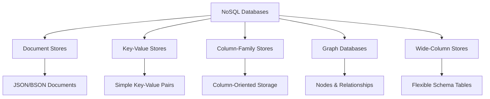

---

## 📄 Document Store Databases

### Definition

Document-store databases (document-oriented databases) store data in document format, typically **JSON** or **BSON** (binary JSON), where each document contains key-value pairs or key-document pairs. These databases are **schema-less**, providing flexibility in data structures.

### 🔧 Characteristics

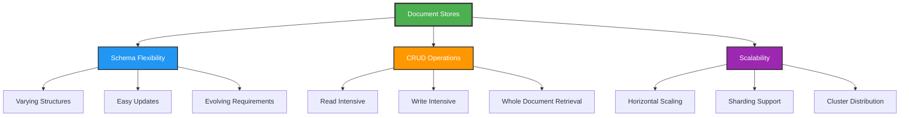

| Feature | Description |
|---------|-------------|
| **Schema Flexibility** | Documents can have varying structures within collections |
| **CRUD Operations** | Efficient for read/write-intensive applications |
| **Scalability** | Horizontal scaling through sharding across clusters |

### 🎯 Use Cases

#### Content Management Systems (CMS)
- **Platform**: WordPress, Drupal
- **Benefits**: Fast storage and access to diverse content types
- **Data Types**: Articles, images, user data, metadata
- **Vendor**: MongoDB

#### E-commerce Platforms
- **Challenge**: Managing diverse product catalogs
- **Solution**: Dynamic product attributes and hierarchies
- **Benefits**: Accommodates changing product listings
- **Vendors**: Couchbase, Amazon DocumentDB

### 🏢 Frequently Mentioned Vendors

| Vendor | Type | Key Features |
|--------|------|--------------|
| **MongoDB** | Document Database | Most popular, rich query language |
| **Couchbase** | Document Database | Built-in caching, mobile sync |
| **Amazon DocumentDB** | Managed Service | MongoDB-compatible, fully managed |

---

## 🔑 Key-Value Stores

### Definition

The **simplest NoSQL databases**, storing data as key-value pairs where each key is unique and directly points to its associated value.

### 🔧 Characteristics

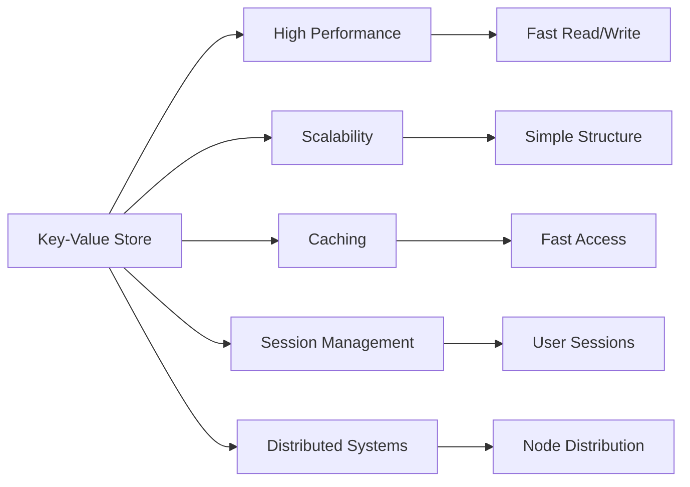

| Feature | Description |
|---------|-------------|
| **High Performance** | Optimized for speedy retrieval based on keys |
| **Scalability** | Simple structure enables easy distribution across nodes |
| **Caching** | Excellent for storing frequently accessed data |
| **Session Management** | Perfect for user session storage |

### 🎯 Use Cases

#### Web Performance Enhancement
- **Method**: Caching frequently accessed data
- **Benefit**: Reduced database load and faster response times
- **Vendors**: Redis, Memcached

#### E-commerce & Gaming Applications
- **Platform**: Amazon DynamoDB
- **Benefits**: High scalability, handles traffic spikes
- **Use Cases**: User profiles, game states, shopping carts

### 🏢 Frequently Mentioned Vendors

| Vendor | Type | Best For |
|--------|------|----------|
| **Redis** | In-Memory Store | Caching, real-time applications |
| **Memcached** | Distributed Cache | Simple caching layer |
| **Amazon DynamoDB** | Managed Service | Serverless, auto-scaling |

---

## 📊 Column-Family Stores

### Definition

**Columnar databases** organize data in columns rather than rows, storing columns together for efficient handling of large datasets with dynamic schemas.

### 🔧 Characteristics

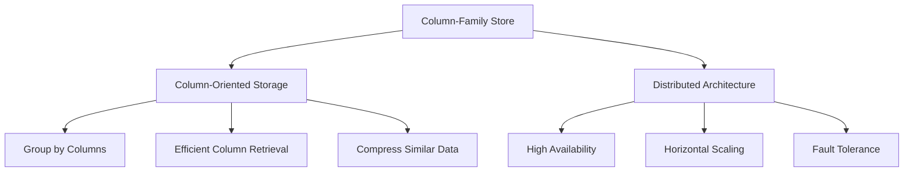

### 🎯 Use Cases

#### IoT Applications
- **Data Type**: Time-series sensor data
- **Challenge**: Massive data volumes with timestamps
- **Solution**: Efficient time-series data analysis
- **Vendor**: Apache Cassandra

#### User Behavior Analytics
- **Purpose**: Store and analyze user preferences
- **Application**: Personalization systems
- **Vendor**: HBase (Hadoop ecosystem)

#### Large-Scale Data Analysis
- **Use Case**: Big data processing and analytics
- **Benefits**: Efficient column-based operations

### 🏢 Frequently Mentioned Vendors

| Vendor | Ecosystem | Best For |
|--------|-----------|----------|
| **Apache Cassandra** | Standalone | High-write throughput, time-series |
| **HBase** | Hadoop | Big data analytics, batch processing |

---

## 🌐 Graph Databases

### Definition

Designed to manage **highly interconnected data**, representing relationships as first-class citizens alongside nodes and properties.

### 🔧 Characteristics

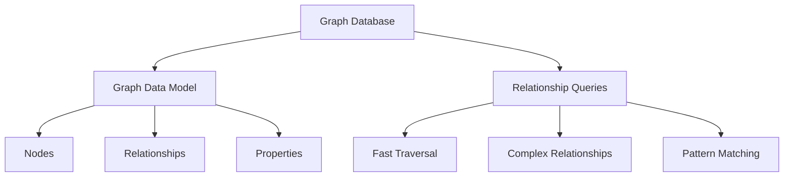

### 🎯 Use Cases

#### Social Networks
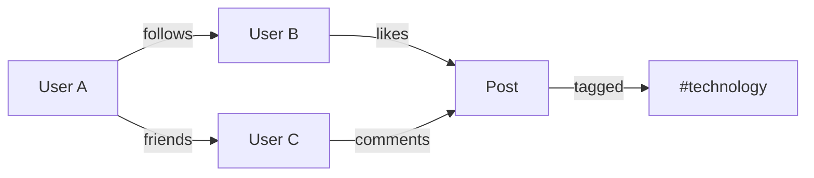

- **Data**: Users, posts, comments, likes
- **Relationships**: Follows, friends, interactions
- **Vendor**: Neo4j

#### Recommendation Systems
- **Analysis**: Complex user-product-behavior relationships
- **Output**: Personalized recommendations
- **Vendor**: Amazon Neptune

### 🏢 Frequently Mentioned Vendors

| Vendor | Type | Strengths |
|--------|------|-----------|
| **Neo4j** | Native Graph | Advanced graph algorithms, Cypher query language |
| **Amazon Neptune** | Managed Service | Supports multiple graph models |
| **ArangoDB** | Multi-Model | Document, graph, and key-value in one |

---

## 📋 Wide-Column Stores

### Definition

Organize data in **tables, rows, and columns** like relational databases, but with a **flexible schema** allowing dynamic column addition.

### 🔧 Characteristics

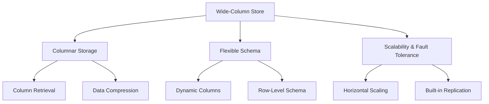

### 🎯 Use Cases

#### Big Data Analytics
- **Processing**: Real-time big data analytics
- **Platform**: Apache HBase with Hadoop
- **Benefits**: Efficient large-scale data processing

#### Enterprise Content Management
- **Data**: Employee records, inventory, documents
- **Scale**: Large organizational datasets
- **Vendor**: Apache Cassandra

### 🏢 Frequently Mentioned Vendors

| Vendor | Platform | Best For |
|--------|----------|----------|
| **Apache HBase** | Hadoop Ecosystem | Batch processing, data warehousing |
| **Apache Cassandra** | Standalone | High availability, write-heavy workloads |

---

## 💡 Expanded Use Case: MongoDB for Content Management Systems

### Overview

Content Management Systems (CMS) collect, govern, manage, and enrich enterprise content including HTML pages, images, articles, and multimedia content across cloud and application environments.

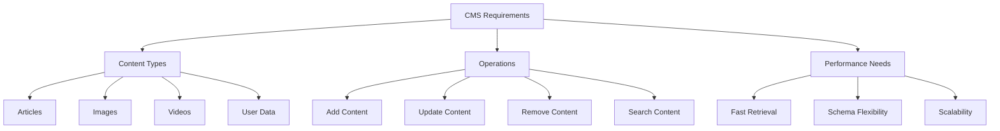

### Why MongoDB for CMS?

| Requirement | MongoDB Solution |
|-------------|------------------|
| **Diverse Content Types** | Flexible document structure |
| **Frequent Schema Changes** | Schema-less design |
| **Scaling Requirements** | Horizontal scaling capabilities |
| **Fast Content Delivery** | Efficient document retrieval |

---

## 📊 Content Structure in MongoDB

### Blog Post Example

```json
{
  "_id": 1,
  "title": "Sample Blog Post",
  "content": "This is the content of the blog post...",
  "author": {
    "name": "John Doe",
    "email": "john@example.com",
    "bio": "A passionate blogger.",
    "created_at": "2023-09-20T00:00:00Z"
  },
  "created_at": "2023-09-20T08:00:00Z",
  "tags": ["mongodb", "blogging", "example"],
  "comments": [
    {
      "text": "Great post!",
      "author": "Emily Johnson",
      "created_at": "2023-09-20T10:00:00Z"
    },
    {
      "text": "Thanks for sharing!",
      "author": "James Martin",
      "created_at": "2023-09-20T11:00:00Z"
    }
  ]
}
```

### Document Structure Benefits

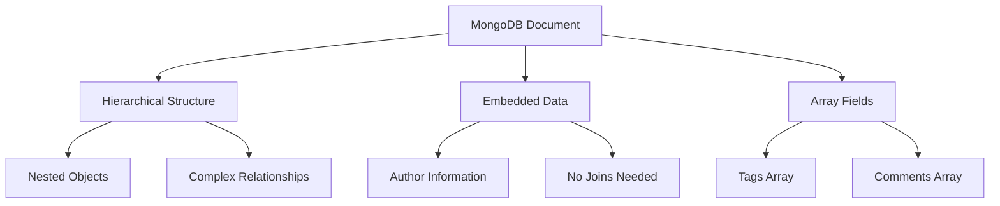

---

## 🔍 Metadata and Indexing

### Text Search Implementation

#### 1. Create Text Index
```javascript
db.articles.createIndex({ subject: "text" })
```

#### 2. Perform Text Search
```javascript
db.posts.find({ $text: { $search: "digital life" } })
```

#### 3. Search Behavior
- MongoDB searches for **stemmed versions** of words
- Searches for "digital" **OR** "life"
- Supports complex text queries

### Common Index Types for CMS

| Index Type | Use Case | Example |
|------------|----------|---------|
| **Text Index** | Content search | Article content, titles |
| **Compound Index** | Multi-field queries | Author + date |
| **Sparse Index** | Optional fields | Published date |
| **Partial Index** | Conditional indexing | Published articles only |

---

## 📈 Scaling CMS with MongoDB

### Horizontal Scaling with Sharding

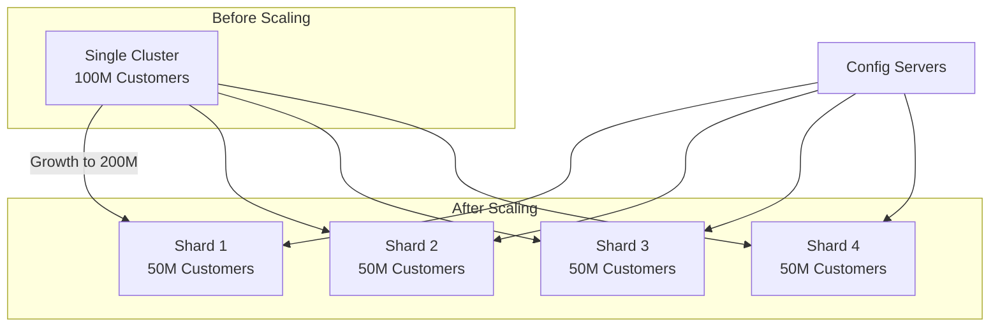

### Scaling Benefits

| Scaling Type | Cost | Performance | Complexity |
|--------------|------|-------------|------------|
| **Vertical** | Exponential | Limited | Low |
| **Horizontal** | Linear | Doubled | Medium |

#### Horizontal Scaling Advantages
- **Double throughput** at **double the cost**
- **Linear performance scaling**
- **Better fault tolerance**
- **Geographic distribution**

### Zone-Based Sharding for Global Distribution

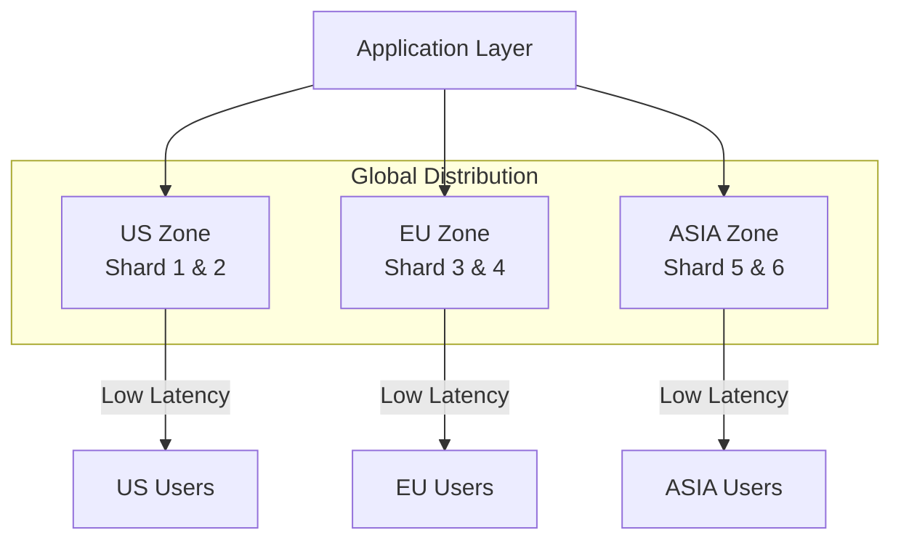

---

## 📋 Database Selection Matrix

### Choosing the Right NoSQL Database

| Use Case | Database Type | Recommended Vendors | Key Factors |
|----------|---------------|-------------------|-------------|
| **Content Management** | Document | MongoDB, DocumentDB | Schema flexibility, rich queries |
| **User Sessions** | Key-Value | Redis, DynamoDB | Speed, simplicity |
| **IoT Data** | Column-Family | Cassandra, HBase | Time-series, high write volume |
| **Social Networks** | Graph | Neo4j, Neptune | Complex relationships |
| **Analytics** | Wide-Column | Cassandra, HBase | Large-scale data processing |

### Decision Framework

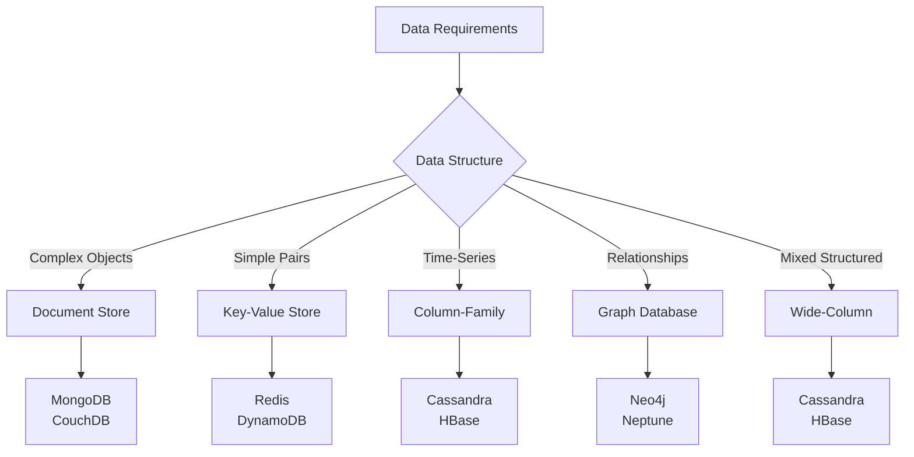

---

## 🎯 Key Takeaways

### ✨ Summary Points

1. **Document Stores** - Best for content management and flexible data structures
2. **Key-Value Stores** - Optimal for caching and simple, fast operations
3. **Column-Family** - Ideal for time-series data and analytics
4. **Graph Databases** - Perfect for relationship-heavy applications
5. **Wide-Column** - Great for big data and enterprise applications

### 🔍 Selection Criteria

- **Data Structure Complexity**
- **Query Requirements**
- **Scalability Needs**
- **Performance Requirements**
- **Consistency Requirements**
- **Development Team Expertise**

### 💡 Best Practices

- **Understand your data patterns** before choosing
- **Consider hybrid approaches** using multiple database types
- **Plan for scaling** from the beginning
- **Evaluate vendor ecosystem** and support
- **Test performance** with realistic workloads

---

*Understanding the nuanced characteristics of each NoSQL database type is crucial in selecting the right database solution that aligns with specific application requirements, scalability needs, and performance expectations.*

**Congratulations!** You have completed this comprehensive guide to NoSQL database types and use cases.
