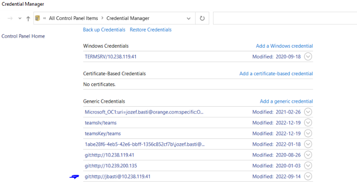

## Git repositories are hosted on Bonobo GIT Server

[http://10.238.119.41/Bonobo.Git.Server/Repository/Index](http://10.238.119.41/Bonobo.Git.Server/Repository/Index)

1. **[Flexi Backend](http://10.238.119.41/Bonobo.Git.Server/Flexi_Backend.git)** - everything related to database and ETL processes also some of the Cubes are located here

2. **[Flexi add-in for excel](http://10.238.119.41/Bonobo.Git.Server/Flexi_AddIn.git)** - all codes for this app, coded in Visual Basic

3. **[Flexi WebAPI](http://10.238.119.41/Bonobo.Git.Server/Flexi_WebAPI.git)** - all codes for the WebAPI

4. **[Flexi API Orchestrator](http://10.238.119.41/Bonobo.Git.Server/Flexi_APIOrchestrator.git)** - Management tool for Flexi API, recreation of models and deployment of solution to IIS

## Git rights setup

[https://raviteja8.wordpress.com/2018/11/15/git-extensions-authentication-issue/#:~:text=Process%20to%20edit%20your%20old,again%2C%20it%27ll%20work.](https://raviteja8.wordpress.com/2018/11/15/git-extensions-authentication-issue/#:~:text=Process%20to%20edit%20your%20old,again%2C%20it%27ll%20work.)

