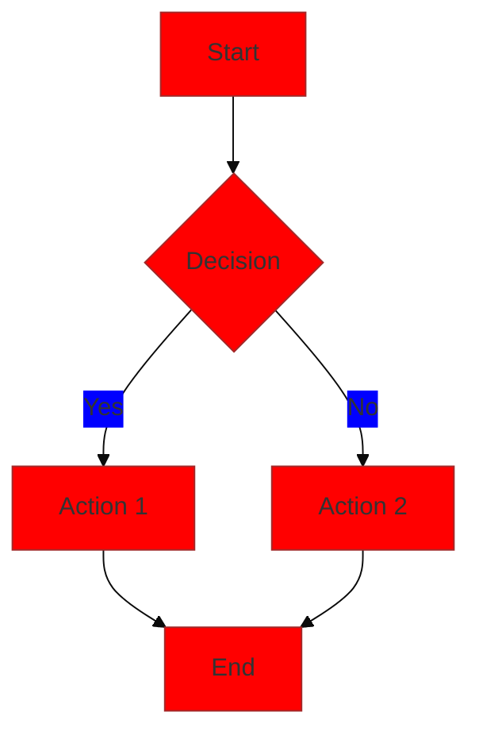
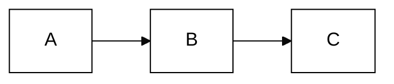
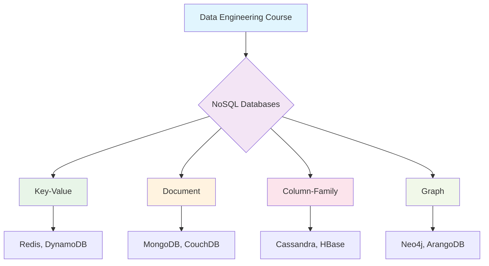
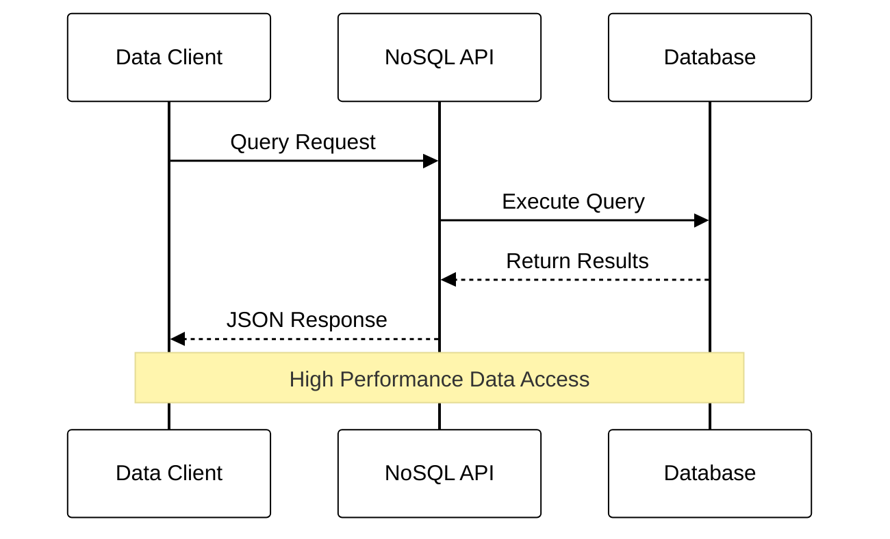
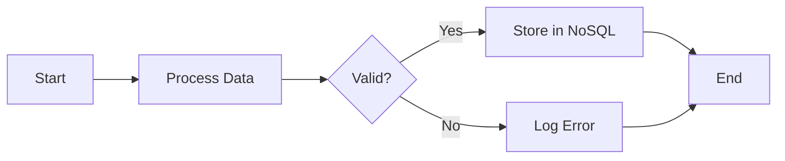
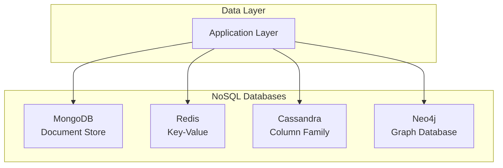
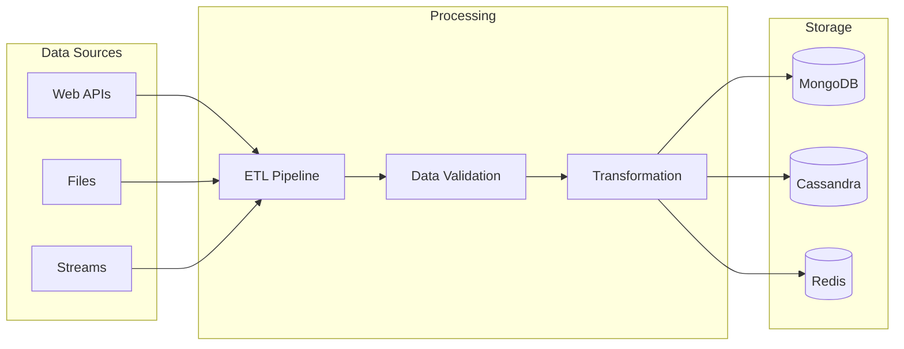

## 🔧 Problem Overview

Mermaid diagrams in Obsidian often appear cropped, cut off, or improperly sized due to:
- Insufficient container width/height
- CSS styling conflicts
- Viewport limitations
- SVG scaling issues
- Plugin configuration problems

## 🚀 Solutions

### Solution 1: Enable Mermaid Plugin

First, ensure you have a Mermaid plugin installed and properly configured:

1. **Install Mermaid Plugin**
   - Go to Settings → Community Plugins
   - Search for "Mermaid" 
   - Install "Mermaid" by Johannes Theiner
   - Enable the plugin

2. **Alternative: Advanced Mermaid Plugin**
   - Search for "Advanced Mermaid"
   - Provides better scaling and customization options

### Solution 2: CSS Snippet for Mermaid Scaling

Create a CSS snippet to fix scaling issues:

```css
/* Mermaid Diagram Fixes */
.mermaid {
    text-align: center;
    max-width: 100% !important;
    height: auto !important;
    overflow: visible !important;
}

.mermaid svg {
    max-width: 100% !important;
    height: auto !important;
    display: block;
    margin: 0 auto;
}

/* Fix for large diagrams */
.mermaid svg[style*="max-width"] {
    max-width: none !important;
    width: 100% !important;
}

/* Ensure container doesn't crop content */
.markdown-preview-view .mermaid {
    overflow-x: auto;
    overflow-y: visible;
    padding: 10px;
    margin: 10px 0;
}

/* Fix for editing mode */
.markdown-source-view .mermaid {
    overflow: visible !important;
}
```

### Solution 3: Diagram Size Configuration

Add size parameters to your Mermaid diagrams:



### Solution 4: Manual Width/Height Control

Use Mermaid configuration blocks:



### Solution 5: Obsidian Settings Configuration

1. **Editor Settings**
   - Settings → Editor → Display
   - Enable "Show line numbers"
   - Set "Tab size" to 4
   - Enable "Vim key bindings" if preferred

2. **Appearance Settings**
   - Settings → Appearance
   - Increase "Font size" if diagrams appear too small
   - Adjust "Zoom level" for better visibility

### Solution 6: Community Plugin Alternatives

If standard Mermaid doesn't work, try these alternatives:

1. **Diagram Plugin**
   - Supports multiple diagram types
   - Better rendering control

2. **PlantUML Plugin**
   - Alternative diagramming solution
   - More reliable rendering

3. **Excalidraw Plugin**
   - Hand-drawn style diagrams
   - Never crops content

## 📁 Implementation Steps

### Step 1: Enable CSS Snippet

1. **CSS Snippet Created**: The file `mermaid-fixes.css` has been created in your `.obsidian/snippets/` folder
2. **Enable in Obsidian**:
   - Open Obsidian
   - Go to Settings → Appearance → CSS snippets
   - Find "mermaid-fixes" and toggle it ON
   - Restart Obsidian if needed

### Step 2: Install Mermaid Plugin

1. **Community Plugins**:
   ```
   Settings → Community Plugins → Browse
   Search: "Mermaid"
   Install: "Mermaid" by Johannes Theiner
   Enable the plugin
   ```

2. **Alternative Plugin**:
   ```
   Search: "Advanced Mermaid"
   Better for complex diagrams
   ```

### Step 3: Test Configuration

Create a test diagram to verify the fix:



### Step 4: Advanced Configuration

For complex diagrams, use configuration blocks:



## 🧪 Test Examples

### Example 1: Simple Flowchart


### Example 2: Database Architecture


### Example 3: Data Pipeline


## 🔧 Troubleshooting

### Issue 1: Diagrams Still Cropped
**Solution**: 
- Check if CSS snippet is enabled
- Restart Obsidian completely
- Try disabling other CSS snippets temporarily

### Issue 2: Plugin Not Working
**Solution**:
- Update to latest Obsidian version
- Reinstall Mermaid plugin
- Check console for error messages (Ctrl+Shift+I)

### Issue 3: Diagrams Not Rendering
**Solution**:
- Verify Mermaid syntax is correct
- Check plugin settings
- Try alternative: PlantUML or Excalidraw

### Issue 4: Performance Issues
**Solution**:
- Limit diagram complexity
- Use simpler themes
- Consider breaking large diagrams into smaller ones

## 📱 Mobile Considerations

For Obsidian Mobile:
```css
/* Add to CSS snippet for mobile */
@media (max-width: 480px) {
    .mermaid {
        font-size: 12px;
        padding: 5px;
    }
    
    .mermaid svg {
        max-width: 100%;
        transform: scale(0.8);
        transform-origin: top left;
    }
}
```

## 🔄 Sync Considerations

When using sync across devices:
- CSS snippets sync automatically
- Plugin settings may need manual setup
- Test diagrams on all devices

## 📚 Integration with Course Materials

This fix enables better visualization for:
- [[learning.tools.Data-Engineering-Course/00-Course-Index|Course Navigation]]
- Database architecture diagrams
- Data flow visualizations
- System design illustrations

## 🎯 Best Practices

1. **Keep diagrams simple** - Easier to read and render
2. **Use consistent styling** - Apply theme variables
3. **Test on multiple screen sizes** - Ensure responsiveness
4. **Add alt text** - For accessibility
5. **Version control** - Keep diagram source in notes

## 📊 Performance Tips

- Use `%%{wrap}%%` for wide diagrams
- Limit nodes to <20 per diagram
- Use subgraphs for organization
- Avoid deeply nested structures

---

**Status**: CSS snippet created and ready to enable  
**Files Created**: 
- `mermaid-fixes.css` in `.obsidian/snippets/`
- This troubleshooting guide

**Next Steps**: 
1. Enable CSS snippet in Obsidian
2. Install Mermaid plugin
3. Test with provided examples
4. Sync to Windows Obsidian

*This solution addresses the most common Mermaid diagram rendering issues in Obsidian, ensuring your Data Engineering Course diagrams display properly.*
