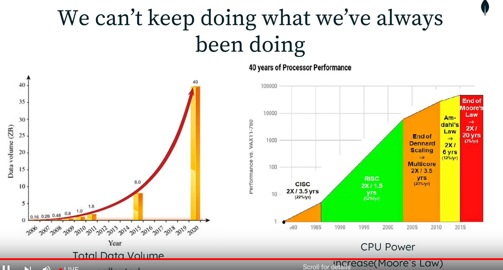
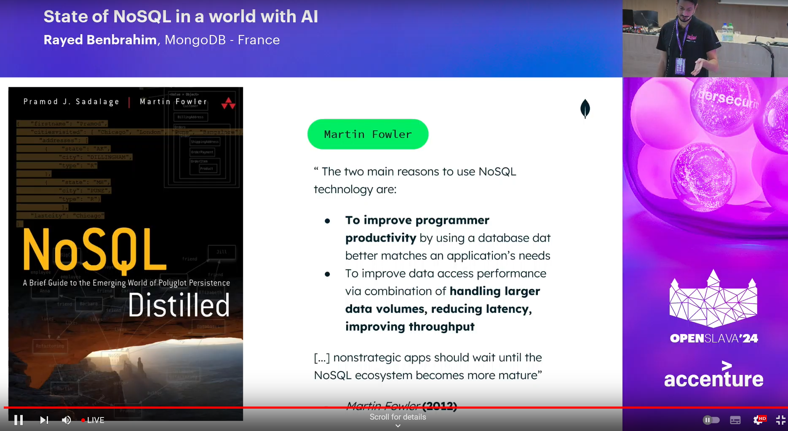
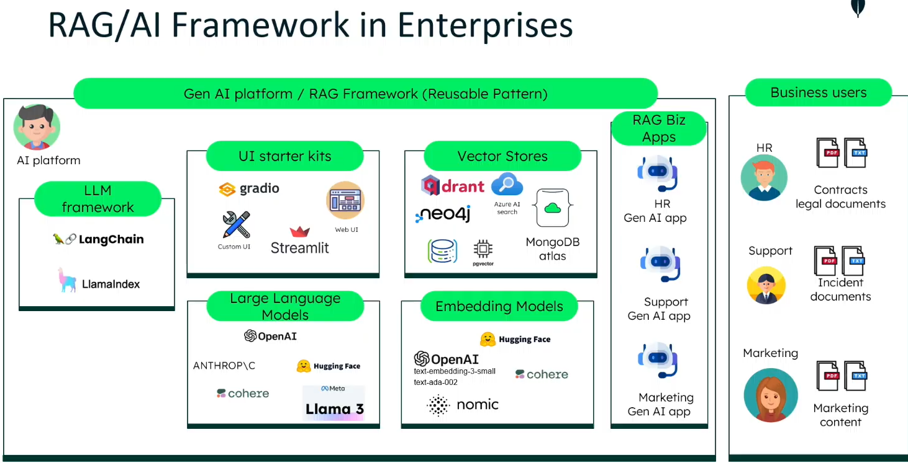

- **vector search**: Is a search algorithm that uses vectors to represent documents and queries. It is used in many applications, such as recommendation systems, search engines, and natural language processing. Vector search is a powerful tool for finding similar items in a large dataset, and it is often used in conjunction with machine learning algorithms to improve search results.
- **Elasticsearch**: Is a distributed, RESTful search and analytics engine capable of solving a growing number of use cases. As the heart of the Elastic Stack, it centrally stores your data so you can discover the expected and uncover the unexpected.
- 

**Martin Fowler**: NoSQL is a term used to describe databases that differ from traditional relational databases in some way. These differences may include the way data is stored, the way data is queried, or the way data is indexed. NoSQL databases are often used in situations where traditional relational databases are not well-suited, such as when dealing with large amounts of unstructured data or when high availability and scalability are required.

what is a vector store ? 