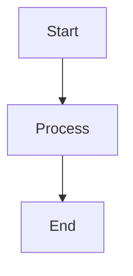

## Overview

Python-based tool that converts Markdown documents to professional PDF format using Pandoc with XeLaTeX engine, custom templates, and Mermaid diagram support.

## Features

### Document Processing
- **Professional PDF Output**: A4 format with 1-inch margins
- **Mermaid Diagrams**: Automatic rendering of embedded diagrams
- **Custom Templates**: LaTeX template for consistent formatting
- **Syntax Highlighting**: Code blocks with Tango color scheme
- **Resource Path Management**: Automatic image and asset resolution

### Advanced Formatting
- **Custom LaTeX Template**: Professional document styling
- **Lua Filters**: Remove tight lists and enhance code blocks
- **Highlight Style**: Tango theme for code syntax highlighting
- **Geometry Settings**: Optimized page layout and margins

## Installation

### System Dependencies

```bash
# Install Pandoc
sudo apt update
sudo apt install pandoc

# Install XeLaTeX
sudo apt install texlive-xetex texlive-fonts-recommended

# Install Mermaid CLI
npm install -g @mermaid-js/mermaid-cli
```

### Python Dependencies

```bash
pip install panflute
```

## Usage

### Basic Command

```bash
python3 MarkdownToPdf.py <input.md> <output.pdf>
```

### Examples

```bash
# Convert single document
python3 MarkdownToPdf.py document.md document.pdf

# Convert with specific paths
python3 MarkdownToPdf.py /path/to/input.md /path/to/output.pdf
```

## Technical Architecture

### Processing Pipeline

1. **Input Validation**: Check command-line arguments
2. **Path Resolution**: Set up resource paths and filters
3. **Mermaid Processing**: Render diagrams through filter
4. **Pandoc Conversion**: Apply template and LaTeX engine
5. **PDF Generation**: Create final document with formatting

### Filter Chain

```python
command = [
    "pandoc", markdown_file, "-o", output_file,
    "--variable=geometry:a4paper",
    "--variable=geometry:margin=1in", 
    "--pdf-engine=xelatex",
    "--filter", mermaid_filter_path,
    "--resource-path", resource_path,
    "--template", template_path,
    "--lua-filter", lua_filter_path,
    "--highlight-style=tango",
    "--wrap=none"
]
```

## Component Files

### Core Components

```
tools/markdown-to-confluence/
├── MarkdownToPdf.py           # Main Python script
├── mermaid-filter.py          # Mermaid diagram processor
├── remove-tightlist.lua       # Lua filter for formatting
├── custom.latex               # LaTeX template
└── README.md                  # Documentation
```

### File Dependencies

- **`mermaid-filter.py`**: Converts Mermaid code blocks to PNG images
- **`remove-tightlist.lua`**: Enhances code block formatting and removes LaTeX artifacts
- **`custom.latex`**: Custom LaTeX template for professional document styling

## Mermaid Integration

### Automatic Diagram Rendering

**Markdown Input:**
````markdown

````

**Processing:**
1. Mermaid filter detects code block
2. Generates PNG image file (`mermaid_1.png`)
3. Replaces code block with image reference
4. Includes image in final PDF

### Diagram Naming

- Sequential numbering: `mermaid_1.png`, `mermaid_2.png`, etc.
- Transparent background for clean integration
- Automatic cleanup after conversion

## Customization Options

### LaTeX Template Variables

```latex
% Document geometry
geometry: a4paper, margin=1in

% Font and styling options (custom.latex)
% Code highlighting theme
% Page headers and footers
```

### Code Block Styling

**Lua Filter Features:**
- Frame borders around code blocks
- Line numbers for code listings
- Language-specific highlighting
- HTML fallback for web output

### PDF Engine Options

- **XeLaTeX**: Unicode support, modern font handling
- **Alternative**: Can be switched to other engines (pdflatex, lualatex)
- **Font Support**: System font integration

## Error Handling

### Common Issues

```python
try:
    subprocess.run(command, check=True)
    print(f"PDF file created: {output_file}")
except subprocess.CalledProcessError as e:
    print(f"Failed to create PDF file. Error: {e}")
```

### Troubleshooting

**Missing Dependencies:**
- Verify Pandoc installation: `pandoc --version`
- Check XeLaTeX: `xelatex --version`
- Test Mermaid CLI: `mmdc --help`

**Permission Issues:**
```python
if os.path.exists(output_file):
    os.chmod(output_file, 0o666)  # Ensure write permissions
```

**Path Resolution:**
- Filter paths are resolved relative to working directory
- Resource paths include input file directory
- Template paths use absolute references

## Advanced Usage

### Batch Processing

```bash
#!/bin/bash
for file in *.md; do
    python3 MarkdownToPdf.py "$file" "${file%.md}.pdf"
done
```

### Custom Template Usage

```bash
# Modify template path in script
template_path = "/custom/path/to/template.latex"
```

### Filter Customization

```python
# Add additional filters
"--lua-filter", custom_filter_path,
"--filter", additional_filter_path
```

## Output Quality

### Professional Features
- **Typography**: LaTeX-quality typesetting
- **Code Formatting**: Syntax-highlighted code blocks with frames
- **Diagrams**: High-quality Mermaid diagram rendering
- **Layout**: Consistent margins and spacing
- **Fonts**: Professional font selection

### Document Structure
- **Headings**: Proper hierarchy and styling
- **Lists**: Clean bullet and numbered lists
- **Tables**: Well-formatted tabular data
- **Images**: Proper scaling and positioning

## Integration Workflow

### Documentation Pipeline
1. **Author** content in Markdown with embedded diagrams
2. **Process** through PDF converter for document generation
3. **Review** PDF output for formatting and quality
4. **Distribute** professional documents to stakeholders

### Version Control
- **Source**: Keep Markdown in version control
- **Assets**: Track diagram sources and templates
- **Output**: Generate PDFs as needed for distribution

## Performance Notes

- **Mermaid Rendering**: Can be slow for complex diagrams
- **XeLaTeX Processing**: Memory-intensive for large documents
- **File Cleanup**: Temporary PNG files are preserved for reuse

## Related Tools

- [[learning.tools.Markdown to Confluence Converter]] - Wiki format conversion
- [[learning.tools.Mermaid Diagram Filter]] - Standalone diagram processing
- [[learning.tools.Development Tools Collection]] - Complete tools overview

---
*Python-based professional PDF generation from Markdown*