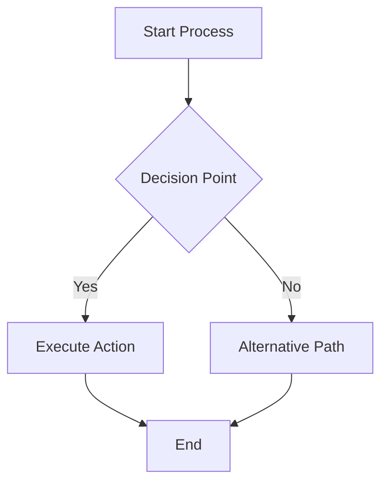

## Overview

Pandoc filter that automatically processes Mermaid diagram code blocks and converts them to PNG images for inclusion in document conversions.

## Features

### Automatic Diagram Processing
- **Code Block Detection**: Identifies Mermaid code blocks in documents
- **Image Generation**: Converts diagrams to PNG format using Mermaid CLI
- **Transparent Backgrounds**: Clean integration with document themes
- **Sequential Naming**: Automatic file naming with incremental counters
- **Error Handling**: Graceful fallback when diagram rendering fails

### Pandoc Integration
- **Filter Framework**: Built on panflute for robust Pandoc integration  
- **Element Replacement**: Converts code blocks to image elements
- **Document Processing**: Maintains document structure during conversion

## Technical Implementation

### Core Components

```python
def action(elem, doc):
    if isinstance(elem, pf.CodeBlock) and 'mermaid' in elem.classes:
        doc.mermaid_number += 1
        filename = f"mermaid_{doc.mermaid_number}.png"
        filepath = os.path.join(os.getcwd(), filename)

        command = [
            "mmdc",
            "-i", "-",
            "-o", filepath,
            "-b", "transparent"
        ]
        
        result = subprocess.run(
            command,
            input=elem.text.encode('utf-8'),
            capture_output=True,
            check=True
        )
        
        image = pf.Image(url=filename, title="")
        return pf.Para(image)
```

### Processing Pipeline

1. **Document Preparation**: Initialize diagram counter
2. **Element Scanning**: Search for Mermaid code blocks
3. **Diagram Generation**: Process each diagram through Mermaid CLI
4. **Element Replacement**: Replace code block with image reference
5. **Error Recovery**: Preserve original code block if rendering fails

## Installation Requirements

### System Dependencies

```bash
# Install Mermaid CLI
npm install -g @mermaid-js/mermaid-cli

# Verify installation
mmdc --help
```

### Python Dependencies

```bash
# Install panflute for Pandoc filter support
pip install panflute
```

## Usage

### As Pandoc Filter

```bash
# Direct usage with Pandoc
pandoc input.md -o output.pdf --filter mermaid-filter.py

# With additional options
pandoc input.md -o output.html \
  --filter mermaid-filter.py \
  --resource-path=./images
```

### Integration with Other Tools

```python
# Used by MarkdownToPdf.py
command = [
    "pandoc", markdown_file, "-o", output_file,
    "--filter", mermaid_filter_path,
    # ... other options
]
```

## Supported Mermaid Diagrams

### Diagram Types
- **Flowcharts**: Process flow and decision trees
- **Sequence Diagrams**: Interaction flows between entities
- **Gantt Charts**: Project timelines and scheduling
- **Class Diagrams**: Object-oriented design structures
- **State Diagrams**: System state transitions
- **Pie Charts**: Data visualization
- **User Journey**: Experience mapping

### Example Usage

````markdown

````

## File Management

### Generated Assets

```
Current Directory/
├── mermaid_1.png          # First diagram
├── mermaid_2.png          # Second diagram  
├── mermaid_3.png          # Third diagram
└── ...
```

### Naming Convention
- **Pattern**: `mermaid_{number}.png`
- **Counter**: Document-level incremental numbering
- **Location**: Current working directory
- **Cleanup**: Manual cleanup required after processing

## Error Handling

### Graceful Degradation

```python
try:
    result = subprocess.run(command, input=elem.text.encode('utf-8'), 
                          capture_output=True, check=True)
    image = pf.Image(url=filename, title="")
    return pf.Para(image)
except subprocess.CalledProcessError as e:
    sys.stderr.write(f"Error rendering mermaid diagram: {e}\n")
    sys.stderr.write(e.stderr.decode('utf-8') + "\n")
    return elem  # Return original code block
```

### Common Error Scenarios
- **Mermaid CLI Not Found**: Preserve original code block
- **Invalid Diagram Syntax**: Display error message and keep code
- **File Permission Issues**: Log error and continue processing
- **Memory Limitations**: Handle large diagram failures gracefully

## Configuration Options

### Mermaid CLI Parameters

```python
command = [
    "mmdc",              # Mermaid CLI command
    "-i", "-",           # Input from stdin
    "-o", filepath,      # Output file path
    "-b", "transparent"  # Transparent background
]
```

### Additional Options
- **Background Color**: `-b white`, `-b transparent`, `-b #ffffff`
- **Image Format**: Default PNG (can be modified to SVG, PDF)
- **Resolution**: DPI settings for high-quality output
- **Theme**: Light/dark theme selection

## Performance Considerations

### Processing Impact
- **CLI Overhead**: Each diagram requires separate process execution
- **File I/O**: PNG generation involves disk operations
- **Memory Usage**: Large documents with many diagrams consume more memory
- **Processing Time**: Complex diagrams increase conversion time

### Optimization Strategies
- **Diagram Caching**: Reuse generated images when possible
- **Batch Processing**: Group diagram generation when feasible
- **Error Limits**: Prevent excessive retry attempts
- **Resource Cleanup**: Clean up temporary files after processing

## Integration Examples

### With Markdown to PDF

```python
# MarkdownToPdf.py integration
mermaid_filter_path = os.path.join(
    os.getcwd(), "tools/markdown-to-confluence/mermaid-filter.py"
)

command.extend(["--filter", mermaid_filter_path])
```

### Standalone Usage

```bash
#!/bin/bash
# Process single file with Mermaid diagrams
pandoc document.md -o document.html \
    --filter ./mermaid-filter.py \
    --self-contained
```

## Troubleshooting

### Installation Issues

```bash
# Check Mermaid CLI installation
which mmdc
mmdc --version

# Check Node.js dependency
node --version
npm --version
```

### Runtime Problems

```bash
# Test Mermaid CLI directly
echo "graph TD; A-->B" | mmdc -i - -o test.png

# Check filter permissions
chmod +x mermaid-filter.py

# Test panflute installation
python -c "import panflute; print('OK')"
```

### Debugging Mode

```python
# Add debug output to filter
sys.stderr.write(f"Processing diagram {doc.mermaid_number}\n")
sys.stderr.write(f"Diagram content: {elem.text[:50]}...\n")
```

## Related Tools

- [[learning.tools.Markdown to PDF Converter]] - Primary integration point
- [[learning.tools.Development Tools Collection]] - Complete tools overview
- [[learning.tools.Pandoc Filters Guide]] - Advanced filter development

## File Location

```
tools/markdown-to-confluence/mermaid-filter.py
```

---
*Pandoc filter for automatic Mermaid diagram rendering*