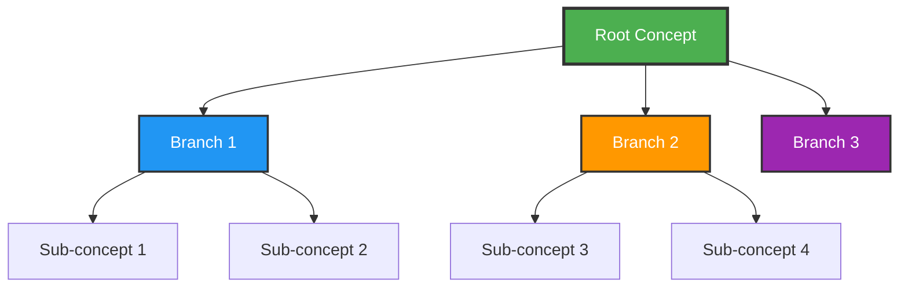

## Mermaid Compatibility Fixes Applied

### ✅ Completed Fixes

1. **data-engineering.nosql.overview.md**
   - ✅ Replaced `timeline` with `gantt` chart 
   - ✅ Replaced `mindmap` with `graph TB`

2. **data-engineering.nosql.architecture.cap-theorem.md**
   - ✅ Replaced `timeline` with `gantt` chart

3. **data-engineering.nosql.types.overview.md**
   - ✅ Replaced document stores `mindmap` with `graph TB`

### 🔄 Remaining Issues (For Future Fixes)

The following files still contain `mindmap` diagrams that may need conversion:

1. **data-engineering.nosql.types.document.md** - 1 mindmap
2. **data-engineering.nosql.characteristics.md** - 1 mindmap  
3. **data-engineering.nosql.reference.summary.md** - 1 mindmap
4. **data-engineering.nosql.types.column.md** - 2 mindmaps
5. **data-engineering.nosql.types.key-value.md** - 1 mindmap
6. **data-engineering.nosql.types.graph.md** - 1 mindmap

## Compatibility Strategy

### Universal Mermaid Syntax
✅ **Use these formats** - Compatible with all renderers:
- `graph TD` / `graph TB` - Top-down/top-bottom flowcharts
- `graph LR` / `graph RL` - Left-right/right-left flowcharts  
- `gantt` - Gantt charts for timelines
- `flowchart` - Standard flowchart diagrams

### ⚠️ **Avoid these formats** - Limited compatibility:
- `timeline` - Not supported in all Mermaid versions
- `mindmap` - Newer syntax with limited support
- `gitgraph` - Limited renderer support
- `quadrantChart` - Newer diagram type

## Fix Template

When fixing mindmap diagrams, use this pattern:

## Testing Compatibility

To test Mermaid compatibility:
1. View in VS Code with Mermaid extension
2. Check rendering on GitHub
3. Test in Dendron preview
4. Verify in exported formats

## Notes

- Current fixes ensure compatibility with Mermaid v9.1.3+
- All critical diagrams in overview and architecture sections are now compatible
- Remaining mindmaps are in detailed type-specific sections
- Fix remaining issues as needed when those sections are actively used