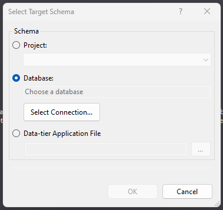

The following applications need to be installed:

## 1.1 Visual Studio 2019 - Professional

**Source:** `\\10.238.119.41\Instalations for Flexi Employee\vs_professional__c7cafea7fd214d9bbfb4b3ea2b19a844.exe` 

**Note:** 
 - You need admin privelages in order to install this application

**Justification:**

for SSIS, .NET Framework 4..?

**TODO:** - Pending issues
 - [ ] Missing Licence, The application is running in trail mode and will expire on the 8'th of december 2024

## 1.2 VisualStudio 2022 - Community Edition

**Source:** 
 - [https://visualstudio.microsoft.com/vs/](https://visualstudio.microsoft.com/vs/)

**Justification:**

for API, .NET7

## 1.3 SQL Server Management Studio (SSMS)

**Source:**

 - [https://learn.microsoft.com/en-us/sql/ssms/download-sql-server-management-studio-ssms?view=sql-server-ver16](https://learn.microsoft.com/en-us/sql/ssms/download-sql-server-management-studio-ssms?view=sql-server-ver16)

**Note:**
- Pick the **Develloper** edition

## 1.4 Git

**Source:**
 - `\\10.238.119.41\Instalations for Flexi Employee\Git-2.35.1.2-64-bit.exe`

**Note:**
 - I personally prefer to use `Notepad++` rather than `Vim` as the default editor.

## 1.5 Git Extentions

**Source:**

 - `\\10.238.119.41\Instalations for Flexi Employee\GitExtensions-3.5.4.12724-65f01f399.msi`

## 1.6 - Flexi

**Source:**

- `\\10.238.119.41\Ribbon`

**Notes:**
- The specified directory contains multiple interesting files and directories, such as:
  - `FlexiVideos`
  - `Files` - This is where the actual installation files are located*
  - `Flexi - Quick guide.pptx` - See slide 33 for installation instructions

(*) The Setup file in `\\10.238.119.41\Ribbon\Files` was working for me, and the subdirectory `Current Version` and also the `setup.zip` did not work for me. 

Once the Flexi application is installed, you will be prompted with a notification when you start up excel

click yes

TODO: Misleading approval request

## 1.7 - VisualStudio Extensions

### 1.7.1 - Microsoft SQL Server 2022 Reporting Services

**source:**
 - [https://download.microsoft.com/download/8/3/2/832616ff-af64-42b5-a0b1-5eb07f71dec9/SQLServerReportingServices.exe](https://download.microsoft.com/download/8/3/2/832616ff-af64-42b5-a0b1-5eb07f71dec9/SQLServerReportingServices.exe)

**Notes:**

- your guess is as good as mine, 

Microsoft SQL Server Analysis Services (SSAS or S.S.A.S. or MSAS or AS) is an online analytical processing (OLAP) and data mining tool in Microsoft SQL Server. SSAS is used as a tool by organizations to analyze and make sense of information possibly spread out across multiple databases, or in disparate tables or files.

## 1.8 Power BI

**Source:**

 - `\\10.238.119.41\Instalations for Flexi Employee\PBIDesktopSetup_x64.exe`

## 1.9 SQL Search

**Source:**
- [https://www.red-gate.com/products/sql-search/installer/](https://www.red-gate.com/products/sql-search/installer/)

## MSSQL Oledb

**NOTE!**

It is pointed out that we need to install bot the x64 and x86 version. 

[sw-install](files/sw-install.xlsx)
